# 강의 01 — 소개

> **최종 수정일:** 2026-10-06
>
> Software Security: Principles, Policies, and Protection, Payer - Ch 1

> **학습 목표**:
> 1. 소프트웨어 취약점이 왜 실제 세계의 치명적인 공격과 경제적 피해로 이어지는지 설명할 수 있다
> 2. 타입 안전성 위반과 메모리 안전성 위반을 구분하고, C/C++ 프로그램이 왜 두 가지 모두에 취약한지 설명할 수 있다
> 3. 버퍼 오버플로우, 임의 쓰기 프리미티브, Use-After-Free를 구체적인 코드 예시와 함께 설명할 수 있다
> 4. 새니타이저(특히 ASan)와 퍼저의 동작 원리, 그리고 두 도구를 함께 사용하는 이유를 설명할 수 있다
> 5. Rust가 메모리 안전성 위반을 방지하는 방식과, unsafe Rust에 여전히 보호가 필요한 이유를 요약할 수 있다
> 6. 자율주행 시스템의 테스트가 어려운 이유와 퍼징을 적용하는 방법을 설명할 수 있다

---

## 목차

- [1. 소프트웨어 보안이 중요한 이유](#1-소프트웨어-보안이-중요한-이유)
  - [1.1 어디에나 존재하는 소프트웨어](#11-어디에나-존재하는-소프트웨어)
  - [1.2 취약점, 해커, 그리고 치명적인 공격](#12-취약점-해커-그리고-치명적인-공격)
  - [1.3 실제 사고 사례](#13-실제-사고-사례)
  - [1.4 사이버 범죄의 경제적 피해](#14-사이버-범죄의-경제적-피해)
  - [1.5 새로운 공격 대상: AI, 로봇, 자율 시스템](#15-새로운-공격-대상-ai-로봇-자율-시스템)
  - [1.6 보안 연구자에 대한 수요](#16-보안-연구자에-대한-수요)
- [2. C/C++와 타입 및 메모리 안전성](#2-cc와-타입-및-메모리-안전성)
  - [2.1 어디에나 쓰이는 C/C++ (안전하지 않은 언어)](#21-어디에나-쓰이는-cc-안전하지-않은-언어)
  - [2.2 증가하는 취약점](#22-증가하는-취약점)
  - [2.3 흔하게 발생하는 타입 및 메모리 안전성 위반](#23-흔하게-발생하는-타입-및-메모리-안전성-위반)
  - [2.4 타입 안전성 위반 vs 메모리 안전성 위반](#24-타입-안전성-위반-vs-메모리-안전성-위반)
- [3. 대표적인 취약점](#3-대표적인-취약점)
  - [3.1 버퍼 오버플로우](#31-버퍼-오버플로우)
  - [3.2 공격 프리미티브: 임의 쓰기](#32-공격-프리미티브-임의-쓰기)
  - [3.3 공격 프리미티브: 위치가 제한된 임의 쓰기](#33-공격-프리미티브-위치가-제한된-임의-쓰기)
  - [3.4 Use After Free](#34-use-after-free)
- [4. 버그 찾기: 새니타이저, 퍼징, 버그 바운티](#4-버그-찾기-새니타이저-퍼징-버그-바운티)
  - [4.1 새니타이저](#41-새니타이저)
  - [4.2 Address Sanitizer (ASan)](#42-address-sanitizer-asan)
  - [4.3 퍼징](#43-퍼징)
  - [4.4 퍼징 팜](#44-퍼징-팜)
  - [4.5 버그 바운티 프로그램](#45-버그-바운티-프로그램)
- [5. 연구 분야 1: C/C++의 타입 및 메모리 안전성 강화](#5-연구-분야-1-cc의-타입-및-메모리-안전성-강화)
- [6. 연구 분야 2: Rust 언어 보안](#6-연구-분야-2-rust-언어-보안)
  - [6.1 왜 Rust인가](#61-왜-rust인가)
  - [6.2 Rust의 확산](#62-rust의-확산)
  - [6.3 소유권](#63-소유권)
  - [6.4 Rust가 메모리 안전성 위반을 방지하는 방법](#64-rust가-메모리-안전성-위반을-방지하는-방법)
  - [6.5 Unsafe Rust](#65-unsafe-rust)
- [7. 연구 분야 3: 자율주행 차량 및 드론 보안](#7-연구-분야-3-자율주행-차량-및-드론-보안)
  - [7.1 동기](#71-동기)
  - [7.2 해결 과제](#72-해결-과제)
  - [7.3 배경: 퍼징](#73-배경-퍼징)
  - [7.4 AutoFuzzer: 입력 변이](#74-autofuzzer-입력-변이)
  - [7.5 AutoFuzzer: 발견된 버그](#75-autofuzzer-발견된-버그)
- [요약](#요약)
- [점검 문제](#점검-문제)

---

<br>

## 1. 소프트웨어 보안이 중요한 이유

### 1.1 어디에나 존재하는 소프트웨어

컴퓨터와 소프트웨어는 더 이상 데스크톱 컴퓨터에만 있지 않다. 소프트웨어는 **서버, 공장, 병원, 자동차, 항공기, 도시 기반 시설**을 제어한다. 따라서 소프트웨어의 결함은 단순한 불편함에 그치지 않고, 물리적 안전과 핵심 기반 시설에 직접적인 영향을 줄 수 있다.

### 1.2 취약점, 해커, 그리고 치명적인 공격

강의는 위협을 간단한 등식으로 요약한다.

$$\text{Developers' mistakes} \rightarrow \text{Vulnerabilities in software}, \qquad \text{Vulnerabilities} + \text{Hackers} = \text{Critical attacks}$$

개발자는 필연적으로 실수를 하며, 그중 일부는 **취약점(vulnerability)** 이 된다. 공격자가 취약점을 발견하고 악용하면, 그 결과는 치명적인 공격으로 이어진다.

> **용어 정의:** 다음 세 용어는 자주 혼동된다. **버그(bug)** 는 프로그램이 의도한 동작에서 벗어나는 모든 결함이다. **취약점(vulnerability)** 은 공격자가 보안 속성(기밀성, 무결성, 가용성)을 침해하는 데 사용할 수 있는 버그이다. **익스플로잇(exploit)** 은 취약점을 실제로 유발하여 공격자의 목적을 달성하는 구체적인 입력이나 프로그램이다. 따라서 모든 취약점은 버그이지만, 모든 버그가 취약점인 것은 아니다. 이 구분은 강의 02에서 정식으로 다룬다.

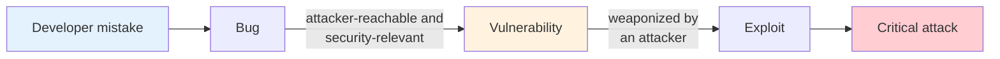

### 1.3 실제 사고 사례

강의는 소프트웨어 취약점의 영향을 보여 주는 여러 뉴스 헤드라인을 제시한다.

| 슬라이드의 헤드라인 | 결과 |
|:----------------------|:------------|
| Amcrest HDSeries 카메라의 치명적 결함으로 기기 완전 장악 가능 | **누군가 당신을 엿볼 수 있다.** |
| 바이러스로 TSMC 공장 가동 중단, 반도체 생산에 차질 | **공장이 멈춘다.** |
| Heartbleed가 웹에서 가장 위험한 보안 결함인 이유 | **약 50만 대의 서버가 영향을 받았다.** |
| 대만에서 Autopilot을 켠 Tesla가 전복된 트럭에 그대로 충돌하고 보행자를 무시함 | **Autopilot이 충돌 사고로 이어진다.** |
| 공격자가 의료 기기를 제어할 수 있음이 밝혀짐 | **의료 기기가 악의적으로 조작될 수 있다.** |

> **참고:** 이 중 두 사건은 대표적인 사례 연구이다. **Heartbleed**(CVE-2014-0160, 2014년)는 OpenSSL의 하트비트(heartbeat) 확장에서 경계 검사가 누락된 버그였다. 서버가 클라이언트가 보냈다고 *주장한* 길이만큼 바이트를 복사했기 때문에, 공격자는 요청 한 번에 최대 64 KB의 서버 메모리를 읽을 수 있었고, 여기에는 개인 키와 비밀번호가 포함될 수 있었다. **TSMC** 사건(2018년)은 패치되지 않은 제조 장비를 통해 확산된 WannaCry 랜섬웨어 웜의 변종 때문에 발생했으며, 생산 라인이 며칠간 멈췄다. 두 사건은 소프트웨어 결함 하나가 수십만 대의 서버나 산업 전체에 영향을 줄 수 있음을 보여 준다.

### 1.4 사이버 범죄의 경제적 피해

| 시간 단위 | 전 세계 사이버 범죄 피해 비용 |
|:-------------|:------------------------------|
| 연간 | **10.5조 달러** |
| 월간 | 8,750억 달러 |
| 주간 | 2,019억 달러 |
| 일간 | 288억 달러 |
| 시간당 | 12억 달러 |
| 분당 | 2,000만 달러 |
| 초당 | 332,900달러 |

- **10.5조 달러**는 2026년 전 세계 사이버 범죄 비용의 예상치이다.
- **15.6조 달러**는 2029년까지의 예측치이며, 이는 연평균 성장률(CAGR) 약 15%에 해당한다.
- 출처: Cybersecurity Ventures / Statista, 2026

### 1.5 새로운 공격 대상: AI, 로봇, 자율 시스템

이제 소프트웨어는 **AI 시스템, IoT 기기, 자율주행 차량, 휴머노이드 로봇**을 구동한다. 슬라이드는 로보택시와 로봇 이미지에 이어 영화 *터미네이터*의 이미지를 보여 주며 이 흐름을 표현한다. 핵심 메시지는 소프트웨어가 물리 세계를 직접 제어하게 될수록 침해된 시스템이 물리적 피해를 일으킬 수 있으므로, 이러한 시스템은 설계 단계부터 보안을 고려해야 한다는 것이다.

### 1.6 보안 연구자에 대한 수요

**기업, 연구소, 정부**를 비롯한 대부분의 기관은 보안 연구자를 필요로 한다.

| 지역 | 슬라이드에 제시된 예시 |
|:-------|:----------------------------|
| **대한민국** | NAVER, Kakao, Samsung, Hyundai, Samsung Research, NSR(국가보안기술연구소), ETRI 등 |
| **글로벌** | Google, Microsoft Research, Facebook(Meta), Amazon, IBM Research, Intel |

---

<br>

## 2. C/C++와 타입 및 메모리 안전성

### 2.1 어디에나 쓰이는 C/C++ (안전하지 않은 언어)

현대 컴퓨터 시스템은 **주로 C/C++로 구현**되어 있다.

| 분야 | C/C++로 구현된 예시 |
|:-------|:------------------------------|
| **운영체제 / 응용 프로그램** | Windows, iOS, Linux, Chrome, Firefox, LLVM |
| **AI** | PyTorch, TensorFlow, Microsoft CNTK, NVIDIA CUDA |
| **IoT** | TinyOS, Contiki, FreeRTOS |

> **[C프로그래밍]** C와 C++를 **안전하지 않은 언어(unsafe language)** 라고 부르는 이유는 언어가 실행 시간에 연산의 유효성을 검사하지 않기 때문이다. 예를 들어 `a[i]`는 `i`가 배열 범위 안에 있는지 검사하지 않고 "`a`의 주소에 `i`와 원소 크기를 곱한 값을 더한 주소"로 컴파일된다. 잘못된 접근은 **정의되지 않은 동작(UB, Undefined Behavior)** 으로 분류되며, 표준은 이때 무슨 일이 일어나야 하는지 규정하지 않는다. 따라서 프로그램은 비정상 종료되거나, 데이터를 조용히 손상시키거나, 공격자가 제어하는 상태로 계속 실행될 수 있다. 이러한 설계가 C/C++에 성능과 저수준 제어 능력을 제공하며, 바로 그 때문에 C/C++가 운영체제, 브라우저, AI 런타임을 지배하고 있다.

### 2.2 증가하는 취약점

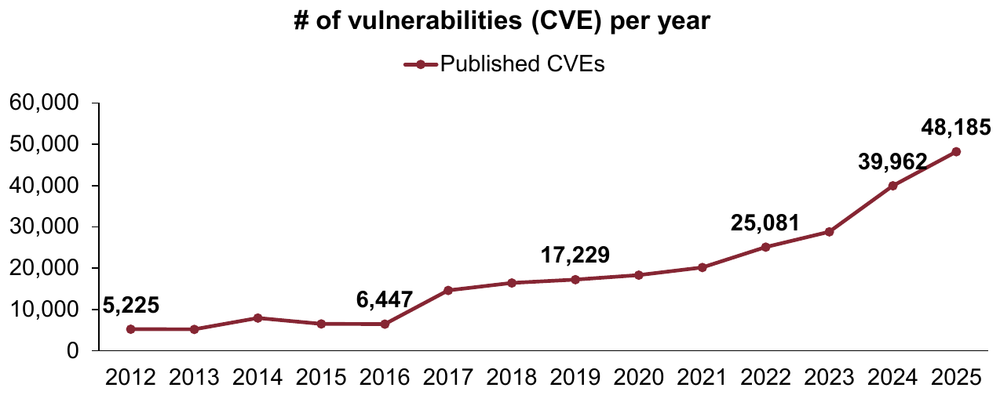

*Lecture 01, Slide 16 — 연도별 공개된 CVE 수 (2012년~2025년)*

| 연도 | 공개된 CVE 수 (그래프에 표시된 값) |
|:-----|:--------------------------------------------|
| 2012 | 5,225 |
| 2016 | 6,447 |
| 2019 | 17,229 |
| 2022 | 25,081 |
| 2024 | 39,962 |
| 2025 | **48,185** |

- 공개된 취약점의 수는 2012년부터 2025년까지 약 **9배** 증가하였다.
- 데이터 출처: CVE Program / NVD 연도별 공개 CVE 수 (2012년~2025년)

> **용어 정의:** **CVE(Common Vulnerabilities and Exposures)** 식별자(예: `CVE-2014-0160`)는 공개된 취약점 하나에 부여되는 고유한 공개 이름으로, 벤더, 연구자, 도구가 같은 문제를 모호함 없이 가리킬 수 있게 한다. NIST가 운영하는 **NVD(National Vulnerability Database)** 는 각 CVE에 0.0부터 10.0까지의 **CVSS** 심각도 점수와 같은 추가 정보를 덧붙인다. CVE 수의 증가는 소프트웨어 자체의 증가와 취약점 연구 및 공개 프로그램의 증가를 함께 반영한다.

### 2.3 흔하게 발생하는 타입 및 메모리 안전성 위반

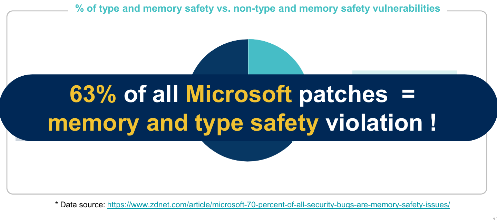

*Lecture 01, Slide 17 — Microsoft 전체 패치의 63%가 메모리 및 타입 안전성 위반*

- 슬라이드에 따르면 **Microsoft 전체 패치의 63%** 가 **메모리 및 타입 안전성 위반**에 대한 것이며, 나머지 37%가 그 밖의 취약점 유형에 대한 것이다.
- 데이터 출처: ZDNet, "Microsoft: 70 percent of all security bugs are memory safety issues"

> **참고:** 인용된 기사는 Microsoft가 매년 부여하는 CVE의 약 **70%** 가 메모리 안전성 문제라는 Microsoft 자체 분석을 보도한다. Google도 Chrome에 대해 비슷한 비율을 보고한 바 있다. 정확한 수치와 관계없이, 대규모 C/C++ 코드베이스에서 발생하는 심각한 취약점의 대부분이 이 한 범주에 속한다는 결론은 일관된다.

### 2.4 타입 안전성 위반 vs 메모리 안전성 위반

C/C++는 **성능을 얻기 위해 타입 안전성과 메모리 안전성을 포기**한다.

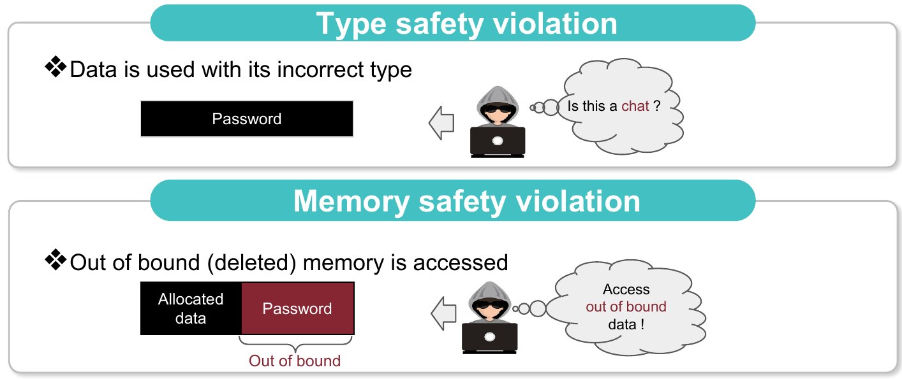

*Lecture 01, Slide 18 — 타입 안전성 위반(위)과 메모리 안전성 위반(아래)*

| 위반 유형 | 정의 | 슬라이드의 그림 설명 |
|:----------|:-----------|:--------------------------|
| **타입 안전성 위반(Type safety violation)** | 데이터가 **잘못된 타입**으로 사용된다. | `Password` 객체를 담은 메모리가 다른 타입으로 해석된다(공격자가 "이게 채팅인가?"라고 묻는다). |
| **메모리 안전성 위반(Memory safety violation)** | **범위를 벗어난(또는 해제된) 메모리**에 접근한다. | 할당된 데이터에서 시작한 접근이 범위를 넘어 인접한 `Password`에 닿는다(공격자가 범위 밖 데이터에 접근한다). |

> **핵심:** 메모리 안전성 위반은 보통 두 가지로 나뉜다. **공간적(spatial)** 위반은 객체의 *경계 밖* 메모리에 접근하는 것이다(예: 버퍼 오버플로우). **시간적(temporal)** 위반은 객체의 *수명이 끝난 뒤*, 즉 해제된 후에 접근하는 것이다(예: Use-After-Free, Double Free). **타입 안전성** 위반은 흔히 **타입 혼동(type confusion)** 이라고 부르며, 유효한 객체에 호환되지 않는 타입의 포인터로 접근하는 것이다. C++에서는 기반 클래스 포인터를 잘못된 파생 클래스로 `static_cast`를 이용해 검사 없이 다운캐스팅하는 경우가 대표적이며, 이후 필드와 가상 함수를 잘못된 오프셋에서 읽게 된다.

> **시험 팁:** 두 위반을 비교하라는 문제가 나오면 각각 *무엇이* 잘못되었는지를 서술한다. 메모리 안전성 위반에서는 접근의 **위치나 수명**이 잘못되었다. 타입 안전성 위반에서는 위치는 유효할 수 있지만, 데이터의 **해석**이 잘못되었다.

---

<br>

## 3. 대표적인 취약점

### 3.1 버퍼 오버플로우

버퍼 오버플로우(buffer overflow) 슬라이드는 우물에서 물이 넘쳐흐르는 사진을 보여 준다. 비유는 직접적이다. 버퍼가 담을 수 있는 것보다 많은 데이터를 쓰면, 넘친 데이터가 인접한 메모리로 흘러가 그곳에 저장된 값을 덮어쓴다.

> **[컴퓨터구조]** 대부분의 아키텍처에서 스택은 **낮은** 주소 방향으로 자라지만, 지역 배열에 대한 쓰기는 **높은** 주소 방향으로 진행된다. 일반적인 스택 프레임에서 지역 버퍼는 저장된 프레임 포인터와 함수의 **복귀 주소(return address)** *아래*에 위치한다. 따라서 지역 버퍼의 끝을 넘어 쓰면 저장된 프레임 포인터를 덮어쓰고, 이어서 복귀 주소를 덮어쓰게 된다. 함수가 반환될 때 CPU는 덮어쓰인 주소로 점프하므로, 공격자가 실행 흐름을 장악하게 된다. 이것이 고전적인 **스택 기반 버퍼 오버플로우**이며, 익스플로잇(Exploitation) 강의에서 자세히 다룬다.

### 3.2 공격 프리미티브: 임의 쓰기

```c
int global[10];

void set(int idx, int val) {
  global[idx] = val;
}
```

- `set()`은 `idx`가 `0`부터 `9` 사이에 있는지 전혀 검사하지 않는다.
- `idx`와 `val`을 모두 제어하는 공격자는 **`global` 주변 약 ±2 GB 범위의 임의의 4바이트 위치**를 **임의의 값**으로 설정할 수 있다.

> **용어 정의:** **공격 프리미티브(attack primitive)** 는 공격자가 버그로부터 얻는 기본적인 능력으로, "임의의 주소에 임의의 값 쓰기"(**임의 쓰기**, arbitrary write)나 "임의의 주소 읽기"(**임의 읽기**, arbitrary read) 등이 있다. 실제 익스플로잇은 이러한 프리미티브를 연결하여 만들어진다. 임의 쓰기는 가장 강력한 프리미티브 중 하나인데, 함수 포인터나 복귀 주소를 덮어쓰는 즉시 제어 흐름 탈취로 이어지기 때문이다.

> **참고:** ±2 GB라는 수치는 인덱스 자체의 범위에서 나온다. 부호 있는 32비트 `int`의 범위는 약 −2<sup>31</sup>부터 2<sup>31</sup>까지, 즉 약 ±20억 개의 원소이다. 엄밀히 말하면 컴파일러는 인덱스에 `sizeof(int)` = 4를 곱하므로, 64비트 플랫폼에서 도달 가능한 바이트 범위는 약 ±8 GB이다. 어느 쪽이든 공격자는 프로그램 데이터 근처의 중요한 메모리 대부분에 도달할 수 있다. 해결책은 `if (idx < 0 || idx >= 10) return;`과 같은 경계 검사를 추가하거나, 부호 없는 타입을 사용하고 상한을 검사하는 것이다.

### 3.3 공격 프리미티브: 위치가 제한된 임의 쓰기

```c
void vuln(char *u1) {
  /* assert(strlen(u1) < MAX); */
  char tmp[MAX];
  strcpy(tmp, u1);
  /* equivalent:
     while (*u1 != 0)
       *(tmp++) = *u1++;
   */
  return strcmp(tmp, "foo");
}
```

- 길이 검사(`assert`)가 주석 처리되어 있으므로, `strcpy`는 길이와 관계없이 `u1`을 `tmp`에 복사한다.
- `u1`을 제어하는 공격자는 **`tmp` 위쪽**의 스택 값을 **`\0`을 제외한** 임의의 바이트로 덮어쓸 수 있으며, 덮어쓴 영역은 항상 **`\0` 바이트로 끝난다**.

주석의 "equivalent" 반복문이 두 가지 제약을 모두 설명한다. 복사는 한 바이트씩 진행되다가 처음 만나는 0 바이트에서 멈추고, 이어서 `strcpy`가 종료 문자 `\0`을 덧붙인다. 3.2절과 비교하면 이 프리미티브는 두 측면에서 더 약하다.

| 속성 | 3.2절 (`global[idx]`) | 3.3절 (`strcpy`) |
|:---------|:---------------------------|:-----------------------|
| 위치 | `idx`로 선택한 임의의 오프셋 | `tmp` 바로 위의 연속된 영역만 가능 |
| 내용 | 임의의 4바이트 값 | `\0`을 제외한 임의의 바이트, 마지막은 `\0` |

> **[컴퓨터구조]** "`\0` 바이트 불가" 제약은 실제로 중요하다. x86-64에서 사용자 공간 주소는 `0x00007ffd12345678`과 같은 정규형(canonical) 48비트 값이므로 상위 2바이트가 0이다. 이러한 값으로 복귀 주소를 덮어쓰려는 공격자는 0이 아닌 하위 바이트들을 쓰고, 종료 문자 `\0`이 정확히 하나의 0 바이트를 채워 주도록 활용할 수 있다. 이러한 제약 때문에 익스플로잇 작성자는 페이로드를 신중하게 설계하며, "배드 문자(bad characters)"는 익스플로잇 개발에서 기본적으로 고려하는 요소이다.

### 3.4 Use After Free

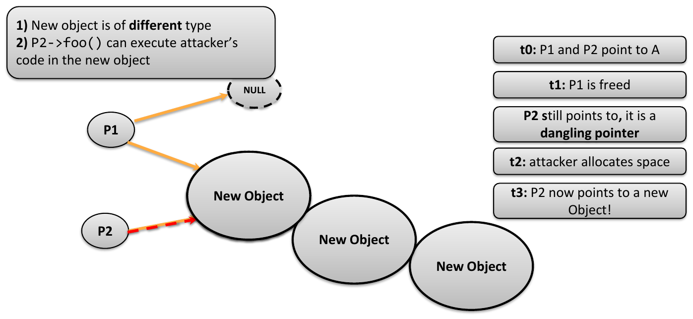

*Lecture 01, Slide 22 — Use After Free: 댕글링 포인터가 결국 새로운 객체를 가리키게 됨*

| 시점 | 사건 |
|:-----|:------|
| **t0** | `P1`과 `P2`가 모두 객체 `A`를 가리킨다. |
| **t1** | `A`가 `P1`을 통해 해제된다(그리고 `P1`은 `NULL`로 설정된다). 그러나 `P2`는 여전히 해제된 메모리를 가리키므로, `P2`는 **댕글링 포인터(dangling pointer)** 이다. |
| **t2** | 공격자가 공간을 할당하고, 할당기는 해제된 메모리를 재사용한다. |
| **t3** | 이제 `P2`는 **새로운 객체**를 가리킨다. |

이로 인해 두 가지 문제가 발생한다.

1. 새로운 객체는 **다른 타입**이므로, `P2`를 통한 접근은 타입 혼동이기도 하다.
2. `P2->foo()`가 새로운 객체에 심어진 **공격자의 코드**를 실행할 수 있다.

> **[운영체제]** glibc `malloc`과 같은 힙 할당기는 해제된 청크를 크기별 자유 리스트(free list)에 보관하고, 비슷한 크기의 다음 요청에 다시 내어 준다. 재사용이 빠르고 캐시 효율이 좋기 때문이다. 공격자는 이 동작을 악용하여 피해 객체를 해제시킨 직후, 내용을 자신이 제어하는 같은 크기의 객체를 할당한다. 이 기법을 **힙 그루밍(heap grooming)** 또는 **힙 펑수이(heap feng shui)** 라고 한다.

> **[객체지향프로그래밍]** C++에서 가상 함수를 가진 객체는 함수 주소 테이블을 가리키는 숨겨진 **vtable 포인터**(vptr)로 시작한다. `P2->foo()` 호출은 "`*P2`에서 vptr을 읽고, vtable에서 `foo`의 주소를 읽어, 그 주소로 점프"하는 코드로 컴파일된다. 공격자가 `P2`가 현재 가리키는 메모리를 제어한다면 vptr을 제어하게 되고, 따라서 호출이 점프할 주소도 제어하게 된다. 이것이 브라우저의 Use-After-Free 버그가 임의 코드 실행으로 자주 이어지는 이유이다.

---

<br>

## 4. 버그 찾기: 새니타이저, 퍼징, 버그 바운티

### 4.1 새니타이저

**새니타이저(sanitizer)** 는 **정책 위반을 디버깅하는** 도구이다. 실제 실행을 관찰하여 메모리 손상이나 메모리 누수와 같은 **잘못된 동작을 표시**한다. 새니타이저에는 여러 종류가 있다.

| 새니타이저 | 주요 탐지 대상 |
|:----------|:------------|
| **Address Sanitizer (ASan)** | 메모리 안전성 위반(범위 밖 접근, Use-After-Free, Double Free) |
| **Memory Sanitizer (MSan)** | 초기화되지 않은 메모리 읽기 |
| **Thread Sanitizer (TSan)** | 스레드 간 데이터 경쟁(data race) |
| **Undefined Behavior Sanitizer (UBSan)** | 정의되지 않은 동작(예: 부호 있는 정수 오버플로우, 잘못된 시프트, 정렬되지 않은 포인터나 널 포인터 사용) |

> **참고:** 새니타이저는 컴파일 시점에 활성화한다(예: `clang -fsanitize=address prog.c`). 새니타이저는 실제 실행 중에 발생한 위반만 보고하는 **동적** 도구이므로, 퍼저와 같은 입력 생성 도구와 함께 사용된다(4.3절).

### 4.2 Address Sanitizer (ASan)

Address Sanitizer는 **가장 널리 쓰이는 새니타이저**이다.

- **메모리 안전성 위반**에 초점을 맞춘다.
- 객체 주변에 **레드존(redzone)** 을 삽입한다.
- **섀도 메모리(shadow memory)** 를 사용하여 각 바이트의 접근 가능 여부를 기록한다.
- **1만 개 이상의 메모리 안전성 위반**을 탐지하였다.


*Lecture 01, Slide 24 — ASan은 매 접근 전에 섀도 메모리에서 `IsAccessible(p)`를 확인하며, 레드존에 닿으면 버그를 보고함*

탐지는 세 단계로 이루어진다.

1. **레드존:** 객체가 할당될 때, ASan은 그 앞뒤에 접근 불가능한 작은 영역(레드존)을 배치한다.
2. **섀도 메모리:** 별도의 메모리 영역이 프로세스 메모리의 각 바이트에 대해 접근 가능 여부를 기록한다. 레드존과 해제된 메모리는 접근 불가능으로 표시된다.
3. **삽입된 검사:** 컴파일러는 주소 `p`에 대한 모든 메모리 접근 앞에 `IsAccessible(p)` 검사를 삽입한다. `p`가 레드존(또는 해제된 메모리)에 속하면 ASan이 **버그**를 보고한다.

> **[컴퓨터구조]** 실제 구현에서는 섀도 바이트 하나가 애플리케이션 메모리 **8바이트**를 나타내며, 섀도 주소는 시프트와 덧셈으로 계산된다: `Shadow = (Addr >> 3) + Offset`. 섀도 값 0은 8바이트 전체가 접근 가능함을, 1부터 7까지의 값 *k*는 앞의 *k*바이트만 접근 가능함을, 음수 값은 레드존이나 해제된 메모리를 의미한다. 검사는 시프트, 덧셈, 로드, 비교만으로 이루어지므로, ASan은 프로그램을 보통 약 2배 정도만 느리게 만들며, 이는 대규모 테스트에 충분히 빠른 수준이다. 또한 해제된 메모리는 즉시 재사용되지 않고 일정 기간 **격리 구역(quarantine)** 에 보관되므로, Use-After-Free가 여전히 접근 불가능한 메모리에 닿게 된다.

### 4.3 퍼징

- **퍼징(fuzzing)** 은 프로그램을 대량의 무작위 입력으로 실행하는 **자동화된 소프트웨어 테스팅 기법**이다.
- 유발된 버그를 **탐지**하기 위해 퍼저는 **새니타이저를 활용**한다.
- **퍼저 + 새니타이저**는 널리 쓰이는 효과적인 조합이다.

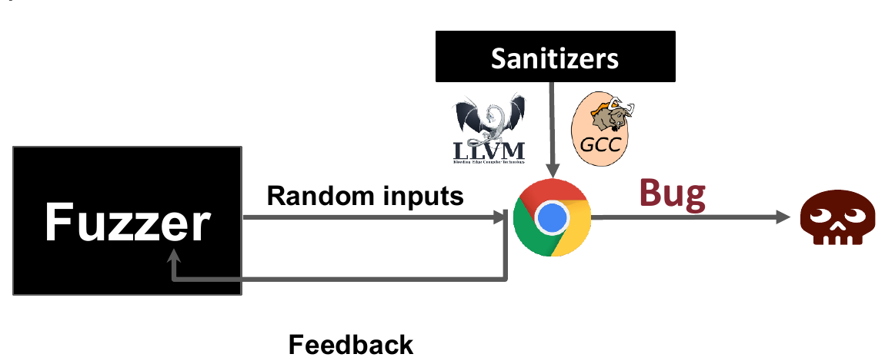

*Lecture 01, Slide 25 — 퍼저는 새니타이저가 삽입된 대상(예: LLVM이나 GCC로 빌드한 Chrome)에 무작위 입력을 보내고, 피드백을 활용하여 버그를 찾음*

두 도구는 서로를 보완한다. 퍼저는 버그가 있는 상태에 *도달*하는 데 능하지만, 조용히 일어나는 메모리 손상을 *알아차리는* 데는 약하다. 새니타이저는 손상이 일어나는 순간 이를 *알아차리는* 데 능하지만, 스스로 입력을 생성할 수는 없다. 두 도구를 결합하면, 그대로 지나칠 수 있었던 조용한 범위 밖 쓰기가 즉시 재현 가능한 비정상 종료 보고로 바뀐다.

> **[소프트웨어공학]** AFL, libFuzzer와 같은 현대 퍼저는 **커버리지 기반(coverage-guided)** 이다. 대상 프로그램에 계측 코드를 삽입하여 각 입력이 실행한 코드 경로(**커버리지**)를 기록한다. 새로운 코드에 도달한 입력은 **코퍼스(corpus)** 에 보관되어 계속 변이되고, 아무것도 추가하지 못한 입력은 버려진다. 이 피드백 루프 덕분에 퍼저는 순수한 무작위 입력 생성으로는 거의 도달할 수 없는 프로그램 깊숙한 곳까지 진행할 수 있다.

### 4.4 퍼징 팜

슬라이드는 **퍼징 팜(fuzzing farm)**, 즉 퍼저를 계속 실행하는 데 전용으로 쓰이는 기계(및 기기) 랙의 사진을 보여 준다. 퍼징은 시도 횟수가 결과를 좌우하므로, 조직들은 퍼징을 여러 기계로 확장하여 하루에 수십억 개의 테스트 입력을 실행한다.

> **참고:** 잘 알려진 예로 Chrome의 퍼저를 대규모 클러스터에서 실행하는 Google의 **ClusterFuzz**와, 그 오픈소스 버전으로서 주요 오픈소스 프로젝트를 지속적으로 퍼징하여 수만 개의 버그를 보고한 **OSS-Fuzz**가 있다.

### 4.5 버그 바운티 프로그램

기업들은 취약점을 책임감 있게 제보한 연구자에게 포상금을 지급한다.

| 프로그램 | 최대 포상금 |
|:--------|:---------------|
| Apple Security Bounty | 최대 **200만 달러** (2025년 11월부터 보너스 포함 시 500만 달러 이상) |
| Google Vulnerability Reward Program | 수백 달러부터 최대 **100만 달러** (Titan M 보안 칩) |
| Meta (Facebook) Bug Bounty Program | 최대 **30만 달러** (현재까지 누적 2,500만 달러 이상 지급) |
| Microsoft Bug Bounty Program | 최대 **25만 달러** |
| Intel Bug Bounty Program | 최대 **10만 달러** |

---

<br>

## 5. 연구 분야 1: C/C++의 타입 및 메모리 안전성 강화

S2 Lab은 세 분야에서 **소프트웨어 및 시스템 보안 강화**에 집중한다.

1. C/C++의 타입 및 메모리 안전성 강화
2. Rust 언어 보안
3. 자율주행 차량과 드론을 포함한 로봇 보안, 웹(브라우저) 보안, AI 보안

첫 번째 분야는 **고급 새니타이저와 퍼저 개발**에 초점을 맞춘다. 슬라이드에 제시된 연구는 다음과 같다.

| 새니타이저 | 학회 | 퍼저 | 학회 |
|:-----------|:------|:--------|:------|
| TypeSan | CCS'16 | FuZZan | USENIX ATC'20 |
| HexType | CCS'17 | SwarmFlawFinder | S&P'22 |
| PsyPry | SEC'23 | Autofuzz | CCS'22 |
| ERASan | S&P'24 | AHA-fuzz | CCS'25 |
| CMASan | S&P'25 | PathFinder | ICSE'25 |
| Type++ | NDSS'25 | iChecker | ASE'26 |
| | | RustGo | CCS'26 |

> **참고:** 표의 학회들은 해당 분야의 최상위 학회이다. **CCS**(ACM Conference on Computer and Communications Security), **S&P**(IEEE Symposium on Security and Privacy), **USENIX Security**(SEC), **NDSS**(Network and Distributed System Security Symposium)는 보안 분야의 "4대 학회"이다. ICSE와 ASE는 최상위 소프트웨어공학 학회이고, USENIX ATC는 최상위 시스템 학회이다. 예를 들어 TypeSan과 HexType은 C++ 프로그램의 **타입 혼동**(잘못된 캐스팅)을 탐지하며, 이는 2.4절의 타입 안전성 위반에 해당한다.

---

<br>

## 6. 연구 분야 2: Rust 언어 보안

### 6.1 왜 Rust인가

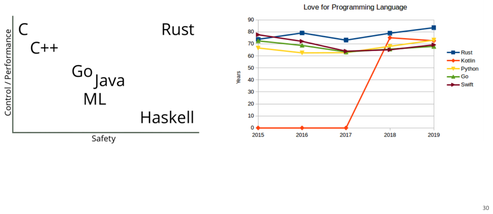

*Lecture 01, Slide 30 — 제어/성능과 안전성에 따른 언어의 위치(왼쪽)와 연도별 "프로그래밍 언어 선호도"(오른쪽)*

- **왼쪽 그래프:** C와 C++는 높은 제어 능력과 성능을 제공하지만 안전성은 낮다. Go, Java, ML은 제어 능력의 일부를 포기하고 안전성을 높였으며, Haskell은 높은 안전성을 제공하지만 제어 능력은 낮다. **Rust**는 오른쪽 위에 위치하여 제어/성능과 안전성을 **모두** 제공한다.
- **오른쪽 그래프:** 2015년부터 2019년까지의 개발자 선호도 조사(Rust, Kotlin, Python, Go, Swift)에서 Rust는 일관되게 가장 사랑받는 언어이다.

### 6.2 Rust의 확산

- **정부 정책:** "White House urges software developers to use memory-safe programming languages"(2024년 2월)라는 제목의 기사는, 백악관 사이버 담당 관계자에 따르면 세간의 이목을 끈 여러 사이버 공격이 메모리 안전성 결함에서 시작되었다고 보도한다.
- **Firefox:** Firefox에서 C/C++ 코드 줄의 비율은 꾸준히 감소하고, Rust 코드 줄의 비율은 증가하였다.

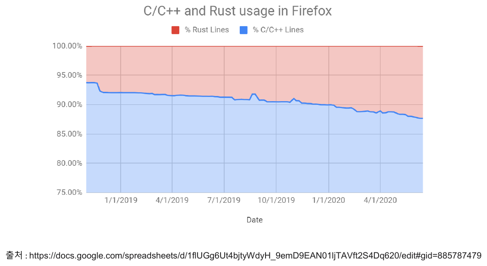

*Lecture 01, Slide 32 — Firefox의 C/C++와 Rust 사용 비율 (2019년~2020년)*

> **참고:** 그래프에서 C/C++ 비율(파란색)은 약 1년 반 만에 약 94%에서 약 88%로 감소하고, Rust 비율(빨간색)은 그만큼 증가한다. Mozilla는 애초에 더 안전한 브라우저 엔진을 작성하기 위해 Rust를 만들었으며, CSS 엔진(Stylo)과 같은 구성 요소를 Rust로 다시 작성하였다.

### 6.3 소유권


*Lecture 01, Slide 33 — `let x = v;`에서 변수 `x`가 값 `v`를 소유함*

- 할당된 모든 메모리는 **고유한 하나의 소유자에게 "소유"** 된다.
- **소유권은 다른 변수로 이전될 수 있다.**

```rust
let v = vec![1, 2, 3];   // v owns the heap-allocated vector
let x = v;               // ownership moves from v to x
// println!("{:?}", v);  // compile error: v no longer owns the value
```

> **[프로그래밍언어]** 소유자가 스코프를 벗어나면 Rust는 메모리를 자동으로 해제한다. 한 시점에 소유자가 정확히 하나뿐이므로 메모리는 정확히 한 번만 해제되며, 따라서 Double Free가 원천적으로 차단된다. 소유권이 이동(move)한 뒤에는 이전 변수를 더 이상 사용할 수 없으며, 컴파일러가 이를 정적으로 검사한다. 소유권을 넘기지 않는 일시적인 접근은 **빌림(borrowing)**(참조 `&T`와 `&mut T`)으로 허용되며, **빌림 검사기(borrow checker)** 가 이를 검사한다.

### 6.4 Rust가 메모리 안전성 위반을 방지하는 방법

| 위협 | Rust의 방어 메커니즘 |
|:-------|:-----------------|
| **댕글링 포인터** (시간적) | Rust는 **공유된 가변 별칭(shared mutable alias)을 금지**할 수 있다. |
| **버퍼 오버플로우** (공간적) | Rust는 일반적으로 객체의 **길이 필드**를 유지하고, **실행 시간에 경계 검사를 자동으로 수행**한다. |

> **[프로그래밍언어]** 별칭 규칙은 흔히 **"별칭 XOR 가변성(aliasing XOR mutability)"** 으로 요약된다. 어떤 시점에 하나의 값은 임의 개수의 공유 참조(`&T`)를 가지거나, 정확히 하나의 가변 참조(`&mut T`)를 가질 수 있지만, 두 가지를 동시에 가질 수는 없다. 또한 컴파일러는 어떤 참조도 그것이 가리키는 값보다 오래 살아남지 않음을 증명한다(수명 검사). 그 결과 3.4절처럼 `P1`을 통해 해제된 메모리를 `P2`가 계속 가리키는 상황은 컴파일 시점에 거부된다. 공간적 안전성 측면에서는 슬라이스와 벡터가 자신의 길이를 함께 가지고 있으며, 범위를 벗어난 인덱스는 조용한 메모리 손상 대신 통제된 **패닉(panic)** 을 일으킨다.

### 6.5 Unsafe Rust

Rust 안에는 이러한 메모리 안전성 보장을 강제하지 않는 **숨겨진 두 번째 언어**가 있다. **Unsafe Rust**는 일반 Rust와 똑같이 동작하지만, 다음과 같은 추가 "초능력"을 제공한다.

1. 원시 포인터(raw pointer) 역참조
2. unsafe 함수나 메서드 호출
3. 가변 정적 변수(mutable static variable)에 접근하거나 수정

**따라서 Rust가 완전히 안전한 것은 아니다!**

> **참고:** 저수준 코드(운영체제 인터페이스, 하드웨어 접근, FFI를 통한 C 라이브러리 호출)는 컴파일러가 검증할 수 없으므로, 실제로는 Unsafe Rust를 피할 수 없다. `unsafe` 블록 안의 버그나 Rust에서 호출하는 C/C++ 코드의 버그는 프로그램 전체의 보장을 깨뜨릴 수 있다. 이것이 unsafe Rust의 보호와 **교차 언어 보안**(C/C++와 혼용된 Rust)이 활발한 연구 분야인 이유이다.

---

<br>

## 7. 연구 분야 3: 자율주행 차량 및 드론 보안

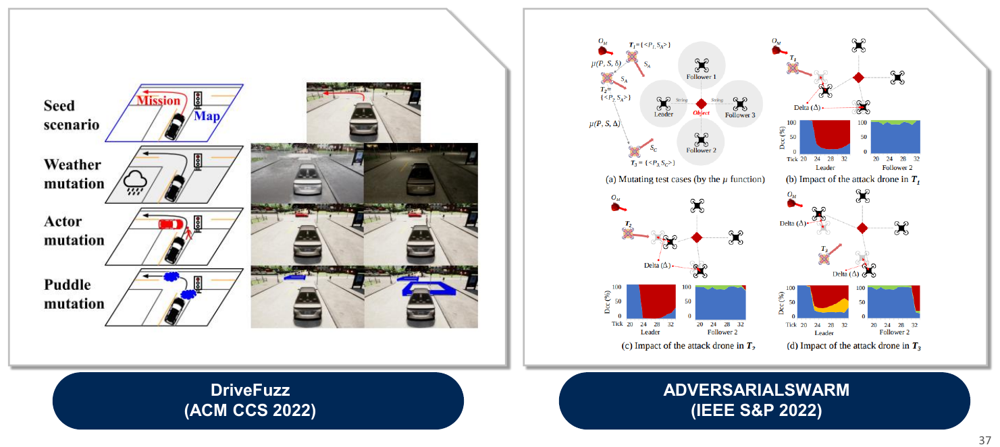

*Lecture 01, Slide 37 — DriveFuzz(ACM CCS 2022)는 주행 시나리오를 변이하고, AdversarialSwarm(IEEE S&P 2022)은 드론 군집을 테스트함*

세 번째 분야는 자율주행 차량이나 드론 군집과 같은 **사이버 물리 시스템(cyber-physical system)** 에 보안 테스팅을 적용한다.

### 7.1 동기

- 자율주행은 **현실이 되어 가고 있다**(Tesla 이미지).
- **하지만 자율주행 시스템을 정말 신뢰할 수 있을까?** 슬라이드는 두 가지 뉴스 보도를 보여 준다. 하나는 대만에서 Autopilot을 켠 Tesla가 전복된 트럭에 그대로 충돌한 사건이고, 다른 하나는 Autopilot 상태의 Tesla가 경찰차를 들이받고, 그 경찰차가 다시 구급차를 들이받은 사건이다.
- 이러한 시스템의 견고성을 보장하는 방법으로 **철저한 테스팅**이 흔히 제안된다.

### 7.2 해결 과제

"Will Tesla Autopilot hit a dog, human, or traffic cone?"과 "Will a Tesla KILL a cat?"이라는 제목의 YouTube 실험은 특이한 상황에서 실제 차량의 동작을 확신할 수 없음을 보여 준다. 이러한 시스템의 테스트에는 두 가지 과제가 있다.

1. 입력 공간이 무한하므로, **모든 코너 케이스를 테스트하는 것은 사실상 불가능하다.**
2. **종단 간(end-to-end) 테스팅 프레임워크가 없다.** 개별 구성 요소는 테스트되지만, 시스템 전체는 테스트되지 않는다.

따라서 **(1) 자율주행 시스템을 위한 종단 간 테스팅 프레임워크로서, (2) 코너 케이스 버그를 다룰 수 있는 것**이 필요하다.

### 7.3 배경: 퍼징

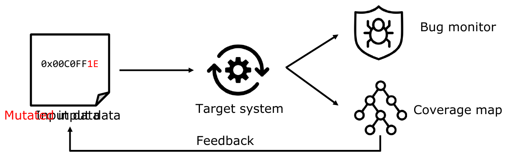

*Lecture 01, Slide 44 — 퍼저는 변이된 입력을 대상 시스템에 제공하고, 버그 모니터와 커버리지 맵을 피드백으로 활용함*

퍼징은 다음과 같은 루프로 동작하는 자동화된 소프트웨어 테스팅 기법이다.

1. 대상 시스템이나 프로그램에 **무작위 데이터를 입력으로 제공**한다.
2. **버그가 유발되었는지 확인**하고, 코드 커버리지를 수집한다.
3. 결과(피드백)를 바탕으로 **입력을 변이**한다.

> **핵심 연구 질문:** 퍼징을 자율주행 시스템에 어떻게 적용할 수 있을까?

> **참고:** 어려운 점은 자동차의 "입력"이 바이트 문자열이 아니라 물리적 장면 전체이고, "버그"가 비정상 종료가 아니라 안전하지 않은 주행 행동이라는 것이다. 따라서 퍼징을 적용하려면 세 가지를 다시 정의해야 한다. 입력이 무엇인지(주행 시나리오), 입력을 어떻게 변이하는지(장면 변경), 버그를 어떻게 탐지하는지(새니타이저 대신 충돌, 차선 침범 등의 위반을 탐지하는 주행 품질 모니터)이다.

### 7.4 AutoFuzzer: 입력 변이

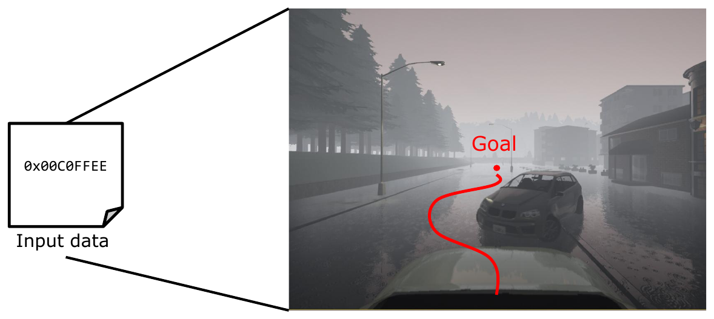

*Lecture 01, Slide 46 — 입력은 시뮬레이터 안의 주행 장면이며, 자율주행 차량이 도달해야 할 목표 지점을 포함함*

퍼저(슬라이드에서는 **AutoFuzzer**라고 부른다)의 입력은 **날씨, 물웅덩이, 주변 객체(actor)** 가 변이되는 **주행 장면**이다.

**날씨 변이:**

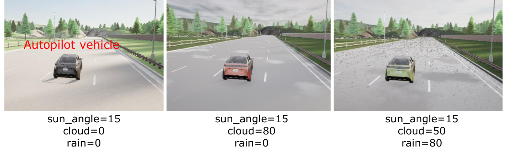

*Lecture 01, Slide 47 — 구름과 비 매개변수를 다르게 설정한 같은 장면*

| 장면 | `sun_angle` | `cloud` | `rain` |
|:------|:-----------:|:-------:|:------:|
| 1 | 15 | 0 | 0 |
| 2 | 15 | 80 | 0 |
| 3 | 15 | 50 | 80 |

**주변 객체 변이:**


*Lecture 01, Slide 48 — 장면에 다른 차량과 보행자를 추가함*

- 장면 1: 움직이는 차량 1대와 정지한 차량 1대
- 장면 2: 걸어가는 보행자 1명과 정지한 차량 1대

### 7.5 AutoFuzzer: 발견된 버그

**AutoFuzzer는 20개의 치명적인 버그를 발견하였다!**

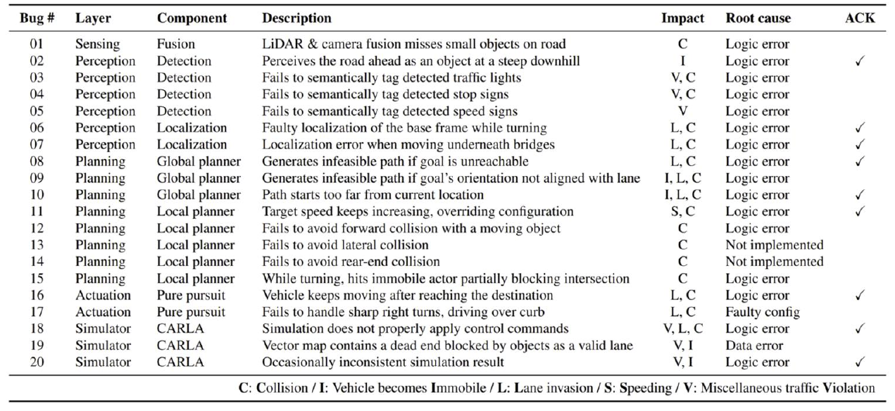

*Lecture 01, Slide 49 — 계층, 구성 요소, 영향, 근본 원인별로 분류한 20개의 치명적인 버그*

| 계층 | 버그 수 | 예시 |
|:------|:----:|:---------|
| **센싱(Sensing)** | 1 | LiDAR와 카메라 융합이 도로 위의 작은 물체를 놓친다. |
| **인지(Perception)** | 6 | 탐지한 신호등, 정지 표지판, 속도 표지판에 의미 태그를 붙이지 못한다. 회전 중이나 다리 아래에서 위치 추정 오류가 발생한다. |
| **계획(Planning)** | 8 | 실행 불가능한 경로를 생성한다. 목표 속도가 계속 증가한다. 전방, 측면, 후방 충돌을 회피하지 못한다. |
| **구동(Actuation)** | 2 | 목적지에 도착한 후에도 차량이 계속 움직인다. 급격한 우회전을 처리하지 못한다. |
| **시뮬레이터(Simulator)** | 3 | 제어 명령이 제대로 적용되지 않는다. 막다른 길을 유효한 차선으로 취급한다. 시뮬레이션 결과가 일관되지 않는다. |

- **영향 범례:** C = 충돌(Collision), I = 차량 정지 불능(vehicle becomes Immobile), L = 차선 침범(Lane invasion), S = 과속(Speeding), V = 기타 교통 위반(miscellaneous traffic Violation)
- **근본 원인:** 대부분의 버그는 **논리 오류(logic error)** 이며, 나머지는 구현되지 않은 기능, 잘못된 설정, 데이터 오류이다. 많은 버그가 개발자에 의해 확인(ACK)되었다.
- 이 부분의 마지막 슬라이드는 교차로를 위에서 내려다본 장면으로, 차량의 계획 경로가 안전하지 않은 주행으로 이어지는 모습을 보여 준다.

> **참고:** C/C++의 메모리 안전성 버그와 달리, 이 버그들의 대부분은 **논리 오류**이다. 메모리가 손상되지 않으므로 새니타이저로는 탐지할 수 없다. 이것이 사이버 물리 시스템을 퍼징하려면 교통 규칙과 충돌을 이해하는 도메인 특화 버그 모니터가 필요한 이유이다.

---

<br>

## 요약

| 개념 | 핵심 요약 |
|:--------|:------------|
| 중요성 | 개발자의 실수는 취약점이 되고, 취약점과 해커가 만나면 치명적인 공격이 되며, 2026년 예상 피해 비용은 10.5조 달러이다. |
| 안전하지 않은 언어 | 현대 시스템(운영체제, 브라우저, AI 프레임워크, IoT)은 주로 C/C++로 작성되며, C/C++는 성능을 위해 타입 및 메모리 안전성을 포기한다. |
| 추세 | 공개된 CVE는 5,225개(2012년)에서 48,185개(2025년)로 증가하였고, Microsoft 보안 문제의 약 63%~70%가 메모리 및 타입 안전성 위반이다. |
| 타입 안전성 위반 | 데이터가 잘못된 타입으로 사용된다(타입 혼동). |
| 메모리 안전성 위반 | 범위를 벗어난(공간적) 메모리나 해제된(시간적) 메모리에 접근한다. |
| 임의 쓰기 | 검사되지 않은 인덱스(`global[idx] = val`)로 공격자가 배열 근처에 임의의 값을 쓸 수 있다. |
| `strcpy` 오버플로우 | 버퍼 위쪽의 스택을 0이 아닌 바이트로 덮어쓰며, 마지막은 `\0`으로 끝난다. |
| Use After Free | 댕글링 포인터가 재할당된, 공격자가 제어하는 객체를 가리키게 되며, 이후 가상 함수 호출이 공격자의 코드를 실행할 수 있다. |
| 새니타이저 | ASan(메모리), MSan(초기화되지 않은 읽기), TSan(데이터 경쟁), UBSan(정의되지 않은 동작)이 있으며, ASan은 레드존과 섀도 메모리를 사용한다. |
| 퍼징 | 변이된 입력과 피드백을 사용하는 자동화된 테스팅이며, 조용한 버그를 탐지하기 위해 새니타이저와 결합한다. |
| 버그 바운티 | 벤더는 책임감 있게 공개된 취약점에 최대 수백만 달러를 지급한다. |
| Rust | 소유권, 별칭 XOR 가변성, 실행 시간 경계 검사로 메모리 안전성 위반을 방지하지만, unsafe Rust는 이 보장을 깨뜨린다. |
| 자율 시스템 | 주행 시나리오(날씨, 물웅덩이, 주변 객체)를 퍼징하여 20개의 치명적인 버그를 발견하였으며, 대부분 논리 오류였다. |

---

<br>

## 점검 문제

1. **타입 vs 메모리 안전성:** 타입 안전성 위반과 메모리 안전성 위반의 차이는 무엇인가? 각각의 예를 하나씩 들어라.

   > **정답:** **타입 안전성 위반**에서는 데이터가 잘못된 타입으로 사용된다. 예를 들어 잘못된 `static_cast` 이후 `Password` 객체에 다른 클래스의 포인터로 접근하면, 그 바이트들이 잘못된 오프셋에서 해석된다. **메모리 안전성 위반**에서는 객체의 경계 밖 메모리(공간적)나 이미 해제된 메모리(시간적)에 접근한다. 예를 들어 버퍼 오버플로우는 배열의 끝을 넘어 인접한 `Password`를 읽고, Use-After-Free는 해제된 객체에 접근한다.

2. **임의 쓰기:** `void set(int idx, int val) { global[idx] = val; }`에서 공격자가 임의 쓰기 프리미티브를 얻는 이유는 무엇이며, 함수를 어떻게 수정해야 하는가?

   > **정답:** 이 함수는 `idx`가 0부터 9 사이인지 검사하지 않으며, `global[idx]`는 `global + idx * 4`로 계산된다. 공격자는 `idx`(양수든 음수든 임의의 부호 있는 32비트 값)와 `val`을 모두 제어하므로, `global` 주변의 거의 모든 위치(예: 함수 포인터)에 임의의 4바이트 값을 쓸 수 있다. 해결책은 `if (idx < 0 || idx >= 10) return;`과 같은 경계 검사이다.

3. **`strcpy` 오버플로우:** `strcpy` 예제에서 공격자가 덮어쓸 수 있는 위치는 어디이며, 공격자가 `\0` 바이트를 자유롭게 쓸 수 없는 이유는 무엇인가?

   > **정답:** 공격자는 `tmp` 바로 위의 연속된 스택 영역만 덮어쓸 수 있으며, 여기에는 다른 지역 변수, 저장된 프레임 포인터, 복귀 주소가 포함된다. `strcpy`는 원본에서 처음 `\0`을 만날 때까지 바이트를 복사한 뒤 종료 문자 `\0`을 쓰므로, 페이로드 중간에 0 바이트를 넣을 수 없으며, 덮어쓴 영역은 항상 정확히 하나의 `\0`으로 끝난다.

4. **Use After Free:** t0부터 t3까지의 Use-After-Free 시나리오를 설명하고, `P2->foo()`가 공격자의 코드를 실행할 수 있는 이유를 설명하라.

   > **정답:** t0에서 `P1`과 `P2`는 객체 `A`를 가리킨다. t1에서 `A`가 `P1`을 통해 해제되지만 `P2`는 여전히 이를 가리키므로 댕글링 포인터가 된다. t2에서 공격자가 새 객체를 할당하고, 할당기는 해제된 메모리를 재사용한다. t3에서 `P2`는 공격자가 제어하는 새 객체를 가리킨다. `foo`가 가상 함수라면 `P2->foo()`는 `P2`가 가리키는 객체에서 vtable 포인터를 읽는데, 이제 이 값을 공격자가 제어하므로 호출은 공격자가 선택한 주소로 점프한다.

5. **ASan:** ASan은 범위 밖 접근을 어떻게 탐지하는가?

   > **정답:** ASan은 모든 객체 주변에 접근 불가능한 **레드존**을 삽입하고, 프로그램 메모리의 각 바이트가 접근 가능한지를 **섀도 메모리**에 기록한다. 컴파일러는 모든 메모리 접근 앞에 `IsAccessible(p)` 검사를 삽입한다. 레드존(또는 마찬가지로 접근 불가능으로 표시된 해제된 메모리)에 닿는 접근은 검사에 실패하며, ASan은 정확한 위치와 함께 버그를 보고한다.

6. **퍼저 + 새니타이저:** 퍼저를 새니타이저와 함께 사용하는 이유는 무엇인가?

   > **정답:** 퍼저는 많은 입력을 생성하여 다양한 프로그램 상태를 탐색하지만, 많은 메모리 손상은 조용히 일어나 프로그램을 비정상 종료시키지 않으므로 퍼저가 이를 알아차리지 못한다. 새니타이저는 이러한 조용한 위반을 즉시 재현 가능한 보고로 바꾸지만, 스스로 입력을 생성할 수는 없다. 따라서 두 도구를 결합하면 버그에 도달하는 것과 탐지하는 것을 모두 해낼 수 있다.

7. **Rust의 안전성:** Rust는 댕글링 포인터와 버퍼 오버플로우를 어떻게 방지하며, Rust가 "완전히 안전하지는 않은" 이유는 무엇인가?

   > **정답:** 모든 값에는 고유한 소유자가 있으며, 소유자가 스코프를 벗어날 때 정확히 한 번 해제된다. 빌림 검사기는 공유된 가변 별칭을 금지하고 참조가 값보다 오래 살아남지 않도록 보장하여 댕글링 포인터를 방지한다. 슬라이스와 벡터 같은 객체는 길이 필드를 가지며 인덱싱은 실행 시간에 경계 검사를 받으므로, 버퍼 오버플로우가 방지된다. 그러나 **unsafe Rust**는 원시 포인터 역참조, unsafe 함수 호출, 가변 정적 변수 접근을 허용하며 컴파일러는 이를 검사하지 않으므로, unsafe 코드(또는 Rust에서 호출하는 C/C++ 코드)의 버그가 여전히 메모리 안전성을 깨뜨릴 수 있다.

8. **자율주행 퍼징:** 자율주행 시스템의 테스트가 어려운 이유는 무엇이며, 강의에서 소개한 퍼저는 입력을 어떻게 정의하고 변이하는가?

   > **정답:** 물리 세계의 입력 공간은 무한하므로 모든 코너 케이스를 테스트할 수 없으며, 기존 테스트는 시스템 전체가 아니라 개별 구성 요소를 검사한다. 이 퍼저는 시뮬레이터에서 종단 간 테스트를 수행한다. 입력은 주행 장면이며, 날씨(태양 각도, 구름, 비), 물웅덩이, 주변 객체(움직이거나 정지한 차량과 보행자)를 변이한다. 버그는 충돌, 정지 불능, 차선 침범, 과속, 기타 교통 위반과 같은 안전하지 않은 주행 결과로 탐지되며, 이를 통해 20개의 치명적인 버그를 발견하였다.

---
