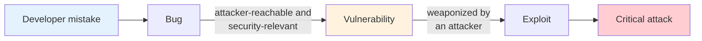

# Lecture 01 — Introduction

> **Last Updated:** 2026-10-06
>
> Software Security: Principles, Policies, and Protection, Payer - Ch 1

> **Learning Objectives**:
> 1. Explain why software vulnerabilities lead to critical real-world attacks and economic damage
> 2. Distinguish type safety violations from memory safety violations, and explain why C/C++ programs suffer from both
> 3. Describe buffer overflows, arbitrary write primitives, and use-after-free with concrete code examples
> 4. Explain how sanitizers (in particular ASan) and fuzzers work, and why they are combined
> 5. Summarize how Rust prevents memory safety violations and why unsafe Rust still needs protection
> 6. Explain why testing autonomous driving systems is difficult and how fuzzing can be applied to them

---

## Table of Contents

- [1. Why Software Security Matters](#1-why-software-security-matters)
  - [1.1 Software Is Everywhere](#11-software-is-everywhere)
  - [1.2 Vulnerabilities, Hackers, and Critical Attacks](#12-vulnerabilities-hackers-and-critical-attacks)
  - [1.3 Real-World Incidents](#13-real-world-incidents)
  - [1.4 Economic Damage of Cybercrime](#14-economic-damage-of-cybercrime)
  - [1.5 Emerging Targets: AI, Robots, and Autonomous Systems](#15-emerging-targets-ai-robots-and-autonomous-systems)
  - [1.6 Demand for Security Researchers](#16-demand-for-security-researchers)
- [2. C/C++ and Type and Memory Safety](#2-cc-and-type-and-memory-safety)
  - [2.1 C/C++ (Unsafe Languages) Are Everywhere](#21-cc-unsafe-languages-are-everywhere)
  - [2.2 Vulnerabilities on the Rise](#22-vulnerabilities-on-the-rise)
  - [2.3 Type and Memory Safety Violations Are Common](#23-type-and-memory-safety-violations-are-common)
  - [2.4 Type Safety Violation vs. Memory Safety Violation](#24-type-safety-violation-vs-memory-safety-violation)
- [3. Representative Vulnerabilities](#3-representative-vulnerabilities)
  - [3.1 Buffer Overflow](#31-buffer-overflow)
  - [3.2 Attack Primitive: Arbitrary Writing](#32-attack-primitive-arbitrary-writing)
  - [3.3 Attack Primitive: Arbitrary Writing, Limited Location](#33-attack-primitive-arbitrary-writing-limited-location)
  - [3.4 Use After Free](#34-use-after-free)
- [4. Finding Bugs: Sanitizers, Fuzzing, and Bug Bounties](#4-finding-bugs-sanitizers-fuzzing-and-bug-bounties)
  - [4.1 Sanitizers](#41-sanitizers)
  - [4.2 Address Sanitizer (ASan)](#42-address-sanitizer-asan)
  - [4.3 Fuzzing](#43-fuzzing)
  - [4.4 Fuzzing Farm](#44-fuzzing-farm)
  - [4.5 Bug Bounty Programs](#45-bug-bounty-programs)
- [5. Research Area 1: Enforcing Type and Memory Safety in C/C++](#5-research-area-1-enforcing-type-and-memory-safety-in-cc)
- [6. Research Area 2: Rust Language Security](#6-research-area-2-rust-language-security)
  - [6.1 Why Rust](#61-why-rust)
  - [6.2 Adoption of Rust](#62-adoption-of-rust)
  - [6.3 Ownership](#63-ownership)
  - [6.4 How Rust Prevents Memory Safety Violations](#64-how-rust-prevents-memory-safety-violations)
  - [6.5 Unsafe Rust](#65-unsafe-rust)
- [7. Research Area 3: Autonomous Vehicle and Drone Security](#7-research-area-3-autonomous-vehicle-and-drone-security)
  - [7.1 Motivation](#71-motivation)
  - [7.2 Challenges](#72-challenges)
  - [7.3 Background: Fuzzing](#73-background-fuzzing)
  - [7.4 AutoFuzzer: Input Mutation](#74-autofuzzer-input-mutation)
  - [7.5 AutoFuzzer: Detected Bugs](#75-autofuzzer-detected-bugs)
- [Summary](#summary)
- [Self-Check Questions](#self-check-questions)

---

<br>

## 1. Why Software Security Matters

### 1.1 Software Is Everywhere

Computers and software are no longer limited to desktop machines. They control **servers, factories, hospitals, vehicles, aircraft, and city infrastructure**. As a result, a flaw in software is no longer just an inconvenience; it can directly affect physical safety and critical infrastructure.

### 1.2 Vulnerabilities, Hackers, and Critical Attacks

The lecture summarizes the threat with a simple equation:

$$\text{Developers' mistakes} \rightarrow \text{Vulnerabilities in software}, \qquad \text{Vulnerabilities} + \text{Hackers} = \text{Critical attacks}$$

Developers inevitably make mistakes, and some of those mistakes become **vulnerabilities**. When an attacker discovers and abuses a vulnerability, the result is a critical attack.

> **Definition:** Three terms are often confused. A **bug** is any deviation of a program from its intended behavior. A **vulnerability** is a bug that an attacker can use to violate a security property (confidentiality, integrity, or availability). An **exploit** is a concrete input or program that triggers a vulnerability to achieve the attacker's goal. Therefore, every vulnerability is a bug, but not every bug is a vulnerability. This distinction is treated formally in Lecture 02.



### 1.3 Real-World Incidents

The lecture presents several news headlines that show the impact of software vulnerabilities.

| Headline on the Slide | Consequence |
|:----------------------|:------------|
| Critical flaws in Amcrest HDSeries cameras allow complete takeover | **Someone can spy on you.** |
| A virus shuts down TSMC factories and impacts chip production | **Factories are shut down.** |
| Why Heartbleed is the most dangerous security flaw on the web | **About 500,000 servers were affected.** |
| A Tesla in Taiwan crashes directly into an overturned truck and ignores a pedestrian with Autopilot on | **Autopilot leads to a crash.** |
| Medical devices are found to be controllable by attackers | **Medical devices can be maliciously controlled.** |

> **Note:** Two of these incidents are classic case studies. **Heartbleed** (CVE-2014-0160, 2014) was a missing bounds check in the heartbeat extension of OpenSSL. The server copied as many bytes as the client *claimed* to send, so an attacker could read up to 64 KB of server memory per request, including private keys and passwords. The **TSMC** incident (2018) was caused by a variant of the WannaCry ransomware worm that spread through unpatched fab equipment and halted production lines for several days. Both show that a single software flaw can affect hundreds of thousands of servers or an entire industry.

### 1.4 Economic Damage of Cybercrime

| Unit of Time | Global Cybercrime Damage Cost |
|:-------------|:------------------------------|
| Per year | **$10.5 trillion** |
| Per month | $875 billion |
| Per week | $201.9 billion |
| Per day | $28.8 billion |
| Per hour | $1.2 billion |
| Per minute | $20 million |
| Per second | $332,900 |

- **$10.5T** is the projected global cost of cybercrime in 2026.
- **$15.6T** is the forecast by 2029, which corresponds to a compound annual growth rate (CAGR) of about 15%.
- Source: Cybersecurity Ventures / Statista, 2026

### 1.5 Emerging Targets: AI, Robots, and Autonomous Systems

Software now drives **AI systems, IoT devices, autonomous vehicles, and humanoid robots**. The slides illustrate this trend with images of robotaxis and robots, followed by images of the *Terminator*. The message is that as software gains direct control over the physical world, a compromised system can cause physical harm, so security must be considered from the design stage of these systems.

### 1.6 Demand for Security Researchers

Most organizations, including **companies, research laboratories, and governments**, need security researchers.

| Region | Examples Shown on the Slide |
|:-------|:----------------------------|
| **South Korea** | NAVER, Kakao, Samsung, Hyundai, Samsung Research, NSR (National Security Research Institute), ETRI, and others |
| **Global** | Google, Microsoft Research, Facebook (Meta), Amazon, IBM Research, Intel |

---

<br>

## 2. C/C++ and Type and Memory Safety

### 2.1 C/C++ (Unsafe Languages) Are Everywhere

Modern computer systems are **mainly implemented in C/C++**.

| Domain | Examples Implemented in C/C++ |
|:-------|:------------------------------|
| **Operating systems / applications** | Windows, iOS, Linux, Chrome, Firefox, LLVM |
| **AI** | PyTorch, TensorFlow, Microsoft CNTK, NVIDIA CUDA |
| **IoT** | TinyOS, Contiki, FreeRTOS |

> **[C Programming]** C and C++ are called **unsafe languages** because the language does not check whether an operation is valid at run time. For example, `a[i]` is compiled to "the address of `a` plus `i` times the element size" without any check that `i` lies within the array. An invalid access is classified as **undefined behavior (UB)**: the standard places no requirement on what happens, so the program may crash, silently corrupt data, or continue in an attacker-controlled state. This design choice gives C/C++ their performance and low-level control, which is exactly why they dominate operating systems, browsers, and AI runtimes.

### 2.2 Vulnerabilities on the Rise


*Lecture 01, Slide 16 — Number of published CVEs per year (2012 to 2025)*

| Year | Published CVEs (values labeled on the chart) |
|:-----|:--------------------------------------------|
| 2012 | 5,225 |
| 2016 | 6,447 |
| 2019 | 17,229 |
| 2022 | 25,081 |
| 2024 | 39,962 |
| 2025 | **48,185** |

- The number of published vulnerabilities increased about **nine times** between 2012 and 2025.
- Data source: CVE Program / NVD annual published CVE counts (2012 to 2025)

> **Definition:** A **CVE (Common Vulnerabilities and Exposures)** identifier, such as `CVE-2014-0160`, is a unique public name assigned to one disclosed vulnerability, so that vendors, researchers, and tools can refer to the same issue unambiguously. The **NVD (National Vulnerability Database)**, operated by NIST, enriches each CVE with additional data, such as a **CVSS** severity score from 0.0 to 10.0. The rising count reflects both the growth of software and the growth of vulnerability research and disclosure programs.

### 2.3 Type and Memory Safety Violations Are Common


*Lecture 01, Slide 17 — 63% of all Microsoft patches are memory and type safety violations*

- According to the slide, **63% of all Microsoft patches** address **memory and type safety violations**, and the remaining 37% address other vulnerability classes.
- Data source: ZDNet, "Microsoft: 70 percent of all security bugs are memory safety issues"

> **Note:** The cited article reports Microsoft's own analysis that roughly **70%** of the CVEs it assigns each year are memory safety issues. Google has reported a similar proportion for Chrome. Regardless of the exact figure, the consistent conclusion is that the majority of severe vulnerabilities in large C/C++ code bases fall into this single category.

### 2.4 Type Safety Violation vs. Memory Safety Violation

C/C++ **trade type and memory safety for performance**.


*Lecture 01, Slide 18 — Type safety violation (top) and memory safety violation (bottom)*

| Violation | Definition | Illustration on the Slide |
|:----------|:-----------|:--------------------------|
| **Type safety violation** | Data is used with its **incorrect type**. | Memory holding a `Password` object is interpreted as a different type (the attacker asks, "Is this a chat?"). |
| **Memory safety violation** | **Out-of-bounds (or deleted) memory** is accessed. | An access that starts in the allocated data runs out of bounds into the adjacent `Password` (the attacker accesses out-of-bound data). |

> **Key Point:** Memory safety violations are usually divided into two classes. A **spatial** violation accesses memory *outside the bounds* of an object (e.g., a buffer overflow). A **temporal** violation accesses an object *outside its lifetime*, that is, after it has been freed (e.g., use-after-free, double free). A **type safety** violation, often called **type confusion**, accesses a valid object through a pointer of an incompatible type. In C++, a typical case is an unchecked downcast with `static_cast` from a base class pointer to the wrong derived class, after which fields and virtual functions are read at the wrong offsets.

> **Exam Tip:** When asked to compare the two violations, state *what* is wrong in each case. In a memory safety violation, the **location or lifetime** of the access is wrong. In a type safety violation, the location may be valid, but the **interpretation** of the data is wrong.

---

<br>

## 3. Representative Vulnerabilities

### 3.1 Buffer Overflow

The slide on buffer overflow shows a photograph of water overflowing a well. The analogy is direct: when more data is written into a buffer than it can hold, the excess spills into the adjacent memory and overwrites whatever is stored there.

> **[Computer Architecture]** On most architectures, the stack grows toward **lower** addresses, while writes into a local array proceed toward **higher** addresses. In a typical stack frame, a local buffer lies *below* the saved frame pointer and the **return address** of the function. Therefore, writing past the end of a local buffer overwrites the saved frame pointer and then the return address. When the function returns, the CPU jumps to the overwritten address, which gives the attacker control of the execution flow. This is the classic **stack-based buffer overflow**, covered in detail in the Exploitation lecture.

### 3.2 Attack Primitive: Arbitrary Writing

```c
int global[10];

void set(int idx, int val) {
  global[idx] = val;
}
```

- `set()` never checks whether `idx` lies in the range `0` to `9`.
- An attacker who controls both `idx` and `val` can set **any 4-byte location within about ±2 GB around `global`** to an **arbitrary value**.

> **Definition:** An **attack primitive** is a basic capability that an attacker gains from a bug, such as "write any value to any address" (an **arbitrary write**) or "read any address" (an **arbitrary read**). Real exploits are built by chaining such primitives. An arbitrary write is one of the strongest primitives, because overwriting a function pointer or a return address immediately leads to control-flow hijacking.

> **Note:** The ±2 GB figure comes from the range of the index itself: a signed 32-bit `int` ranges from about −2<sup>31</sup> to 2<sup>31</sup>, that is, about ±2 billion elements. Strictly speaking, the compiler scales the index by `sizeof(int)` = 4, so on a 64-bit platform the reachable byte range is about ±8 GB. Either way, the attacker can reach almost any interesting memory near the program's data. The fix is a bounds check such as `if (idx < 0 || idx >= 10) return;`, or the use of an unsigned type with an upper bound check.

### 3.3 Attack Primitive: Arbitrary Writing, Limited Location

```c
void vuln(char *u1) {
  /* assert(strlen(u1) < MAX); */
  char tmp[MAX];
  strcpy(tmp, u1);
  /* equivalent:
     while (*u1 != 0)
       *(tmp++) = *u1++;
   */
  return strcmp(tmp, "foo");
}
```

- The length check (`assert`) is commented out, so `strcpy` copies `u1` into `tmp` regardless of its length.
- An attacker who controls `u1` can overwrite values on the stack **above `tmp`**, with any byte **except `\0`**, and the written region always **ends with a `\0` byte**.

The commented "equivalent" loop explains both restrictions. The copy proceeds byte by byte and stops at the first zero byte, and `strcpy` then appends the terminating `\0`. Compared with Section 3.2, this primitive is weaker in two respects:

| Property | Section 3.2 (`global[idx]`) | Section 3.3 (`strcpy`) |
|:---------|:---------------------------|:-----------------------|
| Location | Any offset chosen by `idx` | Only the contiguous region directly above `tmp` |
| Content | Any 4-byte value | Any bytes except `\0`, terminated by `\0` |

> **[Computer Architecture]** The "no `\0` byte" restriction matters in practice. On x86-64, user-space addresses are canonical 48-bit values such as `0x00007ffd12345678`, so their upper two bytes are zero. An attacker who wants to overwrite a return address with such a value can write the non-zero lower bytes and rely on the terminating `\0` to supply exactly one zero byte. Constraints like this are the reason exploit writers carefully design payloads, and why "bad characters" are a standard consideration in exploit development.

### 3.4 Use After Free


*Lecture 01, Slide 22 — Use after free: a dangling pointer ends up pointing to a new object*

| Time | Event |
|:-----|:------|
| **t0** | `P1` and `P2` both point to object `A`. |
| **t1** | `A` is freed through `P1` (and `P1` is set to `NULL`). However, `P2` still points to the freed memory, so `P2` is a **dangling pointer**. |
| **t2** | The attacker allocates space, and the allocator reuses the freed memory. |
| **t3** | `P2` now points to a **new object**. |

This leads to two problems:

1. The new object is of a **different type**, so accessing it through `P2` is also a type confusion.
2. `P2->foo()` can execute the **attacker's code** placed in the new object.

> **[Operating Systems]** Heap allocators such as glibc `malloc` keep freed chunks in free lists grouped by size and hand them out again for the next request of a similar size, because reuse is fast and cache friendly. An attacker exploits this behavior by freeing the victim object and then immediately allocating an object of the same size whose contents the attacker controls, a technique known as **heap grooming** or **heap feng shui**.

> **[Object-Oriented Programming]** In C++, an object with virtual functions begins with a hidden **vtable pointer** (vptr) that points to a table of function addresses. A call `P2->foo()` is compiled into "load the vptr from `*P2`, load the address of `foo` from the vtable, and jump there." If the attacker controls the memory that `P2` now points to, the attacker controls the vptr, and therefore controls the address that the call jumps to. This is why use-after-free bugs in browsers so often lead to arbitrary code execution.

---

<br>

## 4. Finding Bugs: Sanitizers, Fuzzing, and Bug Bounties

### 4.1 Sanitizers

A **sanitizer** is a tool that **debugs policy violations**: it observes actual execution and **flags incorrect behavior**, such as memory corruption or memory leaks. Many different sanitizers exist.

| Sanitizer | Main Target |
|:----------|:------------|
| **Address Sanitizer (ASan)** | Memory safety violations (out-of-bounds access, use-after-free, double free) |
| **Memory Sanitizer (MSan)** | Reads of uninitialized memory |
| **Thread Sanitizer (TSan)** | Data races between threads |
| **Undefined Behavior Sanitizer (UBSan)** | Undefined behavior (e.g., signed integer overflow, invalid shifts, misaligned or null pointer use) |

> **Note:** Sanitizers are enabled at compile time (e.g., `clang -fsanitize=address prog.c`). They are **dynamic** tools that report only violations that actually occur during an execution, which is why they are paired with input generators such as fuzzers (Section 4.3).

### 4.2 Address Sanitizer (ASan)

Address Sanitizer is the **most widely used sanitizer**.

- It focuses on **memory safety violations**.
- It inserts **redzones** around objects.
- It uses **shadow memory** to record whether each byte is accessible.
- It has detected **over 10,000 memory safety violations**.


*Lecture 01, Slide 24 — ASan checks `IsAccessible(p)` in shadow memory before each access; touching a redzone reports a bug*

The detection works in three steps:

1. **Redzones:** When an object is allocated, ASan places small inaccessible regions (redzones) before and after it.
2. **Shadow memory:** A separate memory region records, for each byte of process memory, whether it is accessible or inaccessible. Redzones and freed memory are marked inaccessible.
3. **Instrumented check:** Before every memory access to an address `p`, the compiler inserts a check `IsAccessible(p)`. If `p` falls into a redzone (or freed memory), ASan reports a **bug**.

> **[Computer Architecture]** In the actual implementation, one shadow byte describes **eight** bytes of application memory, and the shadow address is computed with a shift and an add: `Shadow = (Addr >> 3) + Offset`. A shadow value of 0 means that all eight bytes are accessible, a value *k* from 1 to 7 means that only the first *k* bytes are accessible, and a negative value marks a redzone or freed memory. Because the check is only a shift, an add, a load, and a compare, ASan typically slows a program down by only about two times, which is fast enough for large-scale testing. Freed memory is also held in a **quarantine** for a while instead of being reused immediately, so that a use-after-free still hits inaccessible memory.

### 4.3 Fuzzing

- **Fuzzing** is an **automated software testing technique** that runs a program on a large number of random inputs.
- To **detect** triggered bugs, fuzzers **leverage sanitizers**.
- **Fuzzer + Sanitizer** is a popular and effective combination.


*Lecture 01, Slide 25 — The fuzzer sends random inputs to a sanitizer-instrumented target (e.g., Chrome built with LLVM or GCC) and uses feedback to find bugs*

The two tools complement each other. The fuzzer is good at *reaching* buggy states but is bad at *noticing* silent memory corruption. The sanitizer is good at *noticing* corruption the moment it happens but cannot generate inputs. Combined, a silent out-of-bounds write that would otherwise go unnoticed becomes an immediate, reproducible crash report.

> **[Software Engineering]** Modern fuzzers such as AFL and libFuzzer are **coverage-guided**. The target is instrumented to record which code paths an input exercises (the **coverage**). An input that reaches new code is kept in the **corpus** and mutated further, while inputs that add nothing are discarded. This feedback loop allows the fuzzer to progress deep into the program, which pure random input generation rarely achieves.

### 4.4 Fuzzing Farm

The slide shows photographs of a **fuzzing farm**: racks of machines (and devices) dedicated to running fuzzers continuously. Because fuzzing is a numbers game, organizations scale it out across many machines to execute billions of test inputs per day.

> **Note:** A well-known example is Google's **ClusterFuzz**, which runs fuzzers for Chrome on a large cluster, and its open-source counterpart **OSS-Fuzz**, which continuously fuzzes critical open-source projects and has reported tens of thousands of bugs.

### 4.5 Bug Bounty Programs

Companies pay rewards to researchers who report vulnerabilities responsibly.

| Program | Maximum Reward |
|:--------|:---------------|
| Apple Security Bounty | Up to **$2,000,000** (over $5,000,000 with bonuses, from Nov. 2025) |
| Google Vulnerability Reward Program | From a few hundred dollars up to **$1,000,000** (Titan M security chip) |
| Meta (Facebook) Bug Bounty Program | Up to **$300,000** (over $25M awarded to date) |
| Microsoft Bug Bounty Program | Up to **$250,000** |
| Intel Bug Bounty Program | Up to **$100,000** |

---

<br>

## 5. Research Area 1: Enforcing Type and Memory Safety in C/C++

The S2 Lab focuses on enforcing **software and system security** in three areas:

1. Enforcing type and memory safety in C/C++
2. Rust language security
3. Robot security, web (browser) security, and AI security, including autonomous vehicles and drones

The first area focuses on **developing advanced sanitizers and fuzzers**. The works listed on the slide are as follows.

| Sanitizers | Venue | Fuzzers | Venue |
|:-----------|:------|:--------|:------|
| TypeSan | CCS'16 | FuZZan | USENIX ATC'20 |
| HexType | CCS'17 | SwarmFlawFinder | S&P'22 |
| PsyPry | SEC'23 | Autofuzz | CCS'22 |
| ERASan | S&P'24 | AHA-fuzz | CCS'25 |
| CMASan | S&P'25 | PathFinder | ICSE'25 |
| Type++ | NDSS'25 | iChecker | ASE'26 |
| | | RustGo | CCS'26 |

> **Note:** The venues are the top conferences in the field. **CCS** (ACM Conference on Computer and Communications Security), **S&P** (IEEE Symposium on Security and Privacy), **USENIX Security** (SEC), and **NDSS** (Network and Distributed System Security Symposium) are the "big four" of security research. ICSE and ASE are top software engineering venues, and USENIX ATC is a top systems venue. For example, TypeSan and HexType detect **type confusion** (bad casting) in C++ programs, which corresponds to the type safety violations of Section 2.4.

---

<br>

## 6. Research Area 2: Rust Language Security

### 6.1 Why Rust


*Lecture 01, Slide 30 — Languages positioned by control/performance and safety (left) and "love for programming language" over time (right)*

- **Left chart:** C and C++ offer high control and performance but low safety. Go, Java, and ML trade some control for more safety, and Haskell offers high safety with less control. **Rust** is positioned at the top right, offering **both** control/performance **and** safety.
- **Right chart:** In the developer preference survey from 2015 to 2019 (Rust, Kotlin, Python, Go, and Swift), Rust is consistently the most loved language.

### 6.2 Adoption of Rust

- **Government policy:** A news article titled "White House urges software developers to use memory-safe programming languages" (February 2024) reports that a number of headline-making cyberattacks started with memory safety flaws, according to a White House cyber official.
- **Firefox:** The share of C/C++ lines in Firefox steadily decreased while the share of Rust lines increased.


*Lecture 01, Slide 32 — C/C++ and Rust usage in Firefox (2019 to 2020)*

> **Note:** In the chart, the C/C++ share (blue) drops from about 94% to about 88% within roughly a year and a half, and the Rust share (red) grows correspondingly. Mozilla created Rust in the first place to write a safer browser engine, and rewrote components such as the CSS engine (Stylo) in Rust.

### 6.3 Ownership


*Lecture 01, Slide 33 — In `let x = v;`, the variable `x` owns the value `v`*

- All allocated memory is **"owned" by a unique owner**.
- **Ownership can transfer** to another variable.

```rust
let v = vec![1, 2, 3];   // v owns the heap-allocated vector
let x = v;               // ownership moves from v to x
// println!("{:?}", v);  // compile error: v no longer owns the value
```

> **[Programming Languages]** When the owner goes out of scope, Rust automatically frees the memory. Since there is exactly one owner at a time, the memory is freed exactly once, which rules out double free. After a move, the old variable can no longer be used, which the compiler checks statically. Temporary access without transferring ownership is granted through **borrowing** (references `&T` and `&mut T`), checked by the **borrow checker**.

### 6.4 How Rust Prevents Memory Safety Violations

| Threat | Rust's Mechanism |
|:-------|:-----------------|
| **Dangling pointer** (temporal) | Rust can **prohibit shared mutable aliases**. |
| **Buffer overflow** (spatial) | Rust generally maintains a **length field** for an object and performs **bounds checks automatically at run time**. |

> **[Programming Languages]** The aliasing rule is often summarized as **"aliasing XOR mutability"**: at any time, a value may have either any number of shared references (`&T`) or exactly one mutable reference (`&mut T`), but not both. In addition, the compiler proves that no reference outlives the value it points to (lifetime checking). As a result, the situation of Section 3.4, where `P2` keeps pointing to memory freed through `P1`, is rejected at compile time. For spatial safety, slices and vectors carry their length, and an out-of-bounds index causes a controlled **panic** instead of silent memory corruption.

### 6.5 Unsafe Rust

Rust contains **a second language hidden inside it** that does not enforce these memory safety guarantees. **Unsafe Rust** works just like regular Rust but gives extra "superpowers":

1. Dereferencing a raw pointer
2. Calling an unsafe function or method
3. Accessing or modifying a mutable static variable

**Therefore, Rust is not entirely secure!**

> **Note:** Unsafe Rust is unavoidable in practice, because low-level code (operating system interfaces, hardware access, and calls into C libraries through FFI) cannot be verified by the compiler. A bug inside an `unsafe` block, or in C/C++ code called from Rust, can break the guarantees of the entire program. This is why the protection of unsafe Rust and **cross-language security** (Rust mixed with C/C++) are active research areas.

---

<br>

## 7. Research Area 3: Autonomous Vehicle and Drone Security


*Lecture 01, Slide 37 — DriveFuzz (ACM CCS 2022) mutates driving scenarios, and AdversarialSwarm (IEEE S&P 2022) tests drone swarms*

The third area applies security testing to **cyber-physical systems** such as autonomous vehicles and drone swarms.

### 7.1 Motivation

- Autonomous driving is **becoming real** (images from Tesla).
- **But can we really trust autonomous driving systems?** The slides show two news reports: a Tesla in Taiwan crashing directly into an overturned truck with Autopilot on, and a Tesla on Autopilot hitting a police vehicle, which then hit an ambulance.
- **Rigorous testing** is often suggested as a way of ensuring the robustness of such systems.

### 7.2 Challenges

YouTube experiments titled "Will Tesla Autopilot hit a dog, human, or traffic cone?" and "Will a Tesla KILL a cat?" show that the behavior of real vehicles in unusual situations is uncertain. Testing such systems faces two challenges:

1. **Testing all corner cases is practically impossible**, because the input space is infinite.
2. **There is no end-to-end testing framework.** Individual components are tested, but the system as a whole is not.

Therefore, we need **(1) an end-to-end testing framework for autonomous driving systems (2) that can tackle corner-case bugs.**

### 7.3 Background: Fuzzing


*Lecture 01, Slide 44 — A fuzzer feeds mutated inputs to the target system and uses the bug monitor and coverage map as feedback*

Fuzzing is an automated software testing technique that works in a loop:

1. **Provide random data** as inputs to a target system or program.
2. **Check whether bugs are triggered**, and collect code coverage.
3. **Mutate the input** based on the result (feedback).

> **Key research question:** How can fuzzing be applied to autonomous driving systems?

> **Note:** The difficulty is that the "input" of a car is not a byte string but an entire physical scene, and a "bug" is not a crash but unsafe driving behavior. Applying fuzzing therefore requires redefining three things: what an input is (a driving scenario), how to mutate it (change the scene), and how to detect a bug (a driving-quality monitor that detects collisions, lane invasions, and similar violations instead of a sanitizer).

### 7.4 AutoFuzzer: Input Mutation


*Lecture 01, Slide 46 — The input is a driving scene in a simulator, with a goal that the autopilot vehicle must reach*

The input of the fuzzer (called **AutoFuzzer** on the slides) is a **driving scene** whose **weather, puddles, and actors** are mutated.

**Mutating weather:**


*Lecture 01, Slide 47 — The same scene with different cloud and rain parameters*

| Scene | `sun_angle` | `cloud` | `rain` |
|:------|:-----------:|:-------:|:------:|
| 1 | 15 | 0 | 0 |
| 2 | 15 | 80 | 0 |
| 3 | 15 | 50 | 80 |

**Mutating actors:**


*Lecture 01, Slide 48 — Adding other vehicles and pedestrians to the scene*

- Scene 1: one moving vehicle and one stationary vehicle
- Scene 2: one walking pedestrian and one stationary vehicle

### 7.5 AutoFuzzer: Detected Bugs

**AutoFuzzer found 20 critical bugs!**


*Lecture 01, Slide 49 — The 20 critical bugs, classified by layer, component, impact, and root cause*

| Layer | Bugs | Examples |
|:------|:----:|:---------|
| **Sensing** | 1 | LiDAR and camera fusion misses small objects on the road. |
| **Perception** | 6 | Fails to semantically tag detected traffic lights, stop signs, and speed signs; localization errors while turning or under bridges. |
| **Planning** | 8 | Generates infeasible paths; target speed keeps increasing; fails to avoid forward, lateral, and rear-end collisions. |
| **Actuation** | 2 | The vehicle keeps moving after reaching the destination; fails to handle sharp right turns. |
| **Simulator** | 3 | Control commands are not applied properly; a dead end is treated as a valid lane; inconsistent simulation results. |

- **Impact legend:** C = Collision, I = Vehicle becomes Immobile, L = Lane invasion, S = Speeding, V = Miscellaneous traffic Violation
- **Root causes:** Most bugs are **logic errors**, and the others are features that are not implemented, a faulty configuration, or a data error. Many of the bugs were acknowledged (ACK) by the developers.
- The last slide of this part shows a bird's-eye view of an intersection in which the planned path of the vehicle leads it into an unsafe maneuver.

> **Note:** Unlike memory safety bugs in C/C++, most of these bugs are **logic errors**. A sanitizer would not detect them, because no memory is corrupted. This is why fuzzing cyber-physical systems requires a domain-specific bug monitor that understands traffic rules and collisions.

---

<br>

## Summary

| Concept | Key Summary |
|:--------|:------------|
| Why it matters | Developers' mistakes become vulnerabilities; vulnerabilities plus hackers lead to critical attacks, with a projected $10.5T cost in 2026. |
| Unsafe languages | Modern systems (OS, browsers, AI frameworks, IoT) are mainly written in C/C++, which trade type and memory safety for performance. |
| Trend | Published CVEs grew from 5,225 (2012) to 48,185 (2025); about 63% to 70% of Microsoft's security issues are memory and type safety violations. |
| Type safety violation | Data is used with an incorrect type (type confusion). |
| Memory safety violation | Out-of-bounds (spatial) or deleted (temporal) memory is accessed. |
| Arbitrary write | An unchecked index (`global[idx] = val`) lets an attacker write any value near the array. |
| `strcpy` overflow | Overwrites the stack above the buffer with non-zero bytes, ending with `\0`. |
| Use after free | A dangling pointer ends up pointing to a reallocated, attacker-controlled object; virtual calls can then run attacker code. |
| Sanitizers | ASan (memory), MSan (uninitialized reads), TSan (data races), UBSan (undefined behavior); ASan uses redzones and shadow memory. |
| Fuzzing | Automated testing with mutated inputs and feedback; combined with sanitizers to detect silent bugs. |
| Bug bounty | Vendors pay up to millions of dollars for responsibly disclosed vulnerabilities. |
| Rust | Ownership, aliasing XOR mutability, and run-time bounds checks prevent memory safety violations, but unsafe Rust breaks the guarantees. |
| Autonomous systems | Fuzzing driving scenarios (weather, puddles, actors) found 20 critical bugs, mostly logic errors. |

---

<br>

## Self-Check Questions

1. **Type vs. Memory Safety:** What is the difference between a type safety violation and a memory safety violation? Give one example of each.

   > **Answer:** In a **type safety violation**, data is used with an incorrect type. For example, a `Password` object is accessed through a pointer to a different class after a bad `static_cast`, so its bytes are interpreted at the wrong offsets. In a **memory safety violation**, memory outside the bounds of an object (spatial) or memory that has already been freed (temporal) is accessed. For example, a buffer overflow reads past the end of an array into an adjacent `Password`, or a use-after-free accesses a freed object.

2. **Arbitrary Write:** In `void set(int idx, int val) { global[idx] = val; }`, why does an attacker obtain an arbitrary write primitive, and how should the function be fixed?

   > **Answer:** The function does not check that `idx` lies between 0 and 9, and `global[idx]` is computed as `global + idx * 4`. Since the attacker controls both `idx` (any signed 32-bit value, positive or negative) and `val`, the attacker can write any 4-byte value to almost any location around `global`, such as a function pointer. The fix is a bounds check, for example `if (idx < 0 || idx >= 10) return;`.

3. **`strcpy` Overflow:** In the `strcpy` example, which locations can the attacker overwrite, and why can the attacker not write `\0` bytes freely?

   > **Answer:** The attacker can overwrite only the contiguous region of the stack directly above `tmp`, which includes other locals, the saved frame pointer, and the return address. `strcpy` copies bytes until it meets the first `\0` in the source and then writes a terminating `\0`, so the payload cannot contain zero bytes in the middle, and the overwritten region always ends with exactly one `\0`.

4. **Use After Free:** Describe the use-after-free scenario from t0 to t3, and explain why `P2->foo()` can execute attacker code.

   > **Answer:** At t0, `P1` and `P2` point to object `A`. At t1, `A` is freed through `P1`, but `P2` still points to it and becomes a dangling pointer. At t2, the attacker allocates a new object, and the allocator reuses the freed memory. At t3, `P2` points to the new, attacker-controlled object. If `foo` is a virtual function, `P2->foo()` loads the vtable pointer from the object that `P2` points to, which the attacker now controls, so the call jumps to an address of the attacker's choice.

5. **ASan:** How does ASan detect an out-of-bounds access?

   > **Answer:** ASan inserts inaccessible **redzones** around every object and records in **shadow memory** whether each byte of the program's memory is accessible. The compiler inserts a check `IsAccessible(p)` before every memory access. An access that touches a redzone (or freed memory, which is also marked inaccessible) fails the check, and ASan reports the bug with the exact location.

6. **Fuzzer + Sanitizer:** Why are fuzzers combined with sanitizers?

   > **Answer:** A fuzzer generates many inputs and explores many program states, but many memory corruptions are silent and do not crash the program, so the fuzzer would not notice them. A sanitizer turns such silent violations into immediate, reproducible reports, but it cannot generate inputs by itself. The combination therefore both reaches and detects bugs.

7. **Rust Safety:** How does Rust prevent dangling pointers and buffer overflows, and why is Rust "not entirely secure"?

   > **Answer:** Every value has a unique owner and is freed exactly once when the owner goes out of scope. The borrow checker prohibits shared mutable aliases and ensures that references do not outlive the value, which prevents dangling pointers. Objects such as slices and vectors carry a length field, and indexing is bounds-checked at run time, which prevents buffer overflows. However, **unsafe Rust** allows raw pointer dereferences, calls to unsafe functions, and access to mutable statics, which the compiler does not check, so bugs in unsafe code (or in C/C++ code called from Rust) can still break memory safety.

8. **Autonomous Driving Fuzzing:** Why is it difficult to test autonomous driving systems, and how does the fuzzer presented in the lecture define and mutate its inputs?

   > **Answer:** The input space of the physical world is infinite, so not all corner cases can be tested, and existing tests check individual components rather than the system as a whole. The fuzzer performs end-to-end testing in a simulator: its input is a driving scene, and it mutates the weather (sun angle, clouds, rain), puddles, and actors (moving or stationary vehicles and pedestrians). Bugs are detected as unsafe driving outcomes, such as collisions, immobility, lane invasions, speeding, and other traffic violations, which revealed 20 critical bugs.

---
