# L02 기본 원칙

> **최종 수정일:** 2026-10-08
>
> Software Security: Principles, Policies, and Protection, Payer - Ch 2

> **학습 목표**:
> 1. 컴퓨터 보안과 소프트웨어 보안을 정의하고, CIA 3요소와 인증, 부인 방지를 설명할 수 있다
> 2. 위협 모델이 무엇인지 설명하고 구체적인 예에 적용할 수 있다
> 3. 격리, 최소 권한, 결함 격리 구역을 실제 예와 함께 설명할 수 있다
> 4. 단일 도메인, 모놀리식, 마이크로커널 운영체제를 보안 추상화의 관점에서 비교할 수 있다
> 5. 인증과 인가를 구분하고, MAC(Bell-LaPadula, Biba), DAC, RBAC를 비교할 수 있다

---

## 목차

- [1. 보안 목표](#1-보안-목표)
  - [1.1 컴퓨터 보안](#11-컴퓨터-보안)
  - [1.2 CIA 보안 3요소](#12-cia-보안-3요소)
  - [1.3 인증과 부인 방지](#13-인증과-부인-방지)
  - [1.4 소프트웨어 보안](#14-소프트웨어-보안)
- [2. 보안 분석과 위협 모델](#2-보안-분석과-위협-모델)
  - [2.1 보안 분석](#21-보안-분석)
  - [2.2 위협 모델](#22-위협-모델)
  - [2.3 예시: 금고](#23-예시-금고)
  - [2.4 예시: 운영체제](#24-예시-운영체제)
- [3. 기본 보안 메커니즘](#3-기본-보안-메커니즘)
  - [3.1 격리](#31-격리)
  - [3.2 최소 권한](#32-최소-권한)
  - [3.3 결함 격리 구역](#33-결함-격리-구역)
  - [3.4 예시: 메일 서버 (sendmail vs qmail)](#34-예시-메일-서버-sendmail-vs-qmail)
  - [3.5 예시: Docker](#35-예시-docker)
- [4. 하드웨어와 소프트웨어 추상화](#4-하드웨어와-소프트웨어-추상화)
  - [4.1 단일 도메인 OS](#41-단일-도메인-os)
  - [4.2 모놀리식 OS](#42-모놀리식-os)
  - [4.3 마이크로커널](#43-마이크로커널)
- [5. 접근 제어](#5-접근-제어)
  - [5.1 인증과 인가](#51-인증과-인가)
  - [5.2 인증: 당신은 누구인가?](#52-인증-당신은-누구인가)
  - [5.3 인가: 정보 흐름 제어 (IFC)](#53-인가-정보-흐름-제어-ifc)
  - [5.4 IFC의 실제 사례: 국가 망 보안체계](#54-ifc의-실제-사례-국가-망-보안체계)
  - [5.5 접근 제어의 유형](#55-접근-제어의-유형)
  - [5.6 강제적 접근 제어 (MAC)](#56-강제적-접근-제어-mac)
  - [5.7 임의적 접근 제어 (DAC)](#57-임의적-접근-제어-dac)
  - [5.8 역할 기반 접근 제어 (RBAC)](#58-역할-기반-접근-제어-rbac)
- [개념 적용](#개념-적용)
- [요약](#요약)
- [점검 문제](#점검-문제)

---

 

## 1. 보안 목표

### 1.1 컴퓨터 보안

**컴퓨터 보안(computer security)** 은 서로 보완적인 두 가지 방식으로 정의된다.

1. 컴퓨터 시스템과 네트워크를 정보 노출, 하드웨어, 소프트웨어, 전자 데이터의 도난이나 손상, 그리고 제공하는 서비스의 중단이나 오용으로부터 보호하는 것(Wikipedia).
2. 컴퓨터 시스템 내 자산의 **기밀성, 무결성, 가용성(CIA)** 을 보장하는 과정이자 조치와 통제의 집합.

### 1.2 CIA 보안 3요소

| 속성 | 의미 |
|:---------|:--------|
| **기밀성(Confidentiality)** | 공격자가 보호된 데이터를 알아낼 수 없다. |
| **무결성(Integrity)** | 공격자가 보호된 데이터를 수정할 수 없다. |
| **가용성(Availability)** | 공격자가 연산을 중단시키거나 방해할 수 없다. |

기밀성, 무결성, 가용성은 상호 보완적인 보안 목표이다. 시스템의 보안 요구사항에 따라 세 속성을 함께 보호해야 한다.

> **[운영체제]** 이 목표들은 보호가 *무엇을 달성해야 하는지* 설명하고, 운영체제의 메커니즘은 이를 실제로 적용하는 데 도움을 준다. 파일 권한은 기밀성과 무결성을 보호하고, 프로세스 스케줄링과 자원 제한은 가용성을 유지하는 데 도움을 준다. 하나의 메커니즘이 여러 목표를 지원할 수 있으며, 어떤 메커니즘도 그것만으로 시스템의 안전을 보장하지는 않는다.

### 1.3 인증과 부인 방지

ISO/IEC 7498-2는 컴퓨터 보안의 속성으로 두 가지를 추가한다.

- **인증(Authentication):** 컴퓨터 시스템이 송신자의 신원을 확인하는 능력.
- **부인 방지(Non-repudiation, 책임 추적성):** 송신자가 무언가를 보낸 사실을 부인할 수 없음을 컴퓨터 시스템이 확인하는 능력.

> **참고:** ISO/IEC는 국제표준화기구(ISO)와 국제전기기술위원회(IEC)의 공동 기술 위원회이다. 부인 방지의 익숙한 예는 디지털 서명이다. 개인 키를 가진 사람만 서명을 만들 수 있으므로, 서명자는 나중에 그 메시지를 부인할 수 없다.

### 1.4 소프트웨어 보안

- 소프트웨어 보안은 소프트웨어의 보안을 **(i) 테스트하고, (ii) 평가하고, (iii) 개선하고, (iv) 강제하고, (v) 증명하는 것**에 초점을 맞춘다.
- 그 목표는 소프트웨어의 **의도된 사용은 허용**하고, 해를 끼칠 수 있는 **의도되지 않은 사용은 방지**하는 것이다.

---

 

## 2. 보안 분석과 위협 모델

### 2.1 보안 분석

어떤 소프트웨어 시스템이 주어졌을 때, 그것은 안전한가? 답은 "**상황에 따라 다르다**"이며, 분석은 다음 세 가지 질문을 던진다.

1. **공격 표면(attack surface)** 은 무엇인가?
2. **자산(asset)** 은 무엇인가? (공격으로 얼마나 이익을 얻을 수 있는가?)
3. **목표**는 무엇인가? (무엇이 공격자를 움직이는가?)

> **용어 정의:** **공격 표면**은 네트워크 포트, 입력 파일, 시스템 콜, 사용자 인터페이스처럼 공격자가 시스템과 상호작용할 수 있는 모든 지점의 집합이다. 공격 표면이 작을수록 공격자가 버그에 도달할 수 있는 곳이 적다.

### 2.2 위협 모델

**위협(threat)** 은 자산을 손상시키거나 파괴할 수 있는 것이다.

- 자산이 보호하려는 대상이라면, 위협은 그 대상을 무엇으로부터 보호하려는지에 해당한다.
- 집이 자산이라면, 위협은 강도이다.
- 웹사이트에 대한 위협은 웹 해커이다.

**위협 모델(threat model)은 공격자의 능력과 자원을 정의한다.** 위협 모델은 다음을 명시한다.

1. 막고자 하는 공격의 종류
2. 공격자의 능력
3. 공격의 영향
4. 범위 밖의 공격

**방어는 특정 위협 모델을 대상으로 한다.** 그 범위는 일반적일 수도, 매우 구체적일 수도 있다.

| 범위 | 예시 |
|:------|:--------|
| 일반적 | 메모리 손상을 막는다 |
| 매우 구체적 | 복귀 주소 덮어쓰기를 막는다 |

### 2.3 예시: 금고

귀중품을 금고에 넣어 잠가 보호하려 한다. 적절한 보호 수준은 어떤 공격자를 가정하는지에 따라 달라진다.

| 위협 모델 | 공격자의 능력 |
|:-------------|:----------------------|
| 신뢰의 나라 | 공격자가 없으므로 금고를 잠글 필요가 없다. |
| 자물쇠 따기 | 공격자가 자물쇠를 딸 수 있다. |
| 토치 | 공격자가 토치로 금고를 열 수 있다. |
| 첨단 기술 | 공격자가 첨단 기술(X선)로 금고를 열 수 있다. |
| 열쇠 접근 | 공격자가 열쇠를 손에 넣거나 복제할 수 있다. |

### 2.4 예시: 운영체제

| 위협 | 설명 |
|:-------|:------------|
| **악성 확장 모듈** | 공격자가 제어하는 드라이버가 OS에 주입된다. |
| **부트킷(Bootkit)** | 부팅 과정(BIOS, 부트 섹터)이 침해된다. |
| **메모리 손상** | 공간적, 시간적 메모리 안전성 오류와 같은 소프트웨어 버그, 또는 **로우해머(rowhammer)** 와 같은 하드웨어 버그. |
| **데이터 유출** | OS가 실수로 기밀 데이터(예: 무작위화 비밀 값)를 반환한다. |
| **동시성 버그** | 권한 수준을 넘나드는 비동기화된 읽기가 **TOCTTOU**(time of check to time of use) 버그를 일으킨다. |
| **사이드 채널** | 하드웨어(예: 캐시), 투기적 실행(Spectre, Meltdown), 소프트웨어(페이지 중복 제거)와 같은 공유 자원을 통한 간접적인 데이터 유출. |
| **악성 주변 장치** | 공격자가 노출된 버스에 악성 주변 장치를 연결한다. |
| **자원 고갈과 교착 상태** | 자원을 고갈시키거나 접근을 막아 정상적인 연산을 멈춘다. |

> **[운영체제]** **TOCTTOU** 버그는 프로그램이 어떤 조건(예: "사용자가 이 파일에 접근할 수 있다")을 검사한 뒤 나중에 자원을 사용하는데, 그 사이에 공격자가 자원을 바꿔치기할 때(예: 파일을 `/etc/passwd`를 가리키는 심볼릭 링크로 교체) 발생한다. **로우해머**는 DRAM의 한 행에 반복적으로 접근하면 인접한 행의 비트가 뒤집히는 하드웨어 버그로, 소프트웨어 버그가 없어도 메모리가 손상될 수 있다.

---

 

## 3. 기본 보안 메커니즘

세 가지 기본 보안 메커니즘은 **격리(isolation)**, **최소 권한(least privilege)**, **결함 격리 구역(fault compartments)** 이다.

### 3.1 격리

**격리**는 두 구성 요소를 서로 분리한다. 한 구성 요소는 **잘 정의된 API**를 통하지 않고는 다른 구성 요소의 데이터나 코드에 접근할 수 없다.

- **예시:** 사용자 공간 애플리케이션은 파일 시스템 API를 통해서만 디스크에 접근할 수 있으며, OS는 원시 데이터에 대한 직접적인 블록 접근을 금지한다.
- 이를 통해 OS는 사용자 공간 프로세스를 디스크로부터 격리한다.

### 3.2 최소 권한

**최소 권한 원칙**은 구성 요소가 **동작에 필요한 최소한의 권한**만 가지도록 보장한다.

- 권한을 하나라도 더 제거하면 **기능이 줄어든다**.
- 권한을 더 추가해도 (명세에 따르면) **기능이 늘어나지 않는다**.
- 이 속성은 **공격자가 얻을 수 있는 권한을 제한**한다.
- **예시:** Chromium의 렌더링은 최소한의 시스템 콜만 허용되는 캡슐화된 **샌드박스** 안에서 실행된다.

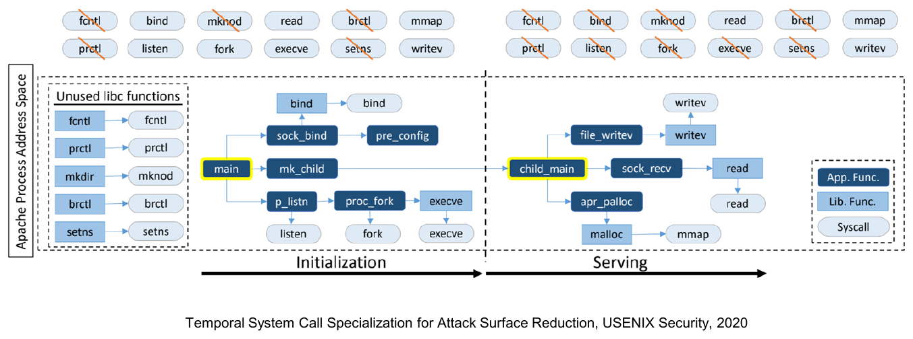

*그림 1. Apache 프로세스의 시간적 시스템 콜 특화*

Apache와 같은 서버는 **초기화** 단계에서는 많은 시스템 콜(예: `bind`, `listen`, `fork`, `execve`, `setns`)이 필요하지만, **서비스** 단계에서는 훨씬 적은 시스템 콜(예: `read`, `writev`, `mmap`)만 필요하다. 따라서 사용하지 않는 libc 함수와 초기화에만 필요한 시스템 콜은 서버가 요청 처리를 시작한 뒤 차단할 수 있으며, 이는 시간에 따라 최소 권한을 적용하는 **시간적 시스템 콜 특수화(temporal system call specialization)** 이다.

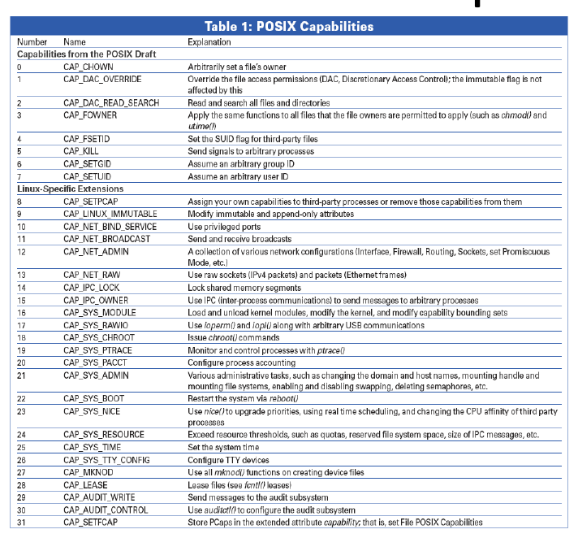

*그림 2. POSIX capabilities*

**Capability**는 특권을 세분화하여 부여하는 방식이다. POSIX 초안에 정의된 capability(예: `CAP_CHOWN`, `CAP_DAC_OVERRIDE`, `CAP_KILL`, `CAP_SETUID`)와 Linux 고유 확장(예: `CAP_NET_BIND_SERVICE`, `CAP_NET_ADMIN`, `CAP_NET_RAW`, `CAP_SYS_MODULE`, `CAP_SYS_PTRACE`, `CAP_SYS_ADMIN`)이 있다. Capability는 모든 것을 할 수 있는 root 권한을 세분화된 단위로 나누므로, 프로세스는 필요한 권한만 받을 수 있다. 예를 들어 웹 서버는 root로 실행하지 않고도 `CAP_NET_BIND_SERVICE`만 받아 80번 포트에 바인딩할 수 있다.

### 3.3 결함 격리 구역

**결함 격리 구역**은 최소 권한과 격리를 기반으로 한다. 두 속성은 함께 사용할 때 가장 효과적이며, 그 형태는 **최소 권한으로 실행되고 상호작용하는 많은 작은 구성 요소**이다.

**결함 격리(fault compartmentalization)** 는 한 구성 요소의 침해가 다른 구성 요소로 확산되지 않도록 경계를 두는 설계 원칙이다.

### 3.4 예시: 메일 서버 (sendmail vs qmail)

**메일 전송 에이전트(MTA, Mail Transfer Agent)** 는 수많은 작업을 수행해야 한다.

- 네트워크로부터 데이터 송수신
- 수신했거나 아직 보내지 않은 메시지 풀 관리
- 각 사용자에게 저장된 메시지에 대한 접근 제공

가능한 접근 방식은 두 가지이다.

| MTA | 설계 | 보안 |
|:----|:-------|:---------|
| **sendmail** | **거대한 모놀리식 서버**를 사용하는 전형적인 Unix 방식 | 높은 복잡도와 과거의 보안 취약점으로 알려져 있다 |
| **qmail** | **서로 통신하는 프로세스들**로 구성된 현대적인 **최소 권한** 방식 | 각 프로세스가 필요한 권한만으로 실행된다 |

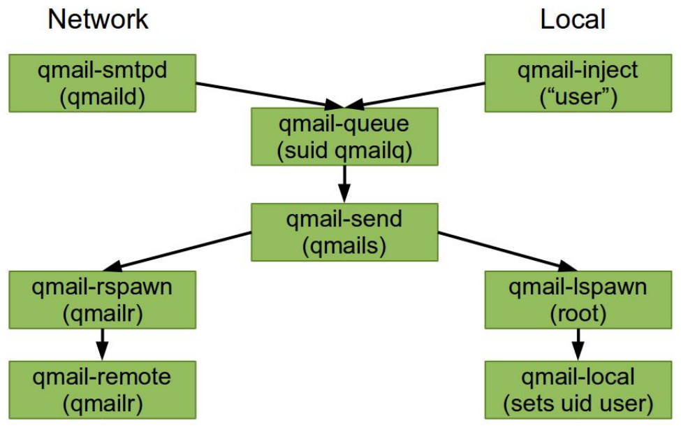

*그림 3. qmail 구성 요소*

| 구성 요소 | 역할 |
|:----------|:-----|
| `qmail-smtpd` (qmaild) / `qmail-inject` ("user") | 네트워크와 로컬 사용자로부터 들어오는 이메일 |
| `qmail-queue` (suid qmailq) | 메시지를 본문과 헤더로 나누고, `qmail-send`에 신호를 보낸다 |
| `qmail-send` (qmails) | 메시지를 로컬 또는 원격으로 보낸다 |
| `qmail-lspawn` (root) | 사용자의 ID로 `qmail-local`을 생성한다 |
| `qmail-local` (sets uid user) | 별칭 확장을 처리하고, 로컬로 전달하거나 필요하면 `qmail-queue`에 신호를 보낸다 |
| `qmail-rspawn` / `qmail-remote` (qmailr) | 원격 메시지를 보낸다 |

> **핵심:** qmail에서는 `qmail-lspawn`만 root로 실행되며, 이 프로세스는 대상 사용자의 ID로 `qmail-local`을 시작하는 일 외에는 거의 아무것도 하지 않는다. 네트워크를 마주하는 `qmail-smtpd`는 권한 없는 사용자로 실행되므로, 네트워크 입력을 파싱하는 버그가 있어도 공격자가 root를 얻지 못한다.

### 3.5 예시: Docker

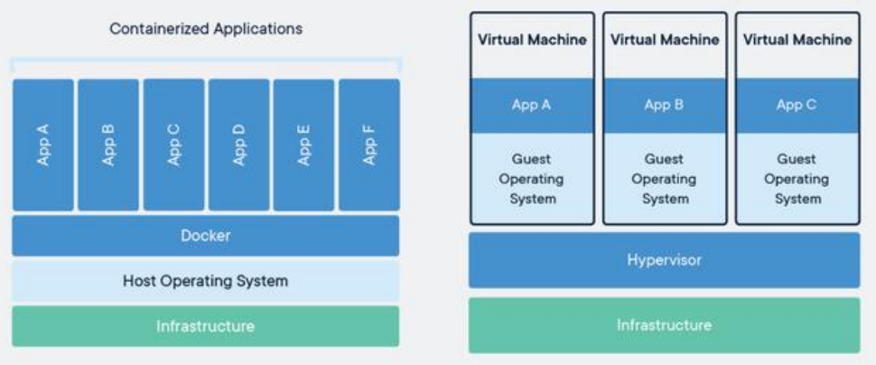

*그림 4. 컨테이너(Docker)와 가상 머신*

| | 컨테이너 (Docker) | 가상 머신 |
|:--|:--------------------|:-----------------|
| 계층 구조 | 앱 → Docker → 호스트 OS → 인프라 | 앱 → 게스트 OS → 하이퍼바이저 → 인프라 |
| 격리 구역 | 각 앱이 자신의 컨테이너에서 실행된다 | 각 앱이 게스트 OS를 가진 자신의 가상 머신에서 실행된다 |
| 공유 계층 | 호스트 OS 커널 | 하이퍼바이저 |

두 설계 모두 애플리케이션을 서로 다른 결함 격리 구역에 둔다. 컨테이너는 호스트 커널을 공유하므로 더 가볍고, 가상 머신은 각자 게스트 OS를 가지므로 더 강한 경계를 제공한다.

---

 

## 4. 하드웨어와 소프트웨어 추상화

**추상화(abstraction)** 는 배경 세부 사항이나 설명 없이 본질적인 특징만을 나타내는 것이다. 추상화를 통해 구현 세부 사항으로 들어가지 않고 아이디어를 캡슐화할 수 있다.

| 계층 | 추상화 |
|:------|:------------|
| 소프트웨어 | **API**는 라이브러리를 사용하는 방법을 정의하여 그 아래의 구현을 추상화한다. |
| 운영체제 | **시스템 콜 인터페이스**는 저수준 구현을 추상화한다. |
| 하드웨어 | **ISA**(명령어 집합 구조)는 명령어의 구현을 논리와 상태로 추상화한다. |

운영체제의 계층 구성 방식은 그 운영체제가 제공하는 격리와 구획화의 정도를 결정한다.

### 4.1 단일 도메인 OS

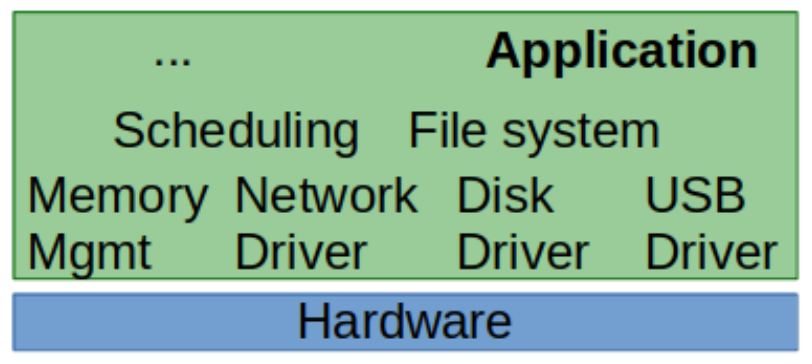

*그림 5. 단일 도메인 OS*

- 격리나 구획화가 없는 **단일 계층**이다.
- 모든 코드가 같은 도메인에서 실행되므로, 애플리케이션이 운영체제 드라이버를 직접 호출할 수 있다.
- 성능이 높으며, **임베디드 시스템**에서 자주 사용된다.

### 4.2 모놀리식 OS

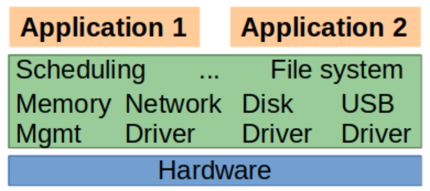

*그림 6. 모놀리식 OS*

- **두 계층:** 운영체제와 애플리케이션.
- OS가 자원을 관리하고 접근을 조율한다.
- 애플리케이션은 권한이 없으며, OS에 접근을 요청해야 한다.
- 개별 구성 요소를 격리하는 비용이 크기 때문에, 성능을 위해 **Linux는 전적으로, Windows는 대부분** 이 방식을 따른다.

### 4.3 마이크로커널

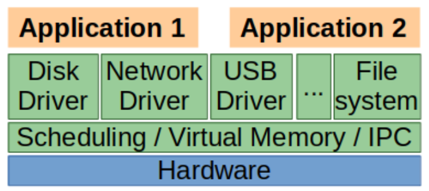

*그림 7. 마이크로커널*

- **여러 계층:** 각 구성 요소가 별도의 프로세스이다.
- 필수적인 부분만 특권을 가진다.
  - 프로세스 추상화(주소 공간)
  - 프로세스 관리(스케줄링)
  - 프로세스 간 통신(IPC)

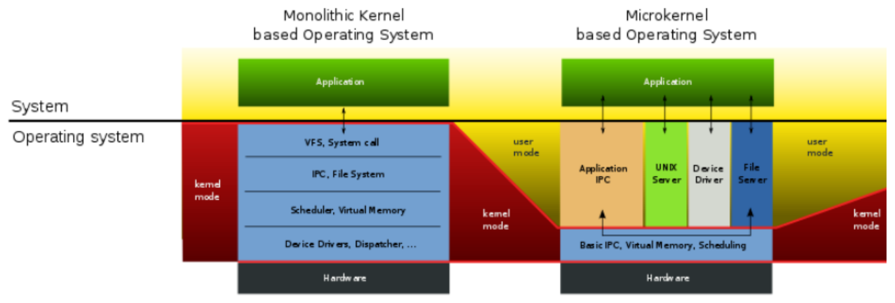

*그림 8. 모놀리식 커널 기반과 마이크로커널 기반 운영체제*

모놀리식 커널에서는 VFS, IPC, 파일 시스템, 스케줄러, 가상 메모리, 장치 드라이버가 모두 커널 모드에서 실행된다. 마이크로커널에서는 기본 IPC, 가상 메모리, 스케줄링만 커널 모드에 남고, 파일 시스템, 장치 드라이버, 서버는 사용자 모드에서 실행된다.

| 설계 | 계층 | 격리 | 성능 |
|:-------|:-------|:----------|:------------|
| 단일 도메인 | 1 | 없음 | 가장 높음 |
| 모놀리식 | 2 (OS, 애플리케이션) | 애플리케이션과 OS 사이 | 높음 |
| 마이크로커널 | 여러 개 | 모든 구성 요소 사이 | 낮음 (IPC 오버헤드) |

---

 

## 5. 접근 제어

### 5.1 인증과 인가

| 개념 | 질문 | 예시 |
|:--------|:---------|:--------|
| **인증(Authentication)** | 당신은 누구인가? (아는 것, 가진 것, 자신의 특징) | 사용자 이름과 비밀번호로 로그인 |
| **인가(Authorization)** | 누가 객체에 접근할 수 있는가? (그 작업을 해도 되는가?) | 데이터 접근에 대한 사용자 권한 확인 |

**접근 제어(access control)** 는 특정 자원에 요구되는 보안을 강제하는 과정이다.

- 사용자가 접근해서는 안 되는 것에 접근하지 못하도록 막는다.
- 접근 제어는 **인증과 인가**에 시간 기반이나 IP 기반 제한과 같은 추가 조치를 더한 것으로 볼 수 있다.

### 5.2 인증: 당신은 누구인가?

신원 확인에는 세 가지 기본 유형이 있다.

| 유형 | 예시 |
|:-----|:--------|
| **아는 것** | 사용자 이름과 비밀번호 |
| **자신의 특징** | 생체 인식 |
| **가진 것** | 스마트카드나 휴대폰 |

인증은 **조합할수록 강해진다.** 한 가지 요소보다 두 가지 요소가 낫다. 예를 들어 사용자 이름과 비밀번호를 확인하면서 보안 토큰의 소지 여부도 함께 확인한다.

### 5.3 인가: 정보 흐름 제어 (IFC)

인가는 "**누가 어떤 정보에 접근할 수 있는가?**"라는 질문에 답한다.

- 접근 정책을 **접근 제어 모델(access control model)** 이라고 부른다.
- 접근 제어 모델은 원래 **미 군**에서 개발되었다.
  - 서로 다른 **비밀 취급 인가 등급(clearance level)** 을 가진 사용자들이 하나의 시스템을 사용했다.
  - 데이터는 서로 다른 인가 등급 사이에서 공유되었다.

### 5.4 IFC의 실제 사례: 국가 망 보안체계

**N²SF**(National Network Security Framework, 국가 망 보안체계)는 같은 개념을 공공 부문 네트워크에 적용한다.

- 일률적인 **망분리**를 **위험 기반, 데이터 중심 통제**로 대체한다.
- 업무 정보와 시스템을 세 등급으로 분류한다.

| 등급 | 의미 | 예시 |
|:------|:--------|:---------|
| **C** (Classified, 기밀) | 국가 핵심 비밀 | 안보, 국방, 외교 |
| **S** (Sensitive, 민감) | 민감 정보 | 개인정보, 내부 핵심 업무 정보 |
| **O** (Open, 공개) | 공개 가능 | 공개 가능한 모든 정보 |

- 등급별로 통제를 차등 적용하며, 등급이 섞여 있으면 **가장 높은 등급이 적용**된다.
- **다섯 단계**를 따른다: 준비 → 분류 → 위협 식별 → 통제 선택 → 평가.
- 군의 비밀 취급 인가 등급과 같은 개념을 공공 부문 네트워크에 적용한 것이다.

### 5.5 접근 제어의 유형

1. **강제적 접근 제어(MAC, Mandatory Access Control)**
2. **임의적 접근 제어(DAC, Discretionary Access Control)**
3. **역할 기반 접근 제어(RBAC, Role-Based Access Control)**

### 5.6 강제적 접근 제어 (MAC)

**개념:** 규칙 기반, 격자(lattice) 기반 정책.

- **중앙에서 통제**한다. 하나의 주체가 어떤 권한을 줄지 결정한다.
- 사용자는 정책을 **스스로 바꿀 수 없다**.
- 예시: **Bell-LaPadula**와 **Biba**.

**Bell-LaPadula**

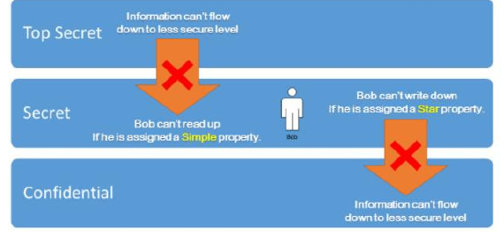

*그림 9. Bell-LaPadula 모델*

- Bell-LaPadula는 **기밀성**만 강제한다.
- 주어진 인가 등급은 **같거나 낮은 등급의 객체 읽기**와 **같거나 높은 등급의 파일 쓰기**를 허용한다.
- **read-down, write-up**("no read up, no write down")으로 요약된다. 정보는 덜 안전한 등급으로 흘러내려갈 수 없다.

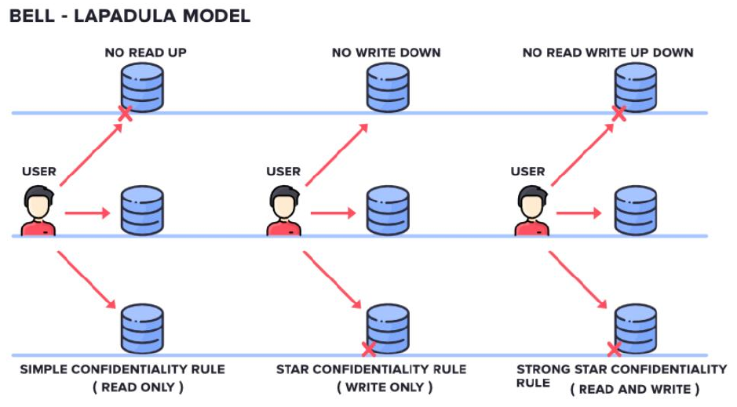

*그림 10. Bell-LaPadula 규칙*

| 규칙 | 의미 |
|:-----|:--------|
| 단순 기밀성 규칙 (simple property) | No read up: 주체는 자신의 등급 이하만 읽는다. |
| 스타 기밀성 규칙 (\* property) | No write down: 주체는 자신의 등급 이상에만 쓴다. |
| 강한 스타 기밀성 규칙 | 다른 등급에서는 읽기와 쓰기를 모두 금지하고, 자신의 등급에서만 둘 다 허용한다. |

**단순하게 구현하면, 공격자가 기밀 파일을 덮어쓸 수 있다.**

**Biba**

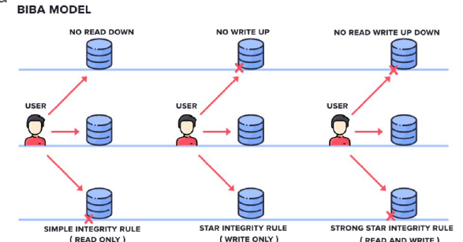

*그림 11. Biba 모델*

- Biba는 **무결성**을 강제한다.
- 주어진 인가 등급은 **같거나 높은 등급의 파일 읽기**와 **같거나 낮은 등급의 파일 쓰기**를 허용한다.
- 요약: **read-up, write-down**(단순 무결성 규칙: no read down, 스타 무결성 규칙: no write up, 강한 스타 무결성 규칙: 다른 등급에서 읽기와 쓰기를 모두 금지).

**단순하게 구현하면, 공격자가 특권 정보를 유출할 수 있다.**

> **핵심:** Bell-LaPadula와 Biba는 서로 거울상이며, 각각 한 가지 속성만 보호한다. Bell-LaPadula는 "write up"을 허용하므로, 낮은 등급의 사용자가 일급비밀 파일을 맹목적으로 덮어쓸 수 있어 **무결성**이 깨진다. Biba는 "write down"을 허용하므로, 높은 등급의 주체가 특권 데이터를 낮은 등급의 파일로 복사할 수 있어 **기밀성**이 깨진다.

### 5.7 임의적 접근 제어 (DAC)

**개념:** **객체의 소유자**가 정책을 정한다.

- MAC은 중앙 통제가 필요하지만, DAC는 사용자에게 권한을 준다.
- 사용자는 자신의 자원에 대한 권한을 가진다(소유권 도입).
- 다른 사용자가 접근하려 하면, 사용자가 자신의 데이터에 대한 권한을 설정한다.
- 예시: **Unix 권한**.

DAC는 **접근 제어 행렬(access control matrix)** 로 표현된다. 이는 각 주체가 각 객체에 대해 어떤 동작을 할 수 있는지 나타내는 주체와 객체의 표이다.

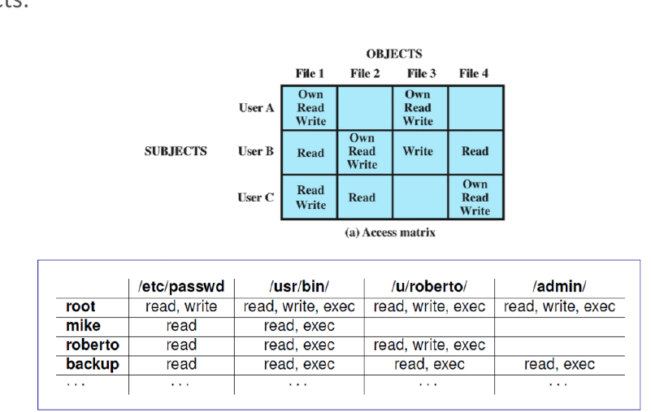

*그림 12. 접근 제어 행렬*

| 주체 | `/etc/passwd` | `/usr/bin/` | `/u/roberto/` | `/admin/` |
|:--------|:--------------|:------------|:--------------|:----------|
| root | read, write | read, write, exec | read, write, exec | read, write, exec |
| mike | read | read, exec | | |
| roberto | read | read, exec | read, write, exec | |
| backup | read | read, exec | read, exec | read, exec |

> **참고:** 행렬을 열 단위로 저장하면 객체별 **접근 제어 목록(ACL)** 이 되고(예: Unix 파일 권한), 행 단위로 저장하면 주체별 **capability 목록**이 된다.

### 5.8 역할 기반 접근 제어 (RBAC)

정책은 **역할(role, 권한의 집합)** 로 정의된다. 개인에게 역할이 할당되고, 역할에 작업 권한이 부여된다.

- 접근 권한은 역할의 집합으로 나뉜다.
- 사용자에게 특정 역할이 할당된다.
- 관리자 권한도 하나의 역할일 수 있다.

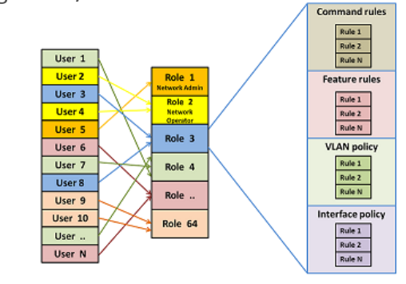

*그림 13. 역할 기반 접근 제어*

그림에서 많은 사용자가 소수의 역할(예: "Network Admin", "Network Operator")에 연결되고, 각 역할은 명령 규칙, 기능 규칙, VLAN 정책, 인터페이스 정책과 같은 규칙 집합에 연결된다. 역할의 규칙을 바꾸면 그 역할이 할당된 모든 사용자의 권한이 함께 바뀐다.

| 모델 | 정책을 정하는 주체 | 예시 |
|:------|:-----------------------|:--------|
| **MAC** | 중앙 기관 | Bell-LaPadula, Biba |
| **DAC** | 객체의 소유자 | Unix 권한 |
| **RBAC** | 역할을 통한 관리자 | 네트워크 장비 역할 |

---

 

## 개념 적용

접근 제어는 **보호하는 속성과 허용되는 접근 방향**으로 정의된다. `High > Medium > Low`라는 선형 등급과 Medium 주체를 가정하면 다음과 같다.

| 접근 | Bell-LaPadula | Biba |
|:-----|:-------------|:-----|
| Low 객체 읽기 | 허용 | 금지 |
| High 객체 읽기 | 금지 | 허용 |
| Low 객체 쓰기 | 금지 | 허용 |
| High 객체 쓰기 | 허용 | 금지 |
| Medium 객체 읽기와 쓰기 | 허용 | 허용 |

> **참고:** 이 표는 각 모델의 기본 읽기 및 쓰기 규칙만 적용한다. 별도의 접근 권한이나 강한 스타 규칙을 추가하면 결과가 달라질 수 있다. Bell-LaPadula의 기본 규칙 두 개를 합친 것이 같은 등급에서만 읽고 쓰는 강한 스타 규칙과 같지는 않다.

**T/F 점검:**

| 문장 | 판단과 근거 |
|:-----|:------------|
| 인증에 성공하면 모든 객체에 접근할 권한도 얻는다. | **F.** 인증은 신원을, 인가는 접근 권한을 확인한다. |
| Bell-LaPadula는 기밀성과 무결성을 모두 보장한다. | **F.** 기밀성을 보호하며, 낮은 등급에서 높은 등급으로 쓰는 행위는 무결성을 해칠 수 있다. |
| Biba는 높은 무결성의 객체가 낮은 무결성의 입력에 오염되는 것을 제한한다. | **T.** 낮은 등급 읽기와 높은 등급 쓰기를 제한한다. |
| 결함 격리는 격리와 최소 권한을 함께 적용한다. | **T.** 접근 경계를 만들고 각 구성 요소의 권한을 제한하여 피해 확산을 줄인다. |

**서술 연습:** 위협 모델을 먼저 정의해야 하는 이유를 설명하라.

> **정답:** 방어의 효과는 가정한 공격자의 능력과 자원에 달려 있다. 보호할 자산, 공격자의 입력 통제 범위, 가능한 공격, 범위에서 제외한 공격을 정해야 어떤 보안 속성을 어떤 메커니즘으로 강제할지 평가할 수 있다.

---

 

## 요약

| 개념 | 핵심 요약 |
|:--------|:------------|
| 소프트웨어 보안의 목표 | 소프트웨어의 의도된 사용은 허용하고, 해를 끼칠 수 있는 의도되지 않은 사용은 방지한다. |
| CIA 3요소 | 기밀성, 무결성, 가용성이 핵심 원칙이며, ISO/IEC 7498-2는 인증과 부인 방지를 추가한다. |
| 보안 분석 | 보안은 공격 표면, 자산, 공격자의 목표에 따라 달라진다. |
| 위협 모델 | 공격자의 능력과 자원을 정의하며, 모든 방어는 특정 위협 모델을 대상으로 한다. |
| 격리 | 구성 요소는 잘 정의된 API를 통해서만 상호작용한다. |
| 최소 권한 | 구성 요소는 동작에 필요한 권한만 가진다(예: Chromium 샌드박스, 시스템 콜 특화, POSIX capabilities). |
| 결함 격리 구역 | 격리되고 최소 권한을 가진 많은 작은 구성 요소(예: qmail, Docker). |
| OS 추상화 | 단일 도메인(격리 없음), 모놀리식(두 계층), 마이크로커널(여러 계층, 최소한의 특권 핵심부). |
| 접근 제어 | 인증(당신은 누구인가)과 인가(무엇에 접근할 수 있는가)의 결합이다. |
| MAC | 중앙 정책이며, Bell-LaPadula(기밀성, read-down/write-up)와 Biba(무결성, read-up/write-down)가 있다. |
| DAC | 소유자가 정책을 정하며, 접근 제어 행렬로 표현된다. |
| RBAC | 권한을 역할로 묶어 사용자에게 할당한다. |

---

 

## 점검 문제

1. **CIA 3요소:** 공격자의 관점에서 기밀성, 무결성, 가용성을 정의하고, ISO/IEC 7498-2가 추가한 두 가지 속성을 말하라.

   > **정답:** 기밀성은 공격자가 보호된 데이터를 알아낼 수 없음을, 무결성은 공격자가 보호된 데이터를 수정할 수 없음을, 가용성은 공격자가 연산을 중단시키거나 방해할 수 없음을 뜻한다. ISO/IEC 7498-2는 **인증**(송신자의 신원 확인)과 **부인 방지** 또는 책임 추적성(송신자가 보낸 사실을 부인할 수 없음)을 추가한다.

2. **위협 모델:** 위협 모델은 무엇을 명시하며, 방어를 왜 위협 모델에 비추어 평가해야 하는가?

   > **정답:** 위협 모델은 공격자의 능력과 자원, 즉 막고자 하는 공격의 종류, 공격자의 능력, 공격의 영향, 범위 밖의 공격을 정의한다. 방어는 위협 모델에 비추어서만 의미가 있다. 예를 들어 자물쇠는 자물쇠 따기만 가정하는 약한 위협 모델에서는 충분하지만, 공격자가 열쇠를 복제할 수 있다면 쓸모가 없다.

3. **최소 권한:** 최소 권한 원칙을 설명하고, 구체적인 적용 사례를 두 가지 들어라.

   > **정답:** 구성 요소는 동작에 필요한 권한만 가져야 한다. 권한을 하나라도 제거하면 기능이 줄고, 권한을 추가해도 기능이 늘지 않는다. 예로는 최소한의 시스템 콜만 허용하는 Chromium 렌더러 샌드박스, 그리고 서버가 초기화에서 서비스 단계로 넘어가면 `execve`와 같은 시스템 콜을 차단하는 시간적 시스템 콜 특화가 있다. POSIX capabilities가 세 번째 예이다.

4. **결함 격리 구역:** qmail이 sendmail보다 안전하다고 여겨지는 이유는 무엇인가?

   > **정답:** sendmail은 모든 작업이 같은 (높은) 권한으로 실행되는 거대한 모놀리식 서버이므로, 버그 하나가 시스템 전체를 침해할 수 있다. qmail은 작업을 서로 통신하는 작은 프로세스들로 나누고, 각 프로세스는 필요한 권한만으로 실행된다. `qmail-lspawn`만 root로 실행되고 네트워크를 마주하는 구성 요소는 권한이 없으므로, 한 구획의 버그가 그 안에 갇힌다.

5. **OS 추상화:** 단일 도메인, 모놀리식, 마이크로커널 운영체제를 격리와 성능 측면에서 비교하라.

   > **정답:** 단일 도메인 OS는 격리가 없는 한 계층이므로 애플리케이션이 드라이버를 직접 호출하며, 빠르고 임베디드 시스템에서 쓰인다. 모놀리식 OS는 두 계층으로 애플리케이션을 OS로부터 격리하지만, 모든 OS 구성 요소가 커널 권한을 공유한다(Linux, 대부분의 Windows). 마이크로커널은 각 구성 요소를 별도의 프로세스로 실행하고 주소 공간, 스케줄링, IPC만 특권으로 유지하므로, IPC 오버헤드를 대가로 가장 강한 격리를 제공한다.

6. **MAC 모델:** Bell-LaPadula의 read-down/write-up과 Biba의 read-up/write-down을 설명하고, 각각을 단순하게 구현했을 때 무엇을 보호하지 못하는지 설명하라.

   > **정답:** Bell-LaPadula는 기밀성을 보호한다. 주체는 자신의 인가 등급 이하의 객체를 읽고 이상의 객체에 쓸 수 있으므로, 정보가 아래로 흐르지 않는다. 단순하게 구현하면 낮은 등급의 사용자가 기밀 파일에 쓰기(write up)로 덮어쓸 수 있어 무결성이 깨진다. Biba는 무결성을 보호한다. 주체는 자신의 등급 이상의 객체를 읽고 이하에 쓸 수 있으므로, 낮은 무결성의 데이터가 높은 무결성의 데이터를 오염시키지 않는다. 단순하게 구현하면 높은 등급의 주체가 특권 정보를 아래로 써서 유출할 수 있다.

7. **DAC vs RBAC:** DAC와 RBAC는 정책을 정하는 주체가 어떻게 다르며, DAC는 어떻게 표현되는가?

   > **정답:** DAC에서는 객체의 소유자가 누가 접근할 수 있는지 결정하며(예: Unix 권한), 정책은 주체, 객체, 허용된 동작으로 이루어진 접근 제어 행렬로 표현된다. RBAC에서는 권한을 역할로 묶고 사용자에게 역할을 할당하며, 관리자는 개별 권한이 아니라 역할을 관리한다.

---
