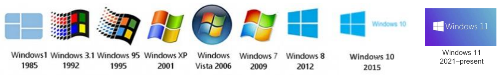
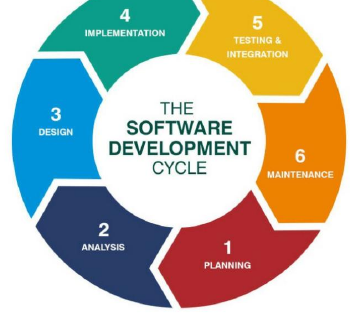
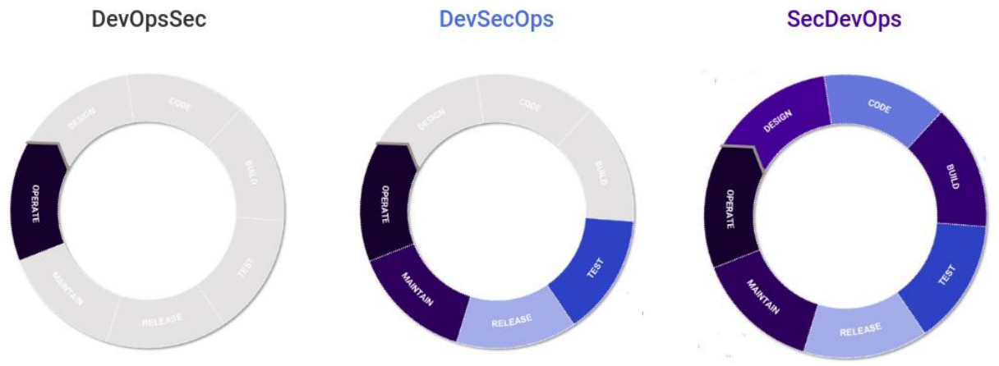
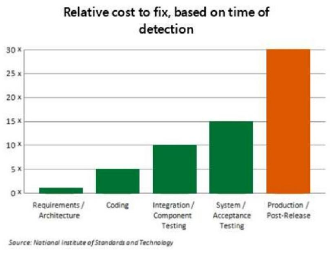
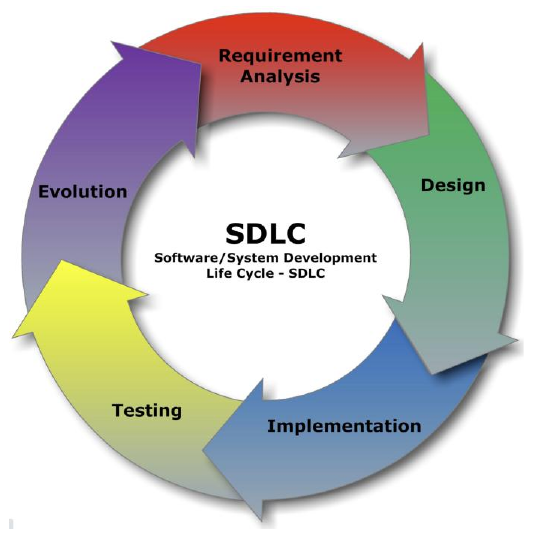

# 강의 03 — 소프트웨어 생명주기

> **최종 수정일:** 2026-10-08
>
> Software Security: Principles, Policies, and Protection, Payer - Ch 3

> **학습 목표**:
> 1. 소프트웨어가 오래 살아남으며 진화하는 산출물인 이유와 그것이 보안에 주는 의미를 설명할 수 있다
> 2. 소프트웨어 공학과 보안 소프트웨어 공학을 구분할 수 있다
> 3. 결함의 상대적 수정 비용을 근거로 보안을 앞당겨야 하는 이유를 설명할 수 있다
> 4. 보안 개발 생명주기(SDLC)의 각 단계에서 수행하는 보안 활동을 설명할 수 있다
> 5. 소프트웨어 공급망 보안의 주요 조치를 설명할 수 있다

---

## 목차

- [1. 소프트웨어의 지속성](#1-소프트웨어의-지속성)
- [2. 소프트웨어 공학과 보안 소프트웨어 공학](#2-소프트웨어-공학과-보안-소프트웨어-공학)
  - [2.1 소프트웨어 공학](#21-소프트웨어-공학)
  - [2.2 보안 소프트웨어 공학](#22-보안-소프트웨어-공학)
  - [2.3 SE와 보안 SE의 차이](#23-se와-보안-se의-차이)
- [3. 보안 개발 생명주기 (SDLC)](#3-보안-개발-생명주기-sdlc)
  - [3.1 요구사항 분석](#31-요구사항-분석)
  - [3.2 설계](#32-설계)
  - [3.3 구현](#33-구현)
  - [3.4 테스팅](#34-테스팅)
  - [3.5 릴리스](#35-릴리스)
  - [3.6 유지보수](#36-유지보수)
  - [3.7 공급망](#37-공급망)
- [개념 적용](#개념-적용)
- [요약](#요약)
- [점검 문제](#점검-문제)

---

 

## 1. 소프트웨어의 지속성

- 소프트웨어는 **한 번에 끝나는 작업이 아니라 진화한다**.
- 소프트웨어 개발, 생산, 유지보수는 **비용과 노동이 많이 든다**.
- **소프트웨어의 수명은 하드웨어보다 길 수 있다.**

*그림 1. 1985년부터 현재까지의 Windows 릴리스*

Windows의 주요 버전은 다음과 같이 발전했다: Windows 1(1985), Windows 3.1(1992), Windows 95(1995), Windows XP(2001), Windows Vista(2006), Windows 7(2009), Windows 8(2012), Windows 10(2015), Windows 11(2021년~현재). Windows 10은 2025년 10월 14일에 지원이 종료되었지만(22H2가 마지막 버전), 유료 확장 보안 업데이트(ESU)는 2027년 10월까지 제공되며 수억 대의 PC가 여전히 Windows 10을 사용한다.

> **핵심:** 소프트웨어는 수십 년 동안 사용되므로, 오늘 만들어진 보안 결함은 수년간 유지, 패치, 지원되어야 한다. 따라서 보안은 마지막에 한 번 덧붙일 수 있는 것이 아니라 소프트웨어 생애의 모든 단계에 포함되어야 한다.

---

 

## 2. 소프트웨어 공학과 보안 소프트웨어 공학

### 2.1 소프트웨어 공학

**소프트웨어 공학(software engineering)** 은 사용자 요구사항을 분석한 뒤, 그 요구사항을 만족하는 소프트웨어 애플리케이션을 설계, 구축, 테스트하는 과정으로 정의된다.

*그림 2. 소프트웨어 개발 주기*

소프트웨어 개발 주기는 (1) 계획, (2) 분석, (3) 설계, (4) 구현, (5) 테스팅 및 통합, (6) 유지보수의 여섯 단계로 이루어진다.

> **[소프트웨어공학]** 일반적인 개발 주기는 보안 개발의 기준선이다. 보안은 각 단계에 관련 작업을 더한다. 분석 단계에서는 보안 요구사항을 정하고, 설계 단계에서는 위협을 검토하며, 구현 단계에서는 코드와 의존성을 확인하고, 테스트 단계에서는 보안 속성을 점검하며, 유지보수 단계에서는 취약점을 계속 수정한다.

### 2.2 보안 소프트웨어 공학

보안 소프트웨어 공학은 다음을 위해 **소프트웨어 개발 생명주기 전반에 보안을 포함**한다.

1. 데이터의 손실이나 손상 방지
2. 데이터에 대한 무단 접근 방지
3. 무단 연산 방지
4. 권한 상승 방지
5. 자원의 중단 시간 방지

### 2.3 SE와 보안 SE의 차이

| | 소프트웨어 공학 (SE) | 보안 소프트웨어 공학 (Secure SE) |
|:--|:--------------------------|:----------------------------------------|
| 초점 | 기능, 일정 준수, 산출물 | 기능 제한, 보안 정책 강제, 제약 조건 정의 |

*그림 3. DevOpsSec, DevSecOps, SecDevOps*

세 개의 고리는 DevOps 주기의 단계(설계, 코드, 빌드, 테스트, 릴리스, 유지보수, 운영)를 나타내며, 강조된 구간은 보안이 적용되는 곳을 표시한다.

| 방식 | 보안이 적용되는 곳 |
|:---------|:--------------------------|
| **DevOpsSec** | 마지막 운영 단계에서만 |
| **DevSecOps** | 테스트 단계부터(테스트, 릴리스, 유지보수, 운영) |
| **SecDevOps** | 설계부터 시작해 모든 단계에서 |

- **Microsoft SDL**은 보안 결함이 약 50%~60% 줄었다고 보고하였다.
- 시프트 레프트 보안은 더 이상 모범 사례에 그치지 않는다. **CISA의 Secure by Design 서약**(2024)과 **EU 사이버 복원력법**(Cyber Resilience Act, 2026년~2027년부터 의무 적용)이 이를 법적 기대 사항으로 만든다.

*그림 4. 발견 시점에 따른 상대적 수정 비용*

| 결함이 발견된 단계 | 상대적 수정 비용 |
|:--------------------------------------|:--------------------:|
| 요구사항 / 아키텍처 | 1배 |
| 코딩 | 5배 |
| 통합 / 컴포넌트 테스팅 | 10배 |
| 시스템 / 인수 테스팅 | 15배 |
| 운영 / 릴리스 이후 | 30배 |

출처: 미국 국립표준기술연구소(NIST)

> **용어 정의:** **시프트 레프트(shift-left) 보안**은 보안 활동을 개발의 더 이른 단계(타임라인의 "왼쪽")로 옮기는 것이다. 그래프가 그 이유를 보여 준다. 요구사항 단계에서 발견된 결함은 수정 비용이 약 1배이지만, 같은 결함이 릴리스 이후에 발견되면 약 30배가 든다.

---

 

## 3. 보안 개발 생명주기 (SDLC)

**보안 SDLC**는 보안 테스팅과 그 밖의 보안 활동을 기존 개발 과정에 통합한다.

*그림 5. 소프트웨어/시스템 개발 생명주기*

주기는 요구사항 분석, 설계, 구현, 테스팅, 진화로 이루어지며, 이후 다시 처음부터 시작된다.

### 3.1 요구사항 분석

프로젝트의 **범위**와 **보안 경계**를 정의한다. 보안 및 개인정보 명세를 정의하고, 자산을 식별하고, 환경을 평가하며, **사용 사례와 오용 사례(use and abuse cases)** 를 명시한다.

| 활동 | 설명 |
|:---------|:------------|
| **위협 모델링** | 위협, 공격 벡터, 비상 계획 |
| **보안 요구사항** | 개인정보 처리 방침, 데이터 관리 계획 |
| **서드파티 의존성** | 의존성과 그 업데이트 정책을 정의하고, 의존성에 대한 위험 분석을 수행한다 |
| **SBOM** | 소프트웨어 자재 명세서(SPDX / CycloneDX)를 산출물로 요구한다 |

> **용어 정의:** **오용 사례(abuse case)** 는 일반적인 사용 사례에 대응하여, 공격자가 기능을 어떻게 악용할 수 있는지를 기술한다. **소프트웨어 자재 명세서(SBOM, Software Bill of Materials)** 는 제품에 포함된 모든 구성 요소와 의존성을 기계가 읽을 수 있는 형태로 나열한 목록이며, SPDX와 CycloneDX가 두 가지 표준 형식이다.

### 3.2 설계

전통적인 설계 단계는 기능 요구사항에 초점을 맞춘다. 여기서는 보안 관심사를 분석의 필수적인 부분으로 만든다.

- 요구사항이 바뀔 때마다 **위협 모델을 지속적으로 갱신**한다.
- **보안 설계 검토**를 수행한다.

### 3.3 구현

구현 중에 설계가 약간 다듬어질 수 있으며, 지속적인 검토와 분석과 함께 보안 문서도 그에 맞게 갱신해야 한다.

| 활동 | 목적 |
|:---------|:--------|
| **코드 리뷰** | 명세에 비추어 코드를 확인하고 버그를 찾는다 |
| **정적 분석** | 높은 코드 품질을 보장하고 결함을 드러낸다 |
| **취약점 스캐닝** | 외부 의존성에 익스플로잇이 있는지 검사한다 |
| **시크릿 스캐닝** | 자격 증명과 키가 커밋되지 않도록 막는다 |
| **AI 생성 코드** | 다른 서드파티 기여와 똑같이 검토한다 |
| **단위 테스트** | 구성 요소 전반의 기능과 보안을 보장한다 |
| **책임 추적성** | 버전 관리와 코딩 표준(단언문, 문서) |
| **지속적 통합(CI)** | 커밋마다 테스트, 정적 분석, 린터를 실행한다 |

### 3.4 테스팅

완성된 구성 요소는 최종적으로 프로토타입에 통합되기 전에 철저히 테스트된다.

- **퍼징**은 확률적 테스트 생성의 한 형태이다.
- **지속적 퍼징**은 CI에서 실행된다(예: 오픈소스 프로젝트를 위한 OSS-Fuzz).
- **동적 분석**은 심볼릭 실행과 모델에 기반한 무거운 테스트로 퍼징을 보완한다.
- **외부 침투 테스트**가 외부 검증을 제공한다.

### 3.5 릴리스

최종 프로토타입을 릴리스하기 전에, 초기 요구사항 분석과 설계의 기본 가정을 검증한다.

- **보안 검토:** 보안 속성을 준수하는지 확인한다.
- **개인정보 검토:** 개인정보 처리 방침을 준수하는지 확인한다.
- 오픈소스 소프트웨어 등에 대한 모든 **라이선스 계약**을 검토한다.

### 3.6 유지보수

소프트웨어를 출시한 뒤에도 보안 속성을 지속적으로 유지한다.

- **서드파티 소프트웨어를 추적**하고 그에 맞게 업데이트한다.
- 버그 바운티 프로그램이나 최소한 공개 연락처를 통해 **취약점 제보 창구**를 제공한다.
- **회귀 테스트:** 업데이트를 배포할 때마다 보안 요구사항과 기능 요구사항을 다시 확인한다.
- **업데이트를 안전하게 배포**한다.

### 3.7 공급망

오늘날 위험의 대부분은 **직접 작성하지 않은 코드**를 통해 들어오므로, 공급망 보안은 SDLC의 모든 단계에 걸쳐 있다.

| 조치 | 설명 |
|:--------|:------------|
| **SBOM** (SPDX / CycloneDX) | 출시하는 모든 구성 요소를 파악한다. |
| **SLSA** | 서명된 출처 증명과 변조를 감지할 수 있는 빌드 파이프라인 |
| **고정과 검증** | 의존성을 고정하고 검증하며, 재현 가능한 빌드를 목표로 한다. |
| **xz utils (2024)** | 신뢰받던 메인테이너가 핵심 라이브러리에 백도어를 심었다. |
| **규제** | CISA Secure by Design(2024), EU 사이버 복원력법(2026년~2027년부터 의무 적용) |

> **참고:** **xz utils** 사건(CVE-2024-3094)에서는 한 기여자가 약 2년에 걸쳐 xz 압축 프로젝트의 메인테이너 신뢰를 얻은 뒤, 릴리스 tarball에 백도어를 숨겼다. 일부 Linux 배포판에서는 침해된 `liblzma`가 SSH 서버에 로드되어 원격 코드 실행이 가능할 뻔했다. 이 백도어는 SSH 로그인이 조금 느려진 것을 계기로 우연히 발견되었다. **SLSA**(Supply-chain Levels for Software Artifacts)는 빌드 무결성의 수준을 정의하며, **재현 가능한 빌드**는 누구나 바이너리가 공개된 소스로부터 빌드되었는지 확인할 수 있게 한다.

---

 

## 개념 적용

보안 활동은 요구사항 분석부터 유지보수까지 이어지며, 각 활동은 수행 목적에 따라 다음 단계와 연결된다.

| 상황 | 연결할 단계와 이유 |
|:-----|:-------------------|
| 개인정보 자산과 공격자 입력을 식별하고 SBOM 제출을 요구한다. | **요구사항 분석.** 보호 대상과 경계, 산출물을 먼저 정한다. |
| 새로운 기능 때문에 외부 입력 경로가 늘어난다. | **설계.** 위협 모델을 갱신하고 설계를 검토한다. 구현 중 변경이라면 관련 문서와 검토도 갱신한다. |
| 커밋에 API 키가 포함되거나 의존 라이브러리의 취약점이 발견된다. | **구현.** 비밀 정보와 의존성 검사를 개발 과정에 통합한다. |
| 퍼징으로 경계 입력을 탐색하거나 외부 침투 테스트를 수행한다. | **테스팅.** 기능뿐 아니라 보안 요구사항 위반을 확인한다. |
| 배포 직전에 보안, 개인정보, 라이선스 조건을 확인한다. | **릴리스.** 초기 가정과 배포 조건을 재검토한다. |
| 라이브러리를 패치한 뒤 기존 기능과 보안 조건을 다시 확인한다. | **유지보수.** 의존성을 갱신하고 회귀 테스트를 수행한다. |

**T/F 점검:**

| 문장 | 판단과 근거 |
|:-----|:------------|
| 보안 검사는 릴리스 직전에만 수행하면 된다. | **F.** 요구사항부터 유지보수까지 포함해야 한다. |
| SBOM을 만들면 모든 의존성이 안전하다는 것이 증명된다. | **F.** 구성 요소의 목록은 추적과 점검의 기초이며, 취약점 부재의 증명은 아니다. |
| 회귀 테스트는 패치로 기존 기능이나 보안 요구사항이 깨졌는지 확인한다. | **T.** 수정 이후의 동작도 다시 검증해야 한다. |
| 공급망 보안은 요구사항 분석 단계에만 속한다. | **F.** 의존성 선정, 빌드, 배포, 업데이트에 걸쳐 적용된다. |

---

 

## 요약

| 개념 | 핵심 요약 |
|:--------|:------------|
| 소프트웨어의 지속성 | 소프트웨어는 진화하며 하드웨어보다 오래 살아남을 수 있으므로(예: 2027년까지의 Windows 10 ESU), 전 생애에 걸쳐 보안을 유지해야 한다. |
| SE vs 보안 SE | SE는 기능, 일정 준수, 산출물에 초점을 맞추고, 보안 SE는 기능 제한, 정책 강제, 제약 조건 정의에 초점을 맞춘다. |
| 시프트 레프트 | 릴리스 이후 결함을 고치는 비용은 요구사항 단계보다 약 30배 크며, SDL은 보안 결함을 약 50%~60% 줄였다. |
| 요구사항 분석 | 위협 모델링, 보안 요구사항, 의존성 위험 분석, SBOM |
| 설계 | 지속적으로 갱신되는 위협 모델, 보안 설계 검토 |
| 구현 | 코드 리뷰, 정적 분석, 취약점 및 시크릿 스캐닝, AI 생성 코드 검토, 단위 테스트, CI |
| 테스팅 | 퍼징(지속적 퍼징, 예: OSS-Fuzz), 동적 분석, 침투 테스트 |
| 릴리스 | 보안, 개인정보, 라이선스 검토 |
| 유지보수 | 의존성 추적, 제보 창구, 회귀 테스트, 안전한 업데이트 |
| 공급망 | SBOM, SLSA, 고정 및 검증된 의존성, 재현 가능한 빌드, xz utils의 교훈 |

---

 

## 점검 문제

1. **소프트웨어의 지속성:** 소프트웨어의 긴 수명이 보안에 왜 중요한가?

   > **정답:** 소프트웨어는 한 번에 끝나는 작업이 아니라 진화하며, 처음 설계된 하드웨어보다 오래 살아남을 수 있다. 예를 들어 Windows 10은 2027년까지 유료 보안 업데이트를 받으며 수억 대의 PC에서 실행된다. 따라서 모든 결함은 수년간 패치되고 지원되어야 하므로, 보안은 마지막에 덧붙이는 것이 아니라 생명주기 전반에 걸쳐 내재되어야 한다.

2. **SE vs 보안 SE:** 보안 소프트웨어 공학은 소프트웨어 공학과 어떻게 다른가?

   > **정답:** 소프트웨어 공학은 기능, 일정 준수, 산출물에 초점을 맞춘다. 보안 소프트웨어 공학은 여기에 더해 기능을 제한하고, 보안 정책을 강제하며, 제약 조건을 정의한다. 그 목표는 데이터 손실이나 손상, 무단 접근이나 연산, 권한 상승, 중단 시간을 방지하는 것이다.

3. **시프트 레프트:** 상대적 수정 비용 그래프를 이용하여 보안을 초기에 고려해야 하는 이유를 설명하라.

   > **정답:** NIST에 따르면 결함을 고치는 비용은 요구사항과 아키텍처 단계에서 약 1배, 코딩 단계에서 5배, 통합 단계에서 10배, 시스템 테스팅 단계에서 15배, 릴리스 이후에는 약 30배이다. 따라서 보안을 일찍 다루는 것(SecDevOps처럼 시프트 레프트하는 것)이 훨씬 저렴하며, Microsoft의 SDL은 보안 결함을 약 50%~60% 줄였다.

4. **SDLC 단계:** SDLC의 각 단계에서 수행하는 보안 활동을 하나씩 말하라.

   > **정답:** 요구사항 분석: 위협 모델링과 SBOM 요구. 설계: 지속적으로 갱신되는 위협 모델을 바탕으로 한 보안 설계 검토. 구현: 코드 리뷰, 정적 분석, 시크릿 스캐닝. 테스팅: 퍼징(예: OSS-Fuzz)과 침투 테스트. 릴리스: 보안, 개인정보, 라이선스 검토. 유지보수: 서드파티 소프트웨어 추적, 제보 창구 제공, 회귀 테스트.

5. **공급망:** 공급망 보안이 왜 중요하며, 어떤 조치로 대응하는가?

   > **정답:** xz utils 백도어(2024)가 보여 주듯, 오늘날 위험의 대부분은 개발자가 직접 작성하지 않은 코드를 통해 들어온다. 대응 조치로는 모든 구성 요소를 파악하기 위한 SBOM(SPDX 또는 CycloneDX), 서명된 출처 증명과 변조 감지 빌드를 위한 SLSA, 의존성 고정과 검증, 재현 가능한 빌드가 있다. CISA Secure by Design과 EU 사이버 복원력법 같은 규제도 이제 이러한 관행을 요구한다.

---
