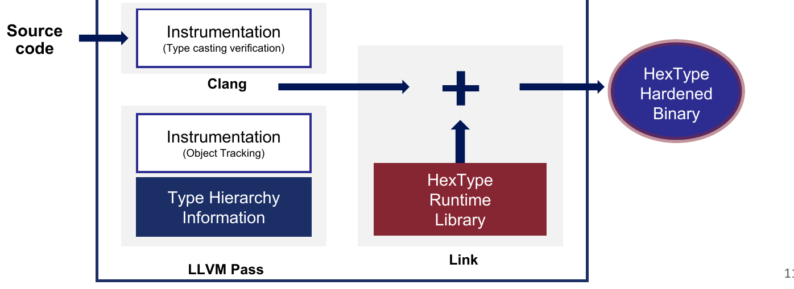
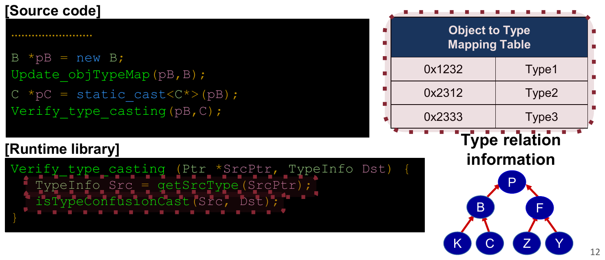
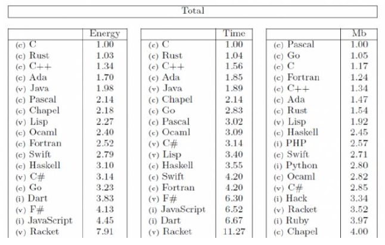
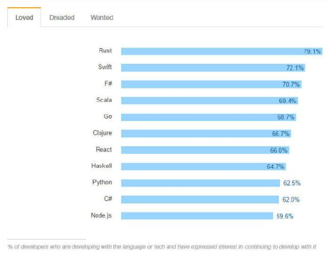
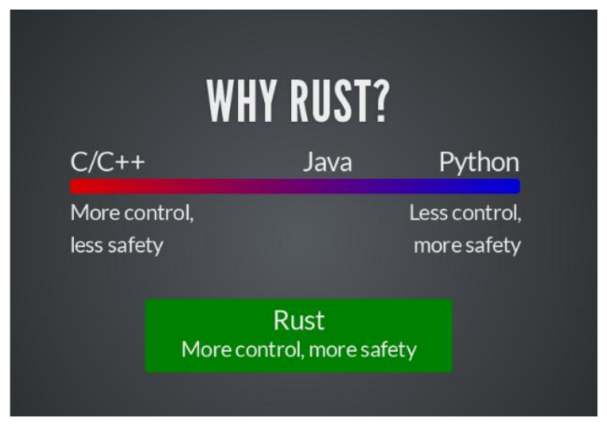
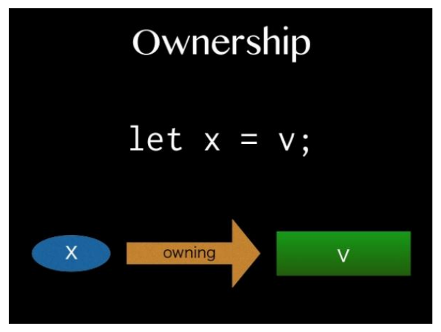
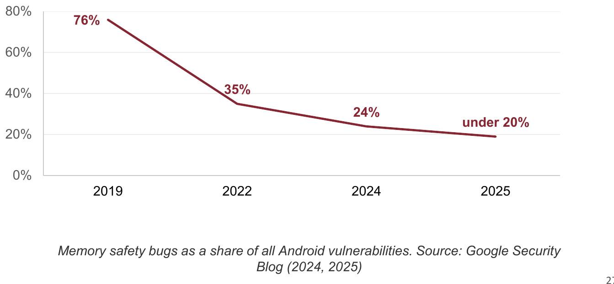
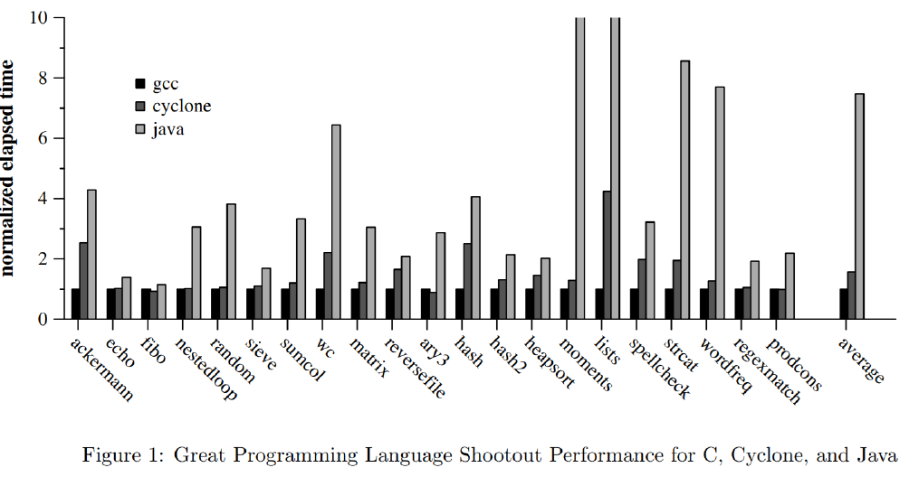
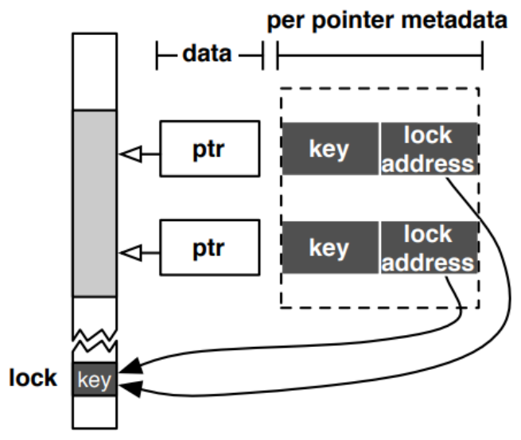

# L04 보안 정책

> **최종 수정일:** 2026-10-08
>
> Software Security: Principles, Policies, and Protection, Payer - Ch 4

> **학습 목표**:
> 1. 보안 정책과 이를 강제하는 방어 메커니즘을 구분할 수 있다
> 2. 일반 정책(격리, 최소 권한, 결함 격리 구역)과 저수준 정책(타입 안전성, 메모리 안전성)을 설명할 수 있다
> 3. 잘못된 다운캐스팅으로 인한 타입 혼동과 HexType의 탐지 방법을 설명할 수 있다
> 4. 공간적, 시간적 메모리 안전성을 정의하고 코드에서 위반을 찾아낼 수 있다
> 5. 메모리 안전성을 얻는 방법인 안전한 언어(Java, Rust), C/C++ 방언, 계측(SoftBound, CETS), 하드웨어(MTE, CHERI)를 비교할 수 있다

---

## 목차

- [1. 보안 정책](#1-보안-정책)
  - [1.1 정의](#11-정의)
  - [1.2 목표](#12-목표)
- [2. 일반 정책](#2-일반-정책)
  - [2.1 격리](#21-격리)
  - [2.2 최소 권한](#22-최소-권한)
  - [2.3 결함 격리 구역](#23-결함-격리-구역)
- [3. 타입 안전성](#3-타입-안전성)
  - [3.1 정의](#31-정의)
  - [3.2 C++ 캐스팅 연산](#32-c-캐스팅-연산)
  - [3.3 타입 캐스팅과 잘못된 다운캐스팅](#33-타입-캐스팅과-잘못된-다운캐스팅)
  - [3.4 HexType](#34-hextype)
- [4. 메모리 안전성](#4-메모리-안전성)
  - [4.1 버그 vs 취약점](#41-버그-vs-취약점)
  - [4.2 정의](#42-정의)
  - [4.3 현실의 메모리 안전성](#43-현실의-메모리-안전성)
  - [4.4 메모리 비안전성의 조건](#44-메모리-비안전성의-조건)
  - [4.5 공간적 메모리 안전성](#45-공간적-메모리-안전성)
  - [4.6 시간적 메모리 안전성](#46-시간적-메모리-안전성)
- [5. 메모리 안전 언어](#5-메모리-안전-언어)
  - [5.1 Java](#51-java)
  - [5.2 Rust](#52-rust)
  - [5.3 실제 환경의 Rust: Android](#53-실제-환경의-rust-android)
  - [5.4 Unsafe Rust](#54-unsafe-rust)
- [6. C/C++의 메모리 안전성](#6-cc의-메모리-안전성)
  - [6.1 메모리 안전성의 정의를 향하여](#61-메모리-안전성의-정의를-향하여)
  - [6.2 두 가지 접근 방식](#62-두-가지-접근-방식)
  - [6.3 C/C++ 방언: Cyclone](#63-cc-방언-cyclone)
  - [6.4 C/C++ 계측](#64-cc-계측)
  - [6.5 SoftBound](#65-softbound)
  - [6.6 CETS](#66-cets)
- [7. 하드웨어, 런타임 방어, 동향](#7-하드웨어-런타임-방어-동향)
  - [7.1 하드웨어 기반 메모리 안전성](#71-하드웨어-기반-메모리-안전성)
  - [7.2 런타임 심층 방어](#72-런타임-심층-방어)
  - [7.3 산업과 정책의 동향](#73-산업과-정책의-동향)
- [개념 적용](#개념-적용)
- [요약](#요약)
- [점검 문제](#점검-문제)

---

<br>

## 1. 보안 정책

### 1.1 정의

**보안(security)** 은 데이터와 자원에 대해 방어 메커니즘을 통해 정책을 적용하고 강제하는 것이다.

| 용어 | 의미 |
|:-----|:--------|
| **보안 정책(security policy)** | **무엇을** 강제할지 명시한다. |
| **방어 메커니즘(defense mechanism)** | 정책을 **어떻게** 강제할지 명시한다. 즉, 정책의 구현 또는 인스턴스이다. |

**예시:** **데이터 실행 방지(DEP, Data Execution Prevention)** 는 프로세스 주소 공간의 각 물리 메모리 페이지가 쓰기 가능하거나 실행 가능하되 둘 다는 될 수 없음을 보장함으로써 **코드 무결성 정책(Code Integrity policy)** 을 강제하는 메커니즘이다.

### 1.2 목표

1. 핵심 보안 정책과 그 영역, 차이점을 안다(격리, 최소 권한, 결함 격리 구역, 타입 안전성, 메모리 안전성).
2. 타입 안전성과 메모리 안전성이 저수준 프로그래밍 언어에 어떻게 적용되는지 이해한다.
3. 이러한 정책이 어떻게 위반될 수 있는지 예를 들 수 있다.

---

<br>

## 2. 일반 정책

### 2.1 격리

**격리(isolation)** 는 무언가를 분리하거나 분리된 상태이다. 두 구성 요소의 **상호작용이 제한되어 있으면** 두 구성 요소는 격리되어 있다.

- OS는 프로세스를 서로 격리하고, 잘 정의된 API를 통한 상호작용만 허용한다.
- 격리는 **가상 메모리**와 **권한 도메인**을 통해 가능해진다.

### 2.2 최소 권한

**최소 권한(least privilege)** 은 각 구성 요소가 동작하는 데 **필요한 최소한의 권한**만 가질 것을 요구한다. 권한을 하나라도 제거하면 구성 요소는 동작을 멈춘다.

- **시스템 콜 정책**은 호출할 수 있는 시스템 콜과 그 매개변수를 제한한다.
- OS는 사용자별로 시스템 콜 권한을 검사하기 전에, 강제된 **프로세스별 정책**에 따라 현재 프로세스에 대해 먼저 검사한다.

### 2.3 결함 격리 구역

**결함 구획화(fault compartmentalization)** 는 시스템의 둘 이상의 부분을 분리하여 오작동이 그 사이로 확산되지 않도록 막는 일반적인 기법이다.

- **격리와 최소 권한의 결합**이 필요하다.
- **결함을 단일 구성 요소 안에 가두는** 강한 정책이다.
- **예시:** QEMU나 Chromium 렌더 프로세스.

---

<br>

## 3. 타입 안전성

### 3.1 정의

**타입 안전성(type safety)** 은 객체에 대한 연산이 항상 **객체의 타입과 호환됨**을 의미한다. **타입 안전성 위반**은 데이터가 잘못된 타입으로 사용될 때 발생하며, 예를 들어 `Password` 객체를 담은 메모리가 다른 타입으로 해석되는 경우이다("이게 채팅인가?").

> **[프로그래밍언어]** 변수의 *정적 타입(static type)* 은 선언에서 컴파일러가 보는 타입이고, 객체의 *동적 타입(dynamic type)* 은 실행 중 실제로 존재하는 객체의 클래스이다. 안전한 다운캐스팅은 동적 타입이 요청한 클래스와 호환되는지 확인해야 한다. 이 차이를 알면 검사 없는 `static_cast`가 컴파일되더라도 타입 혼동을 일으킬 수 있는 이유를 이해할 수 있다.

### 3.2 C++ 캐스팅 연산

| 캐스트 | 검사 | 런타임 타입 정보 | 용도 |
|:-----|:------|:-------------------------|:----|
| `static_cast<ToClass>(Object)` | 컴파일 시간 검사 | 사용하지 않음 | 흔히 쓰이며 빠르다 |
| `dynamic_cast<ToClass>(Object)` | 실행 시간 검사 | RTTI(Runtime Type Information)가 필요하다 | 실행 비용을 고려해야 함 |

### 3.3 타입 캐스팅과 잘못된 다운캐스팅

- **업캐스팅(upcasting):** 자식 포인터(참조)를 부모 클래스 포인터로 변환하는 것.
- **다운캐스팅(downcasting):** 부모 포인터(참조)를 자식 클래스 포인터로 변환하는 것.
  - 부모 포인터가 자식의 **부모 객체**를 가리키고 있을 때 이 변환은 **잘못된(illegal)** 것일 수 있다.

```cpp
// P is C's parent
// C is K's parent
P *pptr;
C *cptr;
...
static_cast<C*>(pptr);
```

P → C → K 클래스 계층에서 `pptr`이 `C`나 `K` 객체의 해당 기반 부분을 가리키면 `C*`로 다운캐스트할 수 있다. 순수한 `P` 객체를 가리키면 이 다운캐스트는 정의되지 않은 동작이다. 실행 시간 타입 검사가 없어서 컴파일될 수 있지만, 이것이 실제 객체의 타입이 올바르다는 뜻은 아니다.

실제 C++ 프로그램에서 다운캐스팅은 매우 빈번하다.

| 애플리케이션 | 다운캐스팅 횟수 |
|:------------|--------------------:|
| Omnetpp | 2,014,000,000 |
| Xalancbmk | 283,000,000 |
| DealII | 3,596,000,000 |
| Soplex | 209,000 |
| Firefox Octane | 623,000,000 |
| Firefox Drom-JS | 4,229,000,000 |
| Firefox Drom-dom | 10,786,000,000 |

**CVE-2019-17026**은 Firefox의 IonMonkey JIT 컴파일러에서 발생한 타입 혼동 취약점이다. 잘못된 타입 해석은 허용되지 않은 메모리 접근으로 이어질 수 있다.

### 3.4 HexType

**HexType**은 타입 혼동(잘못된 다운캐스팅)을 효과적으로 탐지한다.

- **성능 영향을 최소화하기 위한 최적화**를 적용한다.
- **탐지 범위를 최대화하기 위해 객체 할당 패턴**을 처리한다.



*그림 1. HexType 개요*

HexType은 Clang의 LLVM 패스로 구현된다. 소스 코드에 **타입 캐스팅 검증**과 **객체 추적**을 위한 계측 코드를 삽입하고, 타입 계층 정보를 추출한 뒤, **HexType 런타임 라이브러리**와 링크하여 강화된(hardened) 바이너리를 만든다.



*그림 2. HexType의 타입 캐스팅 검증*

```cpp
// [Source code]
B *pB = new B;
Update_objTypeMap(pB, B);              // record: object pB has type B
Verify_type_casting(pB, C);            // check before using the cast result
C *pC = static_cast<C*>(pB);

// [Runtime library]
Verify_type_casting(Ptr *SrcPtr, TypeInfo Dst) {
  TypeInfo Src = getSrcType(SrcPtr);   // look up the real type of the object
  isTypeConfusionCast(Src, Dst);       // compare it against the type hierarchy
}
```

1. 할당 시점에 HexType은 객체의 실제 타입을 **객체-타입 매핑 테이블**에 기록한다(예: `0x1232 → Type1`).
2. 캐스트할 때마다 원본 객체의 실제 타입을 조회하고 **타입 관계 정보**(P → B, F; B → K, C; F → Z, Y와 같은 계층)를 확인한다.
3. 예시에서 `pB`는 `B` 객체를 가리키지만 `C`는 `B`의 자식이므로, 이를 `C*`로 캐스트하는 것은 타입 혼동으로 보고된다.

---

<br>

## 4. 메모리 안전성

### 4.1 버그 vs 취약점

- 메모리 안전성 위반은 **버그**이다. 시스템이 설계된 대로 동작하지 않는 것이다.
- 입력을 **공격자가 제어할 수 있는** 버그는 **취약점**이다.

### 4.2 정의

**메모리 안전성(memory safety)** 은 포인터가 **의도한 대상(referent)** 에만 접근하는 것을 의미한다. **메모리 안전성 위반**은 범위를 벗어난(또는 해제된) 메모리에 접근할 때 발생하며, 예를 들어 할당된 데이터에 대한 접근이 그 끝을 넘어 인접한 `Password`에 닿는 경우이다.

- 메모리 안전성은 **프로그램**, **런타임 환경**, **프로그래밍 언어**에 모두 적용될 수 있는 일반적인 속성이다.
- 메모리 안전성은 **버퍼 오버플로우, NULL 포인터 역참조, Use After Free, 초기화되지 않은 메모리 사용, Double Free**를 금지한다.

| 범위 | 메모리 안전한 조건 |
|:------|:---------------|
| 프로그램 | 그 프로그램의 가능한 모든 실행이 메모리 안전하다. |
| 런타임 환경 | 실행 가능한 모든 프로그램이 메모리 안전하다. |
| 프로그래밍 언어 | 표현 가능한 모든 프로그램이 메모리 안전하다. |

### 4.3 현실의 메모리 안전성

C/C++ 같은 메모리 비안전 언어는 **메모리 안전성을 강제하지 않으며**, 낡거나 잘못된 포인터를 통해 데이터에 접근할 수 있다.

- 메모리 안전성은 **프로그래머에게 맡겨진다**.
- **성능이 핵심이다!**

그 결과는 모든 주요 소프트웨어에서 나타난다.

| 제품 | 메모리 비안전성 버그의 비율 |
|:--------|:------------------------------|
| Chrome | 높음/치명적 등급 취약점의 70% |
| Firefox | 2019년 취약점의 72% |
| 0-day | 실제 공격에 사용된 0-day의 81% (Project Zero 데이터셋) |
| Microsoft | MSRC가 추적한 모든 취약점의 70% |
| Ubuntu | 6개월 표본에서 USN의 커널 CVE 중 65% |
| Android | 높음/치명적 등급 취약점의 65% 이상 |
| macOS | Mojave CVE의 71.5% |

### 4.4 메모리 비안전성의 조건

C/C++의 관점에서 메모리 안전성 위반은 **두 가지 조건**에 의존한다.

1. **포인터가 범위를 벗어나거나 댕글링 상태가 된다.**
   - **댕글링 포인터(dangling pointer)** 는 삭제된(또는 해제된) 메모리 위치를 가리키는 포인터이다.
2. **포인터가 역참조된다**(읽기나 쓰기에 사용된다).
   - **역참조(dereference)** 는 포인터가 가리키는 메모리 위치에 저장된 값을 얻는 것이다.

### 4.5 공간적 메모리 안전성

**공간적 메모리 안전성(spatial memory safety)** 은 모든 메모리 역참조가 포인터의 유효한 객체 **경계 안**에 있음을 보장하는 속성이다.

- 객체의 경계는 객체가 할당될 때 정의된다.
- 그 객체에 대해 계산된 포인터는 객체의 경계를 물려받는다.
- 포인터 연산의 결과는 같은 배열 객체 안이나 마지막 원소 바로 다음 위치여야 한다. 바로 다음 위치의 포인터는 만들 수 있지만 역참조할 수는 없다.
- 연관된 객체 밖을 가리키는 포인터는 역참조할 수 없다. 이러한 잘못된 포인터를 역참조하면 **공간적 메모리 안전성 오류**와 정의되지 않은 동작이 발생한다.

**공간적 메모리 안전성 위반:**

```c
char *ptr = malloc(24);
for (int i = 0; i < 26; ++i) {
  ptr[i] = i+0x41;
}
```

- **고전적인 버퍼 오버플로우**이다. 배열을 할당된 길이를 넘어 순차적으로 접근한다(24바이트를 할당하고 26바이트를 쓴다).

### 4.6 시간적 메모리 안전성

**시간적 메모리 안전성(temporal memory safety)** 은 모든 메모리 역참조가 **역참조 시점에 유효함**을, 즉 가리키는 객체가 포인터가 만들어졌을 때와 같은 객체임을 보장하는 속성이다. 객체가 해제되면 그 메모리는 더 이상 객체와 연관되지 않으며, 포인터도 더 이상 유효하지 않다. 이러한 무효한 포인터를 역참조하면 **시간적 메모리 안전성 오류**와 정의되지 않은 동작이 발생한다.

**시간적 메모리 안전성 위반:**

```c
char *ptr = malloc(26);
free(ptr);
for (int i = 0; i < 26; ++i) {
  ptr[i] = i+0x41;          // write through a dangling pointer
}
```

```cpp
std::vector<int> v { 10, 11 };
int *vptr = &v[1];           // Points *into* 'v'.
v.push_back(12);
std::cout << *vptr;          // Bug (use-after-free)
```

> **참고:** C++ 예제에서 `push_back`에 필요한 크기가 현재 용량을 넘으면 벡터는 더 큰 버퍼를 할당하고 원소를 옮긴 뒤 이전 버퍼를 해제한다. 이 경우 `vptr`은 해제된 이전 버퍼를 가리키므로, 명시적인 `free`가 없어도 역참조하면 Use-After-Free가 발생한다. 재할당하지 않았다면 기존 원소를 가리키는 포인터는 유지된다.

---

<br>

## 5. 메모리 안전 언어

### 5.1 Java

- Java는 **포인터를 참조(reference)로 대체**한다(직접적인 메모리 접근이 없다).
- **데이터를 해제할 방법이 없으며**, 메모리는 **가비지 컬렉션** 이후 암묵적으로 재사용된다.
- 언어와 런타임 시스템이 안전성을 강제한다. 그렇다면 **오버헤드**는?



*그림 3. 프로그래밍 언어별 정규화된 에너지, 시간, 메모리*

R. Pereira 외, "Energy Efficiency across Programming Languages"(ACM SLE 2017)의 표는 결과를 가장 좋은 언어 기준으로 정규화한다((c) 컴파일, (v) 가상 머신, (i) 인터프리터).

| 지표 | 최고 | Rust | C++ | Java |
|:-------|:-----|:-----|:----|:-----|
| 에너지 | C 1.00 | 1.03 | 1.34 | 1.98 |
| 시간 | C 1.00 | 1.04 | 1.56 | 1.89 |
| 메모리 (Mb) | Pascal 1.00 | 1.54 | 1.34 | 표에 나온 언어에 없음 |

Java는 C보다 에너지와 시간을 약 2배 사용하는 반면, Rust는 C에 가깝다.

**Java에서 객체가 가비지가 되는 방식:**

```java
// Example 1
Object a = new Object();
a = null; // after this, if there is no reference to the object,
          // it will be deleted by the garbage collector

// Example 2
if (something) {
    Object o = new Object();
} // as you leave the block, the reference is deleted.
  // Later on, the garbage collector will delete the object itself.
```

### 5.2 Rust

**Rust**는 **성능과 안전성**을 위해 설계된 다중 패러다임 프로그래밍 언어이다.



*그림 4. 개발자 설문의 가장 사랑받는 언어*

개발자 설문 사례("loved"는 해당 언어로 개발 중이며 계속 사용하고 싶다고 답한 개발자의 비율)에서 Rust가 79.1%로 1위이고, 그 뒤를 Swift(72.1%), F#(70.7%), Scala(69.4%), Go(68.7%), Clojure(66.7%), React(66.0%), Haskell(64.7%), Python(62.5%), C#(62.0%), Node.js(59.6%)가 잇는다.



*그림 5. 왜 Rust인가?*

C/C++는 제어 능력이 크지만 안전성이 낮고, Java와 Python은 안전성이 높지만 제어 능력이 작다. **Rust는 더 큰 제어 능력과 더 높은 안전성을 함께 제공한다.**



*그림 6. Rust의 소유권*

- 할당된 모든 메모리는 **고유한 하나의 소유자에게 "소유"** 된다.
- **소유권은 다른 변수로 이전될 수 있다**(`let x = v;`).

**Rust가 메모리 안전성 위반을 방지하는 방법:**

| 위협 | Rust의 메커니즘 |
|:-------|:-----------------|
| 댕글링 포인터 | Rust는 **공유된 가변 별칭을 금지**할 수 있다. |
| 버퍼 오버플로우 / 오버리드 | Rust는 일반적으로 객체의 **길이 필드**를 유지하고, **실행 시간에 경계 검사를 자동으로 수행**한다. |

### 5.3 실제 환경의 Rust: Android



*그림 7. 전체 Android 취약점 중 메모리 안전성 버그의 비율*

| 연도 | 메모리 안전성 버그 (전체 Android 취약점 중 비율) |
|:-----|:----------------------------------------------------------|
| 2019 | 76% |
| 2022 | 35% |
| 2024 | 24% |
| 2025 | 20% 미만 |

출처: Google Security Blog(2024, 2025). "Rust in Android: move fast and fix things"(2025년 11월)에 따르면 다음과 같다.

- 2025년 메모리 안전성 버그는 전체 Android 취약점의 **20% 미만**으로 떨어졌다(2019년에는 75% 이상).
- Rust 코드는 Android의 C/C++ 코드보다 메모리 안전성 취약점 밀도가 약 **1000배 낮다**.
- Android 메모리 안전성 CVE는 **223개(2019년)에서 50개 미만(2024년)** 으로 줄었다.
- Rust는 더 안전할 뿐 아니라, **롤백 비율이 4배 낮고 코드 리뷰 시간이 25% 적다**.
- Rust는 Android 커널, 펌웨어, Chromium(PNG, JSON, 웹 폰트 파서)으로 확장되고 있다.

> **핵심:** 이 감소는 주로 오래된 C/C++ 코드를 다시 작성해서가 아니라, 새 코드를 메모리 안전 언어로 작성했기 때문에 일어났다. 취약점은 새 코드에 집중되므로, 새 코드의 언어를 바꾸면 전체 비율이 빠르게 줄어든다.

### 5.4 Unsafe Rust

Rust 안에는 이러한 메모리 안전성 보장을 강제하지 않는 **숨겨진 두 번째 언어**가 있다. 일반 Rust와 똑같이 동작하지만, 다음과 같은 추가 "초능력"을 제공한다.

1. 원시 포인터 역참조
2. unsafe 함수나 메서드 호출
3. 가변 정적 변수에 접근하거나 수정

**실제 사례:** CVE-2025-48530, Android의 AVIF 파서(CrabbyAVIF)의 unsafe Rust 코드에서 발생한 버퍼 오버플로우.

---

<br>

## 6. C/C++의 메모리 안전성

### 6.1 메모리 안전성의 정의를 향하여

- 범위를 벗어났거나 해제된 **정의되지 않은 메모리에 접근하면** 메모리 안전성이 위반된다.
- **포인터는 capability가 된다.** 포인터는 할당된 메모리의 잘 정의된 영역에 대한 접근을 허용하며, **(주소, 하한, 상한, 유효성)** 의 튜플이 된다.
  - 포인터 연산은 튜플을 갱신한다.
  - 메모리 할당은 유효성을 갱신한다.
  - 역참조는 capability를 검사한다.
- Capability는 **컴파일러가 암묵적으로 추가하고 강제**한다.

### 6.2 두 가지 접근 방식

C/C++에서 메모리 안전성을 어떻게 강제할 수 있으며, 무엇이 C/C++를 메모리 비안전하게 만드는가? 두 가지 접근 방식이 있다.

1. **안전하지 않은 기능을 제거**한다(방언, dialect)
2. **안전하지 않은 기능의 사용을 보호**한다(계측, instrumentation)

### 6.3 C/C++ 방언: Cyclone

- C/C++를 **안전한 포인터**로 확장하고 엄격한 안전 규칙을 강제한다.
- "단순한" 접근 방식: **C를 안전한 부분집합으로 제한**한다(예: Cyclone).
  - 포인터 연산을 제한하고 NULL 검사를 추가한다.
  - 힙에는 가비지 컬렉션을, 스택에는 영역 수명(region lifetime)을 사용한다.
  - 태그된 공용체(tagged union, 변환 제한).
  - 일반 포인터, 절대 NULL이 아닌 포인터, **팻 포인터(fat pointer)**(팻 포인터는 주소, 기준 주소, 크기로 구성된다).
  - 공간적, 시간적 메모리 안전성을 모두 다룬다.



*그림 8. C, Cyclone, Java의 성능*

그래프(Cyclone 논문의 Great Programming Language Shootout)는 gcc 기준으로 정규화한 실행 시간을 보여 준다. Cyclone은 대체로 C에 가깝고, Java는 종종 몇 배 느리다. 따라서 방언의 비용은 속도보다는 **이식**에 있다. 기존 C 코드를 안전한 부분집합에 맞게 다시 작성해야 한다.

### 6.4 C/C++ 계측

- 계측은 **포인터**나 **할당된 메모리** 중 하나를 추적해야 한다.
- 역참조할 때 포인터의 유효성을 검사한다.

| 정책 | 메타데이터 | 장점 | 단점 |
|:-------|:---------|:---------|:---------|
| **객체 기반** | 할당된 객체마다 메타데이터(크기, 위치)를 둔다(포인터에는 없음) | 메타데이터가 분리되어 있어 호환성이 좋다 | 하위 객체 오버플로우를 탐지할 수 없고, 큰 조회에 오버헤드가 있다 |
| **포인터 기반** (팻 포인터 예) | 포인터마다 메타데이터를 둔다 | 하위 객체 오버플로우를 탐지할 수 있다 | 인라인 메타데이터 때문에 호환성이 낮다 |

포인터 기반 방식은 각 포인터에 대해 모든 접근이 올바른지 검증할 수 있다. 객체 기반 방식은 접근이 유효한 객체를 대상으로 하는지 확인할 수 있지만, 서로 다른 포인터를 구분할 수 없다. **객체 기반 방식은 낮은 오버헤드를 얻는 대신 보안성을 낮춘다.**

> **참고:** 하위 객체 오버플로우는 큰 할당 영역 안에 머물면서 필드 경계를 넘는 경우이다. 포인터 메타데이터가 해당 필드의 좁은 경계를 추적하면 이를 검사할 수 있다. 포인터별 메타데이터가 반드시 인라인인 것은 아니다. SoftBound처럼 별도로 저장할 수도 있으므로, 포인터 기반 추적과 팻 포인터 표현을 구분한다.

### 6.5 SoftBound

SoftBound는 C/C++의 **공간적 메모리 안전성을 강제하는 컴파일러 기반 계측**이다.

- **개념:** 모든 포인터에 대한 정보를 포인터 위치로 색인된 **분리된(disjoint) 메타데이터**에 보관한다.
- 소스 코드는 바뀌지 않으며, 컴파일러 기반 변환이다.
- SPEC CPU2006에서 **67%** 의 합리적인 오버헤드를 보인다(원 논문 2009년, SPEC CPU2006은 2018년에 폐기됨).

**SoftBound 계측:**

1. 포인터가 대입될 때 그 포인터의 (분리된) 메타데이터를 **초기화**한다.
2. 대입은 포인터의 **생성**과 **전파**를 모두 포함한다.
3. 포인터가 역참조될 때마다 **경계를 검사**한다.

**계측 전:**

```c
char acctID[3];
char *id = acctID;

void acctInit() {
  char *p = id;    // local, remains in register

  char ch;
  do {
    ch = readchar();
    *p = ch;
    p++;
  } while (ch);
}
```

**계측 후:**

```c
char acctID[3];
char *id = acctID;
lookup(&id)->bse = acctID;      // store bounds
lookup(&id)->bnd = acctID + sizeof(acctID);
void acctInit() {
  char *p = id;                     // local, remains in register
  char *p_bse = lookup(&id)->bse;   // propagate
  char *p_bnd = lookup(&id)->bnd;
  char ch;
  do {
    ch = readchar();
    check(p, p_bse, p_bnd);         // check
    *p = ch;
    p++;
  } while (ch);
}
```

원래 반복문은 0 바이트를 읽을 때까지 입력을 3바이트짜리 `acctID`에 복사하므로, 긴 입력이 들어오면 오버플로우가 발생한다. SoftBound를 적용하면 `id`의 기준 주소와 경계가 분리된 테이블에 저장되고, `p`가 만들어질 때 `p_bse`와 `p_bnd`로 복사되며, 매번 쓰기 전에 검사되므로 네 번째 쓰기가 잡힌다.

### 6.6 CETS

**시간적 메모리 안전성은 공간적 메모리 안전성과 직교한다.**

- 같은 메모리 영역이 새로운 객체에 할당될 수 있다.
- 포인터가 이전 객체가 아니라 새 객체를 참조하는지 어떻게 보장하는가? **낡은 포인터(stale pointer)** 를 어떻게 탐지하는가?
  - 가비지 컬렉션?
  - 메모리를 재사용하지 않기?

**CETS는 메모리 객체 버전 관리를 활용한다.** 할당된 각 메모리 객체와 포인터에는 **고유한 버전**이 부여된다. 역참조할 때 CETS는 포인터의 버전이 메모리 객체의 버전과 같은지 확인한다. 실패 조건은 두 가지이다.

1. 영역이 **해제되었고**, 버전이 더 작다(0).
2. 영역이 **새 객체에 재할당되었고**, 버전이 더 크다.

**CETS 계측:**

1. 메모리 **할당**을 계측하여 메모리 영역에 고유한 버전을 부여하고, 할당 함수가 반환하는 첫 포인터에도 같은 버전을 부여한다.
2. 메모리 **해제**를 계측하여 해당 메모리 영역의 버전을 파기한다.
3. 포인터 대입 시 버전을 **전파**한다.
4. 역참조할 때 포인터와 객체의 버전이 일치하는지 **검사**한다.



*그림 9. CETS의 포인터별 메타데이터*

각 포인터는 포인터별 메타데이터로 **키(key)** 와 **락 주소(lock address)** 를 가진다. 락 주소는 현재 유효한 할당의 키를 저장하는 **락(lock)** 위치를 가리킨다.

**힙 할당:**

1. `next_key`를 증가시켜 새 키를 할당 포인터에 연결한다.
2. 새 락 위치를 얻는다.
3. 키를 락 위치에 쓴다.
4. 반환된 포인터가 해제 가능하다고 기록한다.

```c
ptr = malloc(size);
ptr_key = next_key++;
ptr_lock_addr = allocate_lock();
*(ptr_lock_addr) = ptr_key;
freeable_ptrs_map.insert(ptr_key, ptr);
```

**포인터 메타데이터 전파:** 어떤 포인터 조작이나 연산도 원래 포인터와 같은 메모리 할당을 가리키는 포인터를 만들므로, 새 포인터는 같은 키와 락 주소를 가진다.

```c
newptr = ptr + offset;   // or &ptr[index]
newptr_key = ptr_key;
newptr_lock_addr = ptr_lock_addr;
```

**댕글링 포인터 검사:** 락 주소를 통해 접근한 락 값이 포인터의 키와 같을 때만 검사를 통과한다.

```c
if (ptr_key != *ptr_lock_addr) { abort(); }
value = *ptr;     // original load
```

**힙 해제:**

1. 해제 가능한 포인터 맵을 조회하여 Double Free와 잘못된 해제를 검사하고, 해제가 허용되면 매핑을 제거한다.
2. 락의 값을 `INVALID_KEY`로 설정한다.
3. 락 위치를 해제한다.

```c
if (freeable_ptrs_map.lookup(ptr_key) != ptr) {
  abort();
}
freeable_ptrs_map.remove(ptr_key);
free(ptr);
*(ptr_lock_addr) = INVALID_KEY;
deallocate_lock(ptr_lock_addr);
```

**오버헤드:**

- 17개 SPEC 벤치마크에서 평균 **48%** (CETS, ISMM 2010).
- 공간적 검사 시스템과 결합하면, 완전한 메모리 안전성을 위한 평균 전체 오버헤드는 **116%** 이다.

> **핵심:** `free` 이후 락에는 `INVALID_KEY`가 들어 있으므로, 포인터의 낡은 사본은 모두 검사에 실패한다. 메모리가 재할당되면 새 객체는 새 키를 가진 새 락을 받으므로, 이전 포인터는 여전히 실패한다. 이것이 CETS가 Use-After-Free와 재할당 후 사용을 모두 탐지하는 방법이다.

---

<br>

## 7. 하드웨어, 런타임 방어, 동향

### 7.1 하드웨어 기반 메모리 안전성

소프트웨어 계측은 비용이 크다. **하드웨어는 같은 정책을 훨씬 저렴하게 강제할 수 있다.**

| 기술 | 메커니즘 | 특성 |
|:-----------|:----------|:-----------|
| **ARM MTE** (Memory Tagging Extension) | 각 16바이트 단위(granule)와 포인터에 태그를 붙이고, 하드웨어가 모든 접근에서 태그를 검사한다 | 공간적, 시간적 위반을 **확률적으로** 탐지하며, Pixel 8 이후 기기에 탑재되어 있다 |
| **CHERI / Arm Morello** | 포인터가 하드웨어 capability(주소, 경계, 권한, 유효성 태그)가 된다 | 6.1절의 capability 모델을 하드웨어로 직접 구현한 것이며, **결정적**이다 |

**트레이드오프:** MTE는 오버헤드가 낮지만 확률적이고, CHERI는 결정적이지만 새로운 하드웨어와 재컴파일이 필요하다.

> **참고:** MTE가 확률적인 이유는 태그가 4비트(16가지 값)뿐이기 때문이다. 댕글링 포인터나 범위를 벗어난 포인터는 그 태그가 접근하는 메모리의 태그와 다를 때만 잡히며, 그 확률은 약 15/16이다.

### 7.2 런타임 심층 방어

- **안전한 언어만으로는 충분하지 않다.** unsafe 블록, FFI, 레거시 C/C++에는 여전히 런타임 방어가 필요하다.
- **강화된 할당기:** Scudo(Android 기본값), PartitionAlloc, MiraclePtr.
  - Scudo의 가드 페이지가 CVE-2025-48530을 실제로는 익스플로잇할 수 없게 만들었다.
- **운영 환경의 메모리 오류 탐지:** GWP-ASan은 일부 할당을 표본으로 검사하며, HWASan은 메모리 태그를 사용한다.
- **라이브러리와 컴파일러 강화:** 강화된 libc++와 glibc 단언문, `_FORTIFY_SOURCE`, Clang `-fbounds-safety`.
- **계층적 접근:** 새 코드에는 안전한 언어를, 나머지에는 강화와 계측을 적용한다.

### 7.3 산업과 정책의 동향

- 대규모 C/C++ 코드베이스(Chrome, Android, Microsoft)의 취약점 중 약 **70%** 가 메모리 안전성 문제이다.
- 메모리 안전성은 단순한 엔지니어링 주제가 아니라 **정책 주제**가 되었다.
  - CISA/NSA "The Case for Memory Safe Roadmaps"(2023), 미국 ONCD "Back to the Building Blocks"(2024), EU 사이버 복원력법.
- **실제 시스템의 안전한 언어:** Linux 커널(6.1부터 Rust 지원), Windows 커널 구성 요소, Chromium 파서.
- **C/C++는 사라지는 것이 아니라 강화되고 있다:** `-fbounds-safety`, 강화된 표준 라이브러리, C++ 안전성 프로파일 제안.
- **결론:** 정책은 그대로이지만, 강제 방식은 **언어, 하드웨어, 규제**로 옮겨 가고 있다.

---

<br>

## 개념 적용

**잘못된 다운캐스팅은 타입 혼동을 일으킬 수 있다.** 다운캐스트의 유효성은 실제 객체의 타입이 목적지 타입과 호환되는지에 달려 있다.

**SoftBound 빈칸 연습:** 다음은 분리된 메타데이터 테이블을 사용하는 개념 코드이다. 상한은 포함하지 않는다.

```c
char acctID[3];
char *id = acctID;
lookup(&id)->bse = ____;                 // A
lookup(&id)->bnd = ____;                 // B

char *p = id;
char *p_bse = lookup(&id)->____;          // C
char *p_bnd = lookup(&id)->____;          // D
check(p, p_bse, p_bnd);                  // before *p = ch
```

> **정답:** A는 `acctID`, B는 `acctID + sizeof(acctID)`, C는 `bse`, D는 `bnd`이다. 1바이트 쓰기에서는 `p_bse <= p`이고 `p < p_bnd`여야 한다. 실제 계측의 검사는 주소와 접근 크기를 사용한다. `acctID`가 식에서 변환된 `char *`는 1바이트씩 이동하지만, 배열 전체를 가리키는 `&acctID`는 배열 크기인 3바이트씩 이동한다. `do` 문 뒤의 `while (ch)`에서 `ch`를 사용하려면 해당 조건식에서도 보이는 범위에 선언해야 한다.

**CETS 빈칸 연습:**

```c
newptr = ptr + offset;
newptr_key = ____;                       // A
newptr_lock_addr = ____;                 // B
if (newptr_key != *newptr_lock_addr)
  abort();
// On free, the lock value is set to ____ before lock recycling.  // C
```

> **정답:** A는 `ptr_key`, B는 `ptr_lock_addr`, C는 `INVALID_KEY`이다. 포인터 연산은 새 할당을 만들지 않으므로 키를 새로 발급하지 않는다. 동일한 주소가 재사용되어도 새 할당은 새 키를 가지며, 이전 포인터의 키와 일치하지 않는다. 잠금 위치는 CETS가 관리하는 메타데이터이며, 그 위치를 일반 객체처럼 해제한 뒤 그대로 읽는 코드로 해석하지 않는다.

**T/F 점검:**

| 문장 | 판단과 근거 |
|:-----|:------------|
| `static_cast`가 컴파일되면 실행 시 타입 혼동이 발생하지 않는다. | **F.** 실제 객체 타입에 대한 실행 시간 검사가 없다. |
| SoftBound만으로 해제 후 같은 주소에 재할당된 객체를 항상 구분한다. | **F.** SoftBound는 공간적 경계를 검사하며, 할당 수명의 구분에는 CETS 같은 시간적 검사가 필요하다. |
| 포인터별 메타데이터는 반드시 포인터 안에 저장해야 한다. | **F.** SoftBound는 분리된 메타데이터를 사용한다. |
| 마지막 원소 바로 다음 포인터는 만들 수 있지만 역참조할 수 없다. | **T.** 포인터 계산과 메모리 접근을 구분한다. |

---

<br>

## 요약

| 개념 | 핵심 요약 |
|:--------|:------------|
| 정책 vs 메커니즘 | 정책은 무엇을 강제할지, 메커니즘은 어떻게 강제할지를 말한다(예: DEP는 코드 무결성을 강제한다). |
| 일반 정책 | 격리, 최소 권한, 결함 구획화는 특정 공격 벡터로부터 보호한다. |
| 타입 안전성 | 연산은 객체의 타입과 일치해야 하며, `static_cast`를 이용한 잘못된 다운캐스팅은 타입 혼동을 일으킨다. |
| HexType | 객체별 타입 메타데이터를 유지하고 모든 캐스트를 실행 시간에 검사한다. |
| 메모리 안전성 | 의도한 대상에만 접근하며, 위반에는 범위를 벗어나거나 댕글링 상태인 포인터의 역참조가 필요하다. |
| 공간적 vs 시간적 | 공간적: 모든 역참조가 객체의 경계 안에 있다. 시간적: 역참조 시점에 객체가 여전히 유효하다. |
| 안전한 언어 | Java(참조와 가비지 컬렉션, 약 2배 오버헤드)와 Rust(소유권과 경계 검사, C에 근접)가 있으며, Android의 메모리 안전성 버그는 76%에서 20% 미만으로 줄었다. |
| C/C++ 접근 방식 | 방언(Cyclone)은 안전하지 않은 기능을 제거하고, 계측은 이를 보호하며, 객체 기반 방식은 오버헤드를 위해 보안성을 낮춘다. |
| SoftBound | 분리된 포인터별 경계 메타데이터로 공간적 메모리 안전성을 강제한다(67% 오버헤드). |
| CETS | 키와 락 버전 관리로 시간적 메모리 안전성을 강제한다(48% 오버헤드, 공간적 검사와 함께 116%). |
| 하드웨어 | MTE(확률적, 저비용)와 CHERI(결정적 capability). |
| 동향 | 강화된 할당기, 샘플링 탐지기, 규제가 있으며, 강제 방식은 언어, 하드웨어, 규제로 옮겨 가고 있다. |

---

<br>

## 점검 문제

1. **정책 vs 메커니즘:** 보안 정책과 방어 메커니즘의 차이는 무엇인가? DEP를 예로 들어라.

   > **정답:** 보안 정책은 무엇을 강제해야 하는지를, 방어 메커니즘은 그것을 어떻게 강제하는지를 명시한다. 즉, 메커니즘은 정책의 구현이다. DEP는 모든 페이지가 쓰기 가능하거나 실행 가능하되 둘 다는 될 수 없음을 보장하여 코드 무결성 정책을 강제하는 메커니즘이다.

2. **잘못된 다운캐스팅:** P → C → K 계층에서 `static_cast<C*>(pptr)`은 언제 잘못된 것이며, C++는 왜 이를 잡아내지 못하는가?

   > **정답:** `pptr`이 `C`나 `K`의 해당 기반 부분이 아니라 순수한 `P` 객체를 가리키면 다운캐스트는 정의되지 않은 동작이다. `static_cast`는 실행 시간 검사 없이 컴파일될 수 있다. 적절한 다형적 기반 클래스에서 `dynamic_cast`로 다운캐스트하면, 실패 시 포인터 캐스트는 `nullptr`을 반환하고 참조 캐스트는 `std::bad_cast`를 던진다. 실행 비용은 고려 사항이며, 성능이 중요한 모든 코드에서 사용이 금지된다는 뜻은 아니다.

3. **HexType:** HexType은 타입 혼동을 어떻게 탐지하는가?

   > **정답:** HexType은 객체 할당을 계측하여 각 객체의 실제 타입을 객체-타입 매핑 테이블에 기록하고, 모든 캐스트를 계측하여 검증 함수를 호출하게 한다. 실행 시간에 이 함수는 원본 객체의 실제 타입을 조회하여 타입 계층과 비교하며, 목적지 타입이 실제 타입이나 그 조상이 아니면 타입 혼동으로 보고한다.

4. **공간적 vs 시간적:** 공간적, 시간적 메모리 안전성을 정의하고, `std::vector` 예제를 분류하라.

   > **정답:** 공간적 안전성은 객체 경계를, 시간적 안전성은 원래 객체의 유효성을 검사한다. 벡터 예제에서는 `push_back`으로 재할당이 발생하면 `vptr`이 무효화되고, 이후 역참조는 시간적 위반이 된다. 재할당이 발생하지 않았다면 이 예제만으로 댕글링 포인터라고 판단할 수 없다.

5. **객체 기반 vs 포인터 기반:** 두 계측 정책을 비교하라.

   > **정답:** 객체 기반 정책은 할당별 메타데이터로 주소가 유효한 객체 안에 있는지 확인한다. 포인터 기반 정책은 포인터별 경계나 유효성을 보존하므로, 서로 다른 객체나 하위 객체를 가리키는 포인터를 구분할 수 있다. 인라인 팻 포인터는 호환성에 영향을 주지만, SoftBound처럼 포인터 메타데이터를 분리해서 저장할 수도 있다.

6. **SoftBound와 CETS:** 각각 어떤 속성을 어떻게 강제하는가?

   > **정답:** SoftBound는 공간적 메모리 안전성을 강제한다. 모든 포인터의 기준 주소와 경계 메타데이터를 분리된 테이블에 저장하고, 대입 시 전파하며, 모든 역참조에서 경계를 검사한다(67% 오버헤드). CETS는 시간적 메모리 안전성을 강제한다. 각 할당에 락 위치에 저장된 고유한 키를 부여하고, 키와 락 주소를 포인터와 함께 전파하며, 해제 시 락을 `INVALID_KEY`로 설정하고, 모든 역참조에서 키가 락 값과 일치하는지 검사한다(48% 오버헤드, 공간적 검사와 결합하면 116%).

7. **하드웨어 메모리 안전성:** ARM MTE와 CHERI를 비교하라.

   > **정답:** MTE는 각 16바이트 단위와 포인터에 태그를 붙이고 모든 접근에서 태그가 일치하는지 검사한다. 저렴하고 이미 배포되어 있지만(Pixel 8 이후) 위반을 확률적으로만 탐지한다. CHERI는 포인터를 주소, 경계, 권한, 유효성 태그를 가진 하드웨어 capability로 바꾸어 capability 모델을 결정적으로 강제하지만, 새로운 하드웨어와 재컴파일이 필요하다.

---
