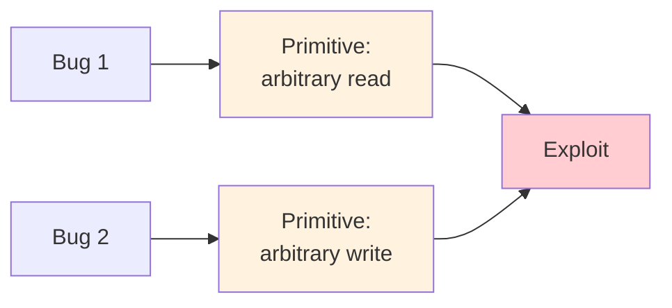

# L05 소프트웨어 버그

> **최종 수정일:** 2026-10-08
>
> Software Security: Principles, Policies, and Protection, Payer - Ch 4, 5

> **학습 목표**:
> 1. 소프트웨어 버그가 공격 프리미티브로 이어지는 방식과, 프리미티브의 연쇄가 익스플로잇이 되는 과정을 설명할 수 있다
> 2. 임의 쓰기, 위치가 제한된 쓰기, 임의 읽기 프리미티브를 설명할 수 있다
> 3. 코드에서 흔한 C/C++ 버그 유형을 찾아낼 수 있다: 부적절한 초기화, 부작용, 스코프, 연산자 우선순위, 제어 흐름, Use-After-Free, 정의되지 않은 동작, 타입 혼동

---

## 목차

- [1. 소프트웨어 버그에서 공격 프리미티브로](#1-소프트웨어-버그에서-공격-프리미티브로)
  - [1.1 공격 프리미티브](#11-공격-프리미티브)
  - [1.2 임의 쓰기](#12-임의-쓰기)
  - [1.3 위치가 제한된 임의 쓰기](#13-위치가-제한된-임의-쓰기)
  - [1.4 임의 읽기](#14-임의-읽기)
- [2. 흔한 버그 유형](#2-흔한-버그-유형)
  - [2.1 부적절한 초기화](#21-부적절한-초기화)
  - [2.2 부작용](#22-부작용)
  - [2.3 스코프](#23-스코프)
  - [2.4 연산자 우선순위](#24-연산자-우선순위)
  - [2.5 제어 흐름: 잘못 들어간 세미콜론](#25-제어-흐름-잘못-들어간-세미콜론)
  - [2.6 제어 흐름: goto fail](#26-제어-흐름-goto-fail)
  - [2.7 Use-After-Free](#27-use-after-free)
  - [2.8 정의되지 않은 동작](#28-정의되지-않은-동작)
  - [2.9 타입 혼동](#29-타입-혼동)
- [개념 적용](#개념-적용)
- [요약](#요약)
- [점검 문제](#점검-문제)

---

<br>

## 1. 소프트웨어 버그에서 공격 프리미티브로

### 1.1 공격 프리미티브

- **공격 프리미티브(attack primitive)** 는 익스플로잇의 구성 요소이다.
  - **익스플로잇(exploitation)** 은 소프트웨어 취약점이나 보안 결함을 이용해 의도하지 않은 효과를 일으키는 것이다(예: 원격으로 네트워크에 접근해 높은 권한을 얻거나, 네트워크 깊숙이 이동하는 것).
- **소프트웨어 버그는 공격 프리미티브로 이어진다.** 즉, 버그는 공격자에게 연산 능력을 제공한다.
- **공격 프리미티브의 연쇄가 익스플로잇이 되며**, 공격 프리미티브의 바탕이 된 버그는 **취약점**이 된다.



### 1.2 임의 쓰기

```c
int global[10];

void set(int idx, int val) {
  global[idx] = val;
}
```

`idx`와 `val`을 제어하면 공격자는 **배열 경계 밖의 위치를 선택하고 4바이트 값을 쓸 수 있다**. 바이트 오프셋은 `idx * sizeof(int)`로 계산한다.

### 1.3 위치가 제한된 임의 쓰기

```c
int vuln(char *u1) {
  /* assert(strlen(u1) < MAX); */
  char tmp[MAX];
  strcpy(tmp, u1);
  /* equivalent:
     char *out = tmp;
     while ((*out++ = *u1++) != '\0') {}
   */
  return strcmp(tmp, "foo");
}
```

`u1`을 제어하는 공격자는 **`tmp` 위쪽**의 스택 값을 (`\0`을 제외하고) 덮어쓸 수 있으며, 덮어쓴 영역은 `\0` 바이트로 끝난다.

### 1.4 임의 읽기

```c
int global[10];

int get(int idx) {
  return global[idx];
}
```

`idx`를 제어하고 반환값을 관찰하면 공격자는 **배열 경계 밖의 4바이트 값을 읽을 수 있다**. 실제 범위는 쓰기 예제와 마찬가지로 주소 연산 방식과 매핑에 달려 있다.

| 프리미티브 | 공격자가 제어하는 것 | 능력 |
|:----------|:------------------|:-----------|
| 임의 쓰기 | `idx`, `val` | `global` 근처에 임의의 4바이트 값을 쓴다 |
| 위치가 제한된 임의 쓰기 | `u1` | 스택에서 `tmp` 위쪽에 0이 아닌 바이트를 쓰며, 마지막은 `\0`이다 |
| 임의 읽기 | `idx` (그리고 반환값을 본다) | `global` 근처의 임의의 4바이트 값을 읽는다 |

> **핵심:** 임의 읽기는 보통 무작위화를 우회하기 위한 주소나 카나리 값 같은 비밀을 유출하는 데 쓰이고, 이어서 임의 쓰기로 코드 포인터를 손상시킨다. 실제 익스플로잇은 대개 두 종류의 프리미티브를 연결한다.

---

<br>

## 2. 흔한 버그 유형

모든 버그가 공격 프리미티브에 직접 대응하지는 않는다. C/C++의 오류는 초기화, 표현식 평가, 제어 흐름, 객체 수명, 타입 변환 등 다양한 원인에서 발생한다. 특정 오류만 검사하는 방어는 다른 오류 경로를 놓칠 수 있다.

### 2.1 부적절한 초기화

```c
typedef unsigned int uint;
int getmin(int *arr, uint len) {
  int min;
  for (int i=0; i<len; i++)
    min = (min < arr[i]) ? min : arr[i];
  return min;
}
```

`min`이 **초기화되지 않았으므로** 임의의 값을 가질 수 있다. (`-Wuninitialized`로 잡을 수 있을까?)

> **참고:** 초기화되지 않은 `min`을 읽는 코드를 특정 쓰레기 값이 반환되는 동작으로 보장해서는 안 된다. 이 예제는 정의되지 않은 동작을 일으킬 수 있다. `len > 0`을 확인한 뒤 `arr[0]`으로 초기화하고 두 번째 원소부터 순회하거나, 빈 입력의 처리까지 정한 뒤 `INT_MAX`로 초기화한다. 컴파일러 경고가 모든 경로를 잡아내지는 못한다.

### 2.2 부작용

```c
if (foo == 12 || (bar = 13))
  baz = 12;
```

**`foo != 12`일 때만 `bar = 13`이 실행되며, `baz = 12`는 두 경우 모두 실행된다.** `foo == 12`이면 왼쪽이 참이므로 오른쪽 대입을 생략한다. 그렇지 않으면 대입식의 값 13이 참이므로 조건문 본문을 실행한다.

> **단락 평가:** 조건식 안의 대입이나 함수 호출은 앞선 피연산자의 값에 따라 실행 여부가 달라질 수 있다. 대입식의 결과가 13이므로 이 예제의 전체 조건은 두 경우 모두 참이다.

> **[프로그래밍언어]** C에서 `=`는 값을 대입하고, 대입식 자체도 그 값을 결과로 가진다. 조건식에서는 0이 아닌 값이 참이다. 반면 `==`는 두 값을 비교한다. 따라서 `(bar = 13)`은 참이며, 단락 평가에 따라 대입문 자체가 실행될지가 결정된다. 대입과 비교를 구분하면 이 예제의 흐름을 훨씬 쉽게 따라갈 수 있다.

### 2.3 스코프

```c
int a;
void calc(int b) {
  int a = b*12;
  if (b + 24 == 96)
    a = b;
}
```

**지역 변수 `a`에 값이 대입되고, 전역 변수 `a`는 수정되지 않는다.** 지역 선언이 전역 선언을 가린다(shadowing).

### 2.4 연산자 우선순위

```c
void find(node **curr, val) {
  while (*curr != NULL) {
    if (*curr->val == val) {
      return;
    } else {
      *curr = *curr->next;
    }
  }
}
```

**화살표 연산자 `->`와 점 연산자 `.`는 역참조 `*`보다 더 강하게 결합**하므로, `*curr->val`은 `*(curr->val)`을 의미한다. 괄호를 쓰면 문제가 해결된다. 즉, `(*curr)->`로 써야 한다.

### 2.5 제어 흐름: 잘못 들어간 세미콜론

```c
int x,y;
for (x=0; x<xlen; x++)
  for (y=0; y<ylen; y++);
    pix[y*xlen + x] = x*y;
```

**잘못 들어간 `;`가 두 번째 반복문의 문장을 끝내므로**, 대입은 **한 번만** 실행된다. 바깥 반복문의 본문은 빈 문장을 가진 안쪽 반복문뿐이므로, 대입은 두 반복문이 모두 끝난 뒤 `x == xlen`, `y == ylen`인 상태에서 실행된다. (범위를 벗어난) 쓰기 `pix[ylen*xlen + xlen] = xlen*ylen`만 실행된다. 이러한 오류는 **부분적인 초기화**를 일으켜 공격자가 **정보를 유출**할 수 있게 한다.

### 2.6 제어 흐름: goto fail

```c
if (isbad(cert))
  goto fail;
if (invalid(cert))
  goto fail;
  goto fail;
```

**두 번째 `goto`는 어떤 경우에도 실행되며**(더 이상 `if`의 범위에 속하지 않는다), 항상 오류로 빠진다. 이것이 Apple SSL(Secure Sockets Layer) 구현의 유명한 **goto fail 버그**이다.

참고 자료: https://nakedsecurity.sophos.com/2014/02/24/anatomy-of-a-goto-fail-apples-ssl-bug-explained-plus-an-unofficial-patch/

> **참고:** Apple의 실제 코드에서는 오류 변수가 여전히 0(성공)인 상태로 `fail:`에 도달했으므로, 그곳으로 점프하면 마지막 서명 검사를 건너뛰고 인증서가 유효하다고 보고했다. 그 결과 중간자 공격자가 아무 인증서나 제시할 수 있었다. 모든 `if` 본문에 중괄호를 쓰거나, 도달할 수 없는 코드에 대한 컴파일러 경고를 켰다면 막을 수 있었다.

### 2.7 Use-After-Free

```c
Node *ptr = (Node*)malloc(sizeof(Node));
ptr->val = getval();
free(ptr);
search(ptr);
```

메모리 객체가 **해제된 뒤에 사용된다**.

참고 자료: C11 표준 초안 N1570, 6.2.4p2:

> 객체의 *수명(lifetime)* 은 그 객체를 위한 저장 공간이 예약되어 있음이 보장되는 프로그램 실행 구간이다. 객체는 수명 동안 존재하며, 일정한 주소를 가지고, 마지막으로 저장된 값을 유지한다. 객체를 수명 밖에서 참조하면 그 동작은 정의되지 않는다. 포인터가 가리키는 객체(또는 그 바로 다음)의 수명이 끝나면 포인터의 값은 불확정 상태가 된다.

### 2.8 정의되지 않은 동작

C++ 표준은 모든 C++ 프로그램의 관찰 가능한 동작을 정밀하게 정의한다.

**정의되지 않은 동작(undefined behavior)** 은 **프로그램의 동작에 아무런 제한이 없음**을 의미한다. 정의되지 않은 동작의 예는 다음과 같다.

- 배열 경계 밖의 메모리 접근
- 부호 있는 정수 오버플로우
- 널 포인터 역참조

> **참고:** 컴파일러는 정의되지 않은 동작이 절대 일어나지 않는다고 가정할 수 있으므로, 그런 경우에만 의미가 있는 코드를 제거할 수 있다. 예를 들어 부호 있는 오버플로우를 탐지하려는 `if (x + 1 < x)` 같은 검사는 최적화로 완전히 사라질 수 있다.

### 2.9 타입 혼동

타입 혼동은 **잘못된 다운캐스트**를 통해 발생한다.

```cpp
Child1 *c = new Child1();
Parent *p = static_cast<Parent*>(c);   // OK
Child2 *d = static_cast<Child2*>(p);   // Fail!
```


*그림 1. Parent로의 업캐스트(올바름)와 Child2로의 다운캐스트(잘못됨)*

`Child1`에서 `Parent`로의 업캐스트는 항상 올바르다(초록색 화살표). `Parent`에서 `Child2`로의 다운캐스트는 잘못된 것이다(빨간색 화살표). 객체가 실제로는 `Child1`이지만 `static_cast`는 이를 실행 시간에 검사하지 않기 때문이다.

---

<br>

## 개념 적용

**코드 추적과 빈칸 연습:**

| 코드 또는 상황 | 판단과 수정 방향 |
|:---------------|:-----------------|
| `foo == 12 \|\| (bar = 13)` | `foo == 12`이면 `bar`는 그대로이고 `baz = 12`가 실행된다. 그렇지 않으면 `bar = 13`과 `baz = 12`가 모두 실행된다. |
| `*curr->val`에서 `curr`가 `node **` | 의도한 필드 접근은 `(*curr)->val`이다. `->`가 `*`보다 먼저 결합한다. |
| 안쪽 `for` 뒤의 불필요한 `;` | 빈 반복문이 끝난 뒤 쓰기가 한 번 실행된다. 들여쓰기 대신 문장과 중괄호의 범위를 추적한다. |
| 초기화되지 않은 `min` | 읽기 전에 초기화하고 빈 배열의 처리도 정한다. |
| 해제 뒤 `search(ptr)` | 이전 객체의 수명이 끝난 포인터를 사용하므로 시간적 안전성 위반이다. |

```c
void set(int idx, int val) {
  if (____ || ____) return;
  global[idx] = val;                     // global has 10 elements
}
```

> **정답:** `idx < 0`, `idx >= 10`이다. `idx > 10`은 인덱스 10을 허용하므로 틀리다. 부호 있는 인덱스에서 상한만 검사하면 음수 인덱스를 놓친다.

**버그 분류:** 오류의 원인과 발생 위치에 따라 버그를 다음과 같이 분류할 수 있다. 하나의 오류가 여러 범주에 걸칠 수도 있다.

| 버그 범주 | 확인할 개념 |
|:---------|:------------|
| Unchecked system call returning code | 실패 반환값을 확인하기 전에 후속 연산을 수행하는가? |
| Stack buffer overflow/underflow | 지역 버퍼의 상한이나 하한을 넘는가? |
| Command injection | 외부 입력이 명령 문자열의 구문으로 해석되는가? |
| Arithmetic overflow/underflow | 크기나 인덱스 계산이 표현 범위를 넘는가? 부호 있는 오버플로우는 정의되지 않은 동작이며, 부호 없는 정수는 모듈러 연산으로 감기지만 위험한 크기를 만들 수 있다. |
| Heap overflow/underflow | 동적 할당 영역의 앞이나 뒤를 접근하는가? |
| Temporal safety violation | 해제되거나 무효화된 객체를 사용하는가? |
| Local persisting pointers | 지역 객체의 수명이 끝난 뒤에도 그 주소가 남아 사용되는가? |
| String vulnerability | 길이, 버퍼 용량, 종료 문자 조건을 지키는가? |
| Iteration errors | 반복 시작과 종료 조건이 유효한 모든 원소를 정확히 다루는가? |
| Wrong operators | 대입과 비교, 논리와 비트 연산, 우선순위를 혼동했는가? |
| Type error | 포인터 타입, 변환, 표현 범위가 실제 데이터와 호환되는가? |

> **핵심:** 타입 오류는 잘못된 C++ 다운캐스트뿐 아니라 부적절한 포인터 타입이나 값의 변환도 포함한다. 버그의 원인, 공격자가 통제하는 입력, 읽기나 쓰기의 범위, 보안 결과를 연결하여 설명한다.

---

<br>

## 요약

| 개념 | 핵심 요약 |
|:--------|:------------|
| 공격 프리미티브 | 버그는 프리미티브로 이어지고, 프리미티브의 연쇄가 익스플로잇이 되며, 그 바탕의 버그는 취약점이 된다. |
| 임의 쓰기 / 읽기 | 검사되지 않은 인덱스로 배열 주변의 4바이트 값을 쓰거나 읽는다. 위치는 원소 크기에 따라 계산된다. |
| 위치가 제한된 쓰기 | `strcpy`는 스택에서 `tmp` 위쪽을 0이 아닌 바이트로 덮어쓰며, 마지막은 `\0`이다. |
| 부적절한 초기화 | 초기화되지 않은 `min` 등을 읽으면 정의되지 않은 동작이 발생할 수 있다. |
| 부작용 | 조건 안의 대입이나 호출은 단락 평가에 따라 실행 여부가 달라진다. |
| 스코프 | 지역 변수가 같은 이름의 전역 변수를 가린다. |
| 연산자 우선순위 | `->`와 `.`는 `*`보다 강하게 결합하므로 `(*curr)->`로 써야 한다. |
| 제어 흐름 | 잘못 들어간 `;`나 중복된 `goto fail;`이 제어 흐름을 바꾼다(부분 초기화, 검사 생략). |
| Use-After-Free | 수명이 끝난 객체를 사용하는 것은 정의되지 않은 동작이다. |
| 정의되지 않은 동작 | 동작에 제한이 없다(범위 밖 접근, 부호 있는 오버플로우, 널 역참조). |
| 타입 혼동 | `static_cast`를 이용한 잘못된 다운캐스트는 객체에 잘못된 타입을 부여한다. |
| 메모리 및 타입 안전성 | 공간적 안전성은 경계, 시간적 안전성은 유효성에 관한 것이며, 타입 안전성은 객체가 올바른 타입을 가지도록 보장한다. |

---

<br>

## 점검 문제

1. **버그와 프리미티브:** 소프트웨어 버그, 공격 프리미티브, 익스플로잇, 취약점은 어떤 관계인가?

   > **정답:** 소프트웨어 버그는 공격 프리미티브로 이어지며, 프리미티브는 임의 읽기나 쓰기처럼 공격자에게 어떤 연산 능력을 주는 구성 요소이다. 공격 프리미티브의 연쇄가 익스플로잇이 되며, 익스플로잇에 사용된 프리미티브의 바탕이 된 버그가 취약점이 된다.

2. **임의 읽기:** `int get(int idx) { return global[idx]; }`에서 공격자는 무엇을 할 수 있으며, 이것이 익스플로잇에서 왜 유용한가?

   > **정답:** `idx`를 제어하고 반환값을 관찰하면 배열 경계 밖의 값을 읽어 주소나 카나리 같은 비밀을 유출할 수 있다. 이어서 쓰기 프리미티브로 코드 포인터를 손상시키면 방어를 우회하는 익스플로잇으로 연결된다. 접근 가능한 주소의 범위는 `idx * sizeof(int)`의 주소 계산과 실제 메모리 매핑에 따라 달라진다.

3. **연산자 우선순위:** `find` 함수의 `*curr->val`은 무엇이 잘못되었으며, 어떻게 고치는가?

   > **정답:** `->`가 `*`보다 강하게 결합하므로 `*curr->val`은 `*(curr->val)`로 해석된다. 이는 `curr`(`node **`)를 `node *`처럼 취급한 뒤 그 결과를 역참조하는 것이다. 의도한 표현식은 `(*curr)->val`이며, `(*curr)->next`에도 같은 수정이 필요하다.

4. **제어 흐름:** goto fail 버그를 설명하라.

   > **정답:** 두 번째 `if` 다음에 중복된 `goto fail;`이 어떤 `if` 본문에도 속하지 않았으므로 무조건 실행되었다. 따라서 모든 실행이 `fail` 레이블로 점프하여 나머지 인증서 검사를 건너뛰었다. Apple의 SSL 구현에서는 그 시점에 오류 변수가 여전히 성공을 나타내고 있었으므로, 잘못된 인증서가 받아들여졌다.

5. **정의되지 않은 동작:** 정의되지 않은 동작을 정의하고, 예를 세 가지 들어라.

   > **정답:** 정의되지 않은 동작은 언어 표준이 프로그램의 동작에 아무런 제한을 두지 않는다는 뜻이므로, 결과는 비정상 종료, 조용한 손상, 또는 그 밖의 무엇이든 될 수 있다. 예로는 배열 경계 밖의 메모리 접근, 부호 있는 정수 오버플로우, 널 포인터 역참조가 있으며, C11 6.2.4p2에 따르면 Use-After-Free도 정의되지 않은 동작이다.

6. **타입 혼동:** `p`가 `Child1` 객체에서 얻어진 경우 `static_cast<Child2*>(p)`가 실패하는 이유는 무엇인가?

   > **정답:** `p`는 `Child1` 객체를 가리키므로 `Child2*`로의 다운캐스트는 정의되지 않은 동작이다. `static_cast`는 실제 객체에 대한 실행 시간 검사를 하지 않아 컴파일될 수 있다. 이는 캐스트의 안전성이 확인되었다는 뜻이 아니며, 다른 타입의 필드나 가상 함수를 잘못 해석하는 타입 혼동으로 이어질 수 있다.

---
