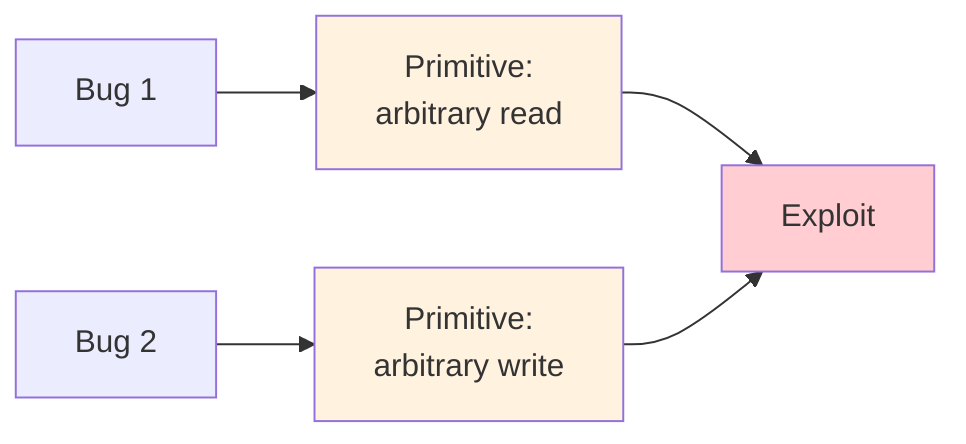
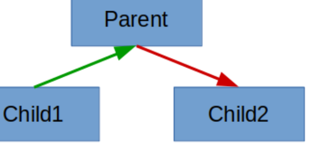

# Lecture 05 — Software Bugs

> **Last Updated:** 2026-10-06
>
> Software Security: Principles, Policies, and Protection, Payer - Ch 4, 5

> **Learning Objectives**:
> 1. Explain how software bugs map to attack primitives and how a chain of primitives forms an exploit
> 2. Describe the arbitrary write, limited-location write, and arbitrary read primitives
> 3. Recognize common C/C++ bug types in code: improper initialization, side effects, scoping, operator precedence, control flow, use-after-free, undefined behavior, and type confusion

---

## Table of Contents

- [1. From Software Bugs to Attack Primitives](#1-from-software-bugs-to-attack-primitives)
  - [1.1 Attack Primitives](#11-attack-primitives)
  - [1.2 Arbitrary Write](#12-arbitrary-write)
  - [1.3 Arbitrary Write, Limited Location](#13-arbitrary-write-limited-location)
  - [1.4 Arbitrary Read](#14-arbitrary-read)
- [2. Common Bug Types](#2-common-bug-types)
  - [2.1 Improper Initialization](#21-improper-initialization)
  - [2.2 Side Effects](#22-side-effects)
  - [2.3 Scoping](#23-scoping)
  - [2.4 Operator Precedence](#24-operator-precedence)
  - [2.5 Control Flow: A Rogue Semicolon](#25-control-flow-a-rogue-semicolon)
  - [2.6 Control Flow: goto fail](#26-control-flow-goto-fail)
  - [2.7 Use-After-Free](#27-use-after-free)
  - [2.8 Undefined Behavior](#28-undefined-behavior)
  - [2.9 Type Confusion](#29-type-confusion)
- [Summary](#summary)
- [Self-Check Questions](#self-check-questions)

---

<br>

## 1. From Software Bugs to Attack Primitives

### 1.1 Attack Primitives

- **Attack primitives** are the building blocks of an exploit.
  - **Exploitation** takes advantage of a software vulnerability or security flaw to cause unintended effects (e.g., remotely accessing a network and gaining elevated privileges, or moving deeper into the network).
- **Software bugs map to attack primitives**, i.e., they enable computation for the attacker.
- **A chain of attack primitives results in an exploit**, and the underlying bugs of the attack primitives become **vulnerabilities**.



### 1.2 Arbitrary Write

```c
int global[10];

void set(int idx, int val) {
  global[idx] = val;
}
```

An attacker with control of `idx` and `val` can set **any 4-byte location within ±2 GB around `global`** to an arbitrary value.

### 1.3 Arbitrary Write, Limited Location

```c
void vuln(char *u1) {
  /* assert(strlen(u1) < MAX); */
  char tmp[MAX];
  strcpy(tmp, u1);
  /* equivalent:
     while (*u1 != 0)
       *(tmp++) = *u1++;
   */
  return strcmp(tmp, "foo");
}
```

An attacker with control of `u1` can overwrite values (except `\0`) on the stack **above `tmp`**, ending with a `\0` byte.

### 1.4 Arbitrary Read

```c
int global[10];

int get(int idx) {
  return global[idx];
}
```

An attacker with control over `idx` and access to the return value can **read arbitrary 4-byte values within ±2 GB of `global`'s address**.

| Primitive | Attacker Controls | Capability |
|:----------|:------------------|:-----------|
| Arbitrary write | `idx`, `val` | Write any 4-byte value near `global` |
| Arbitrary write, limited location | `u1` | Write non-zero bytes above `tmp` on the stack, ending with `\0` |
| Arbitrary read | `idx` (and sees the return value) | Read any 4-byte value near `global` |

> **Key Point:** An arbitrary read is typically used to leak secrets such as addresses (to defeat randomization) or canary values, and an arbitrary write is then used to corrupt a code pointer. Real exploits usually chain both kinds of primitives.

---

<br>

## 2. Common Bug Types

Not all bugs map as clearly to primitives as the earlier examples. **C/C++ provides many different opportunities for failure.** The slide illustrates this with a photograph titled "Maximum Security Entrance": a gate on a path whose surrounding lawn is covered with tire tracks that simply drive around it. A single check is useless if there are many other ways around it.

### 2.1 Improper Initialization

```c
typedef unsigned int uint;
int getmin(int *arr, uint len) {
  int min;
  for (int i=0; i<len; i++)
    min = (min < arr[i]) ? min : arr[i];
  return min;
}
```

`min` is **not initialized** and may have an arbitrary value. (Would `-Wuninitialized` catch it?)

> **Note:** If the stale stack value in `min` happens to be smaller than every element, the function returns that garbage value, and if `len` is 0, it always does. The fix is to initialize `min` with `arr[0]` (after checking `len > 0`) or with `INT_MAX`. `-Wuninitialized` (enabled by `-Wall`) warns about such cases, but compilers cannot catch every path.

### 2.2 Side Effects

```c
if (foo == 12 || (bar = 13))
  baz = 12;
```

According to the slide, **`bar` is set if `foo != 12`, while `baz` is never set.** Watch out when calling functions in an expression; their side effects will linger.

> **Note:** Because `||` short-circuits, the assignment `bar = 13` is only evaluated when `foo != 12`, which is the side effect the slide warns about. Strictly speaking, as written, `bar = 13` evaluates to 13 (true), so `baz` is set in both cases; the point to remember is that an assignment or function call inside a condition may or may not run depending on the other operands.

> **[C Programming]** In C, `=` assigns a value and the assignment expression itself evaluates to that value; any nonzero value is true in a condition. By contrast, `==` compares two values. Thus `(bar = 13)` is true, and short-circuit evaluation determines whether that assignment runs at all. Keeping assignment and comparison distinct makes this example much easier to trace.

### 2.3 Scoping

```c
int a;
void calc(int b) {
  int a = b*12;
  if (b + 24 == 96)
    a = b;
}
```

The **local variable `a` is assigned, while the global variable `a` is not modified**: the local declaration shadows the global one.

### 2.4 Operator Precedence

```c
void find(node **curr, val) {
  while (*curr != NULL) {
    if (*curr->val == val) {
      return;
    } else {
      *curr = *curr->next;
    }
  }
}
```

The **arrow operator `->` and the dot operator `.` bind more tightly than dereference `*`**, so `*curr->val` means `*(curr->val)`. Parentheses would solve the problem, i.e., `(*curr)->`.

### 2.5 Control Flow: A Rogue Semicolon

```c
int x,y;
for (x=0; x<xlen; x++)
  for (y=0; y<ylen; y++);
    pix[y*xlen + x] = x*y;
```

A **rogue `;` terminates the statement in the second loop**, and the assignment will only be executed **once**. The body of the outer loop is just the inner loop with its empty statement, so the assignment runs after both loops have finished, with `x == xlen` and `y == ylen`. Only the (out-of-bounds) write `pix[ylen*xlen + xlen] = xlen*ylen` will be executed. Such errors may result in **partial initialization**, allowing an adversary to **leak information**.

### 2.6 Control Flow: goto fail

```c
if (isbad(cert))
  goto fail;
if (invalid(cert))
  goto fail;
  goto fail;
```

A **double `goto` executes in any case** (it is no longer scoped by the `if`) and always errors out. This was the famous **goto fail bug** in Apple's SSL (Secure Sockets Layer) implementation.

Reference: https://nakedsecurity.sophos.com/2014/02/24/anatomy-of-a-goto-fail-apples-ssl-bug-explained-plus-an-unofficial-patch/

> **Note:** In Apple's real code, `fail:` was reached with the error variable still holding 0 (success), so jumping there skipped the final signature check and reported the certificate as valid. As a result, a man-in-the-middle could present any certificate. Braces around every `if` body, or a compiler warning for unreachable code, would have prevented it.

### 2.7 Use-After-Free

```c
Node *ptr = (Node*)malloc(sizeof(Node));
ptr->val = getval();
free(ptr);
search(ptr);
```

A memory object is **used after it has been deallocated**.

Reference: C11 standard draft N1570, 6.2.4p2:

> The *lifetime* of an object is the portion of program execution during which storage is guaranteed to be reserved for it. An object exists, has a constant address, and retains its last-stored value throughout its lifetime. If an object is referred to outside of its lifetime, the behavior is undefined. The value of a pointer becomes indeterminate when the object it points to (or just past) reaches the end of its lifetime.

### 2.8 Undefined Behavior

The C++ standard precisely defines the observable behavior of every C++ program.

**Undefined behavior** means that there are **no restrictions on the behavior of the program**. Examples of undefined behavior are:

- Memory accesses outside of array bounds
- Signed integer overflow
- Null pointer dereference

> **Note:** Because the compiler may assume that undefined behavior never happens, it can remove code that only matters when it does. For example, a check such as `if (x + 1 < x)` intended to detect signed overflow may be optimized away entirely.

### 2.9 Type Confusion

Type confusion arises through **illegal downcasts**.

```cpp
Child1 *c = new Child1();
Parent *p = static_cast<Parent*>(c);   // OK
Child2 *d = static_cast<Child2*>(p);   // Fail!
```



*Lecture 05, Slide 16 — Upcast to Parent (legal) and downcast to Child2 (illegal)*

The upcast from `Child1` to `Parent` is always legal (green arrow). The downcast from `Parent` to `Child2` is illegal (red arrow), because the object is actually a `Child1`, and `static_cast` does not check this at run time.

---

<br>

## Summary

| Concept | Key Summary |
|:--------|:------------|
| Attack primitives | Bugs map to primitives; a chain of primitives forms an exploit, and the underlying bugs become vulnerabilities. |
| Arbitrary write / read | An unchecked index lets an attacker write or read any 4-byte value within ±2 GB of `global`. |
| Limited-location write | `strcpy` overwrites non-zero bytes above `tmp` on the stack, ending with `\0`. |
| Improper initialization | Uninitialized variables (e.g., `min`) hold arbitrary values. |
| Side effects | Assignments or calls inside conditions run only depending on short-circuit evaluation. |
| Scoping | A local variable shadows a global variable of the same name. |
| Operator precedence | `->` and `.` bind more tightly than `*`; write `(*curr)->`. |
| Control flow | A rogue `;` or a duplicated `goto fail;` changes the control flow (partial initialization, skipped checks). |
| Use-after-free | Using an object after its lifetime ends is undefined behavior. |
| Undefined behavior | No restrictions on behavior (out-of-bounds access, signed overflow, null dereference). |
| Type confusion | Illegal downcasts with `static_cast` give an object the wrong type. |
| Memory and type safety | Spatial safety is about bounds, temporal safety is about validity, and type safety ensures that objects have the correct type. |

---

<br>

## Self-Check Questions

1. **Bugs and Primitives:** How are software bugs, attack primitives, exploits, and vulnerabilities related?

   > **Answer:** Software bugs map to attack primitives, which are building blocks that give the attacker some computation, such as an arbitrary read or write. A chain of attack primitives results in an exploit, and the bugs underlying the primitives used in the exploit become vulnerabilities.

2. **Arbitrary Read:** In `int get(int idx) { return global[idx]; }`, what can an attacker do, and why is this useful in an exploit?

   > **Answer:** By controlling `idx` and observing the return value, the attacker can read any 4-byte value within about ±2 GB of `global`. Such a read primitive is typically used to leak secrets, such as addresses or canaries, which are then used together with a write primitive to build a reliable exploit.

3. **Operator Precedence:** What is wrong with `*curr->val` in the `find` function, and how is it fixed?

   > **Answer:** `->` binds more tightly than `*`, so `*curr->val` is parsed as `*(curr->val)`, which treats `curr` (a `node **`) as if it were a `node *` and then dereferences the result. The intended expression is `(*curr)->val`, and the same fix applies to `(*curr)->next`.

4. **Control Flow:** Explain the goto fail bug.

   > **Answer:** After the second `if`, a duplicated `goto fail;` was not part of any `if` body, so it executed unconditionally. Every execution therefore jumped to the `fail` label, skipping the remaining certificate checks. In Apple's SSL implementation, the error variable still indicated success at that point, so invalid certificates were accepted.

5. **Undefined Behavior:** Define undefined behavior and give three examples.

   > **Answer:** Undefined behavior means that the language standard places no restrictions on what the program does, so the result may be a crash, silent corruption, or anything else. Examples are memory accesses outside array bounds, signed integer overflow, and null pointer dereference; use-after-free is also undefined behavior according to C11 6.2.4p2.

6. **Type Confusion:** Why does `static_cast<Child2*>(p)` fail when `p` was obtained from a `Child1` object?

   > **Answer:** `p` points to an object that is actually a `Child1`. Casting it down to `Child2*` is illegal because the object is not a `Child2`, but `static_cast` performs no runtime check, so the cast succeeds and any access through `d` interprets `Child1`'s memory as a `Child2`, which is type confusion.

---
