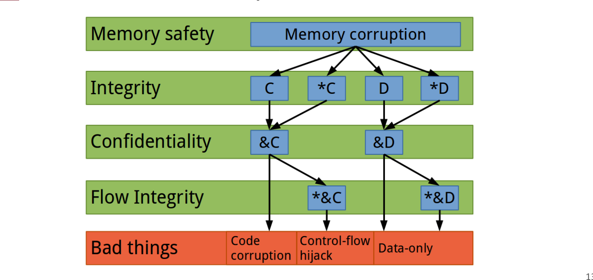
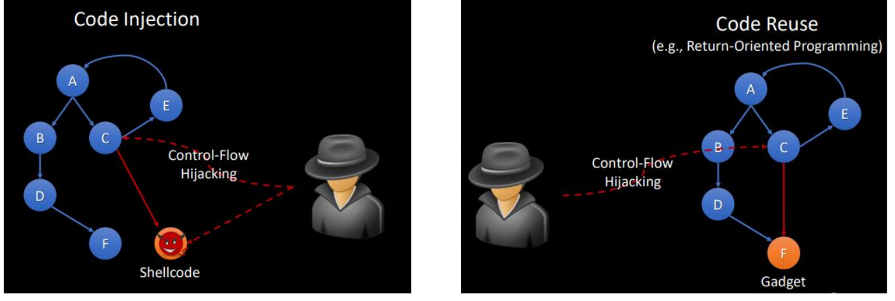
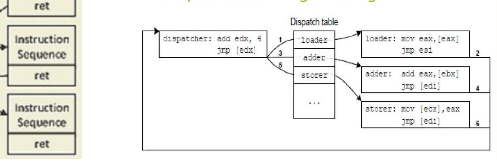
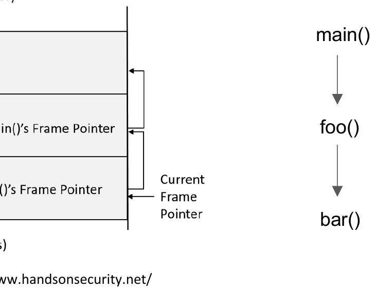
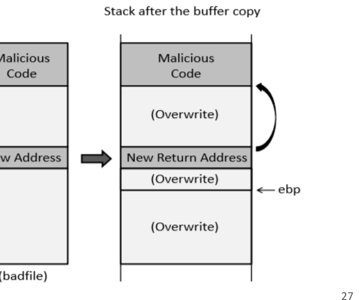
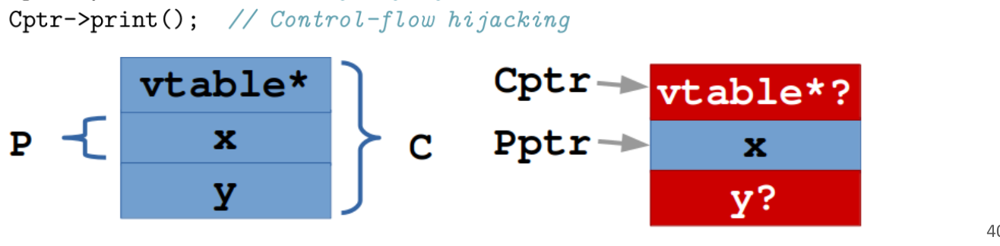
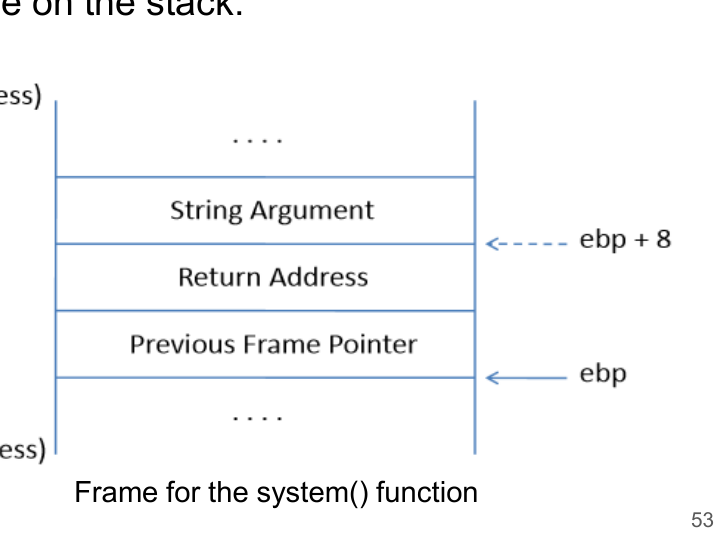

# L06 익스플로잇

> **최종 수정일:** 2026-10-08
>
> Software Security: Principles, Policies, and Protection, Payer - Ch 5

> **학습 목표**:
> 1. 익스플로잇이 무엇인지, 공격자의 네 가지 목표(DoS, 정보 유출, 코드 실행, 권한 상승)를 설명할 수 있다
> 2. 저수준 공격이 메모리/타입 안전성 위반에서 시작되어 "나쁜 결과"로 이어지는 경로를 설명할 수 있다
> 3. 코드 실행 공격의 세 유형(코드 변조, 코드 주입, 코드 재사용)을 구분할 수 있다
> 4. 스택 기반 버퍼 오버플로우 익스플로잇의 개념적 단계를 설명할 수 있다
> 5. return-to-libc와 타입 혼동 익스플로잇이 왜 방어 기법을 우회하는지 설명할 수 있다

---

## 목차

- [1. 익스플로잇 개요](#1-익스플로잇-개요)
  - [1.1 익스플로잇이란](#11-익스플로잇이란)
  - [1.2 악성코드: 바이러스, 웜, 트로이 목마](#12-악성코드-바이러스-웜-트로이-목마)
  - [1.3 악성코드 전략: Morris 웜](#13-악성코드-전략-morris-웜)
- [2. 공격자의 목표](#2-공격자의-목표)
  - [2.1 서비스 거부 (DoS)](#21-서비스-거부-dos)
  - [2.2 정보 유출](#22-정보-유출)
  - [2.3 코드 실행](#23-코드-실행)
  - [2.4 권한 상승](#24-권한-상승)
- [3. 저수준 공격 경로](#3-저수준-공격-경로)
  - [3.1 메모리 안전성과 타입 안전성 위반](#31-메모리-안전성과-타입-안전성-위반)
  - [3.2 소프트웨어 공격 유형](#32-소프트웨어-공격-유형)
  - [3.3 코드 실행과 코드 포인터](#33-코드-실행과-코드-포인터)
  - [3.4 코드 변조](#34-코드-변조)
  - [3.5 코드 주입](#35-코드-주입)
  - [3.6 코드 재사용](#36-코드-재사용)
- [4. 종단 간 익스플로잇](#4-종단-간-익스플로잇)
  - [4.1 스택 레이아웃과 함수 호출](#41-스택-레이아웃과-함수-호출)
  - [4.2 스택 기반 코드 주입의 개념적 단계](#42-스택-기반-코드-주입의-개념적-단계)
  - [4.3 힙 기반 코드 주입](#43-힙-기반-코드-주입)
  - [4.4 타입 혼동](#44-타입-혼동)
- [5. 방어와 우회: Return-to-libc](#5-방어와-우회-return-to-libc)
  - [5.1 실행 불가능 스택](#51-실행-불가능-스택)
  - [5.2 Return-to-libc의 개념](#52-return-to-libc의-개념)
- [개념 적용](#개념-적용)
- [요약](#요약)
- [점검 문제](#점검-문제)

---

<br>

## 1. 익스플로잇 개요

### 1.1 익스플로잇이란


- 익스플로잇은 소프트웨어 취약점이나 보안 결함을 이용해 의도하지 않은 효과를 일으키는 것이다(예: 원격으로 네트워크에 접근해 높은 권한을 얻거나, 네트워크 깊숙이 이동하는 것).
- 공격 모델의 전제는 다음과 같다.
  1. 주어진 소프트웨어에 보안과 관련된 취약점이 있다.
  2. 우리가 그 취약점을 **알고 있다**.

> **핵심:** 익스플로잇은 취약점을 공격자의 능력으로 전환하는 과정이다. 악용에 필요한 조건을 분석하면 해당 조건을 제한하는 **완화 기법(mitigation)** 을 설계할 수 있다.

### 1.2 악성코드: 바이러스, 웜, 트로이 목마

**악성코드(malware)** 는 컴퓨터 시스템에 피해를 주도록 의도적으로 설계된 모든 소프트웨어이다. 최초의 바이러스, 웜, 트로이 목마는 가정용 컴퓨터(와 네트워크)의 등장과 함께 나타났다.

| | 웜 (Worms) | 바이러스 (Viruses) | 트로이 목마 (Trojan Horses) |
|:--|:-----------|:-------------------|:----------------------------|
| 자기 복제 | 가능 | 가능 | 불가능 |
| 특징 | 기존 프로그램에 붙을 필요가 없다 | 기존 프로그램에 스스로를 붙인다 | 스파이웨어, 랜섬웨어가 트로이 목마의 일종이다 |

### 1.3 악성코드 전략: Morris 웜

**Morris 웜**은 1988년 인터넷의 상당 부분에서 코드 실행을 얻기 위해 사용한 일련의 익스플로잇 덕분에 널리 퍼졌다.

| 전략 | 설명 |
|:-----|:-----|
| `rsh`/`rexec`에 대한 사전 공격 | `rsh`, `rexec`는 원격 컴퓨터에서 셸 명령을 실행하게 해 준다 |
| `fingerd`의 스택 기반 오버플로우 | 셸을 생성하기 위해 악용 |
| `sendmail`의 디버그 모드로 명령어 주입 | |

> **참고:** Morris 웜은 역사상 최초의 대규모 인터넷 웜으로 꼽히며, 당시 인터넷에 연결된 컴퓨터의 약 10%를 마비시켰다. 이 사건을 계기로 미국에 CERT(Computer Emergency Response Team)가 설립되었다. 세 가지 서로 다른 취약점을 동시에 이용하여 여러 공격 기법이 결합될 수 있음을 보여 준다.

---

<br>

## 2. 공격자의 목표

공격자의 목표는 크게 네 가지이다: **서비스 거부, 정보 유출, 코드 실행, 권한 상승.**

### 2.1 서비스 거부 (DoS)

서비스의 정상적인 사용을 막는 것이다. (1) 비정상적인 서비스 종료를 일으키거나(예: 세그먼테이션 폴트), (2) 대량의 중복되거나 불필요한 요청으로 서비스를 압도하여 정상 요청을 더 이상 처리할 수 없게 만든다.

### 2.2 정보 유출

민감한 정보가 공격자에게 비정상적으로 전달되는 것이다. 정보 유출은 불법적, 암묵적, 또는 의도하지 않은 정보 전달을 악용하여, 접근 권한이 없어야 할 공격자에게 민감한 데이터를 넘긴다.

> **참고:** **콜드 부트 공격(cold boot attack)** 은 전원 차단 후에도 남아 있는 메모리 내용을 이용한다. DRAM은 전원이 꺼진 뒤에도 수 초에서 수 분간 내용을 유지하므로, 메모리 모듈을 차갑게 식혀 다른 기기로 옮기면 암호화 키 같은 민감 데이터를 읽어낼 수 있다. 이는 소프트웨어 버그가 아니라 하드웨어 특성을 이용한 정보 유출이다.

### 2.3 코드 실행

코드 실행은 공격자가 애플리케이션이 제공하는 제한된 연산에서 벗어나 임의의 코드를 대신 실행하게 한다. 두 가지 방법으로 달성할 수 있다.

1. 새로운 코드를 **주입(inject)** 한다.
2. 기존 코드를 다른 방식으로 **재사용(repurpose)** 한다.

### 2.4 권한 상승

의도하지 않은 방식으로 권한을 높이는 것이다. 공격자가 커널 버그나 특권 프로그램의 버그를 통해 관리자 권한을 얻는 것이 그 예이다. 흔한 예로 `is_admin` 플래그를 설정하는 것이 있다.

```c
bool isAdmin = false;
...
if (isAdmin) // do privileged operations
```

> **핵심:** 권한 상승은 반드시 코드 실행을 필요로 하지 않는다. 위 예처럼 **데이터 하나(`isAdmin`)만 덮어써도** 권한이 올라갈 수 있다. 이것이 뒤에 나오는 "데이터만(data-only) 공격"의 기초이다.

---

<br>

## 3. 저수준 공격 경로



*그림 1. 저수준 공격 경로*

저수준 공격은 아래에서 위로, 깨뜨리는 보안 속성에 따라 계층적으로 볼 수 있다.

1. **메모리 안전성**이 깨지면 **메모리 손상(memory corruption)** 이 일어난다.
2. 이는 **무결성(Integrity)** 위반으로 이어진다. 데이터(`C`, `D`)나 포인터(`*C`, `*D`)를 공격자가 제어하게 된다.
3. 이어서 **기밀성(Confidentiality)** 위반(주소 `&C`, `&D` 유출)이나 **흐름 무결성(Flow Integrity)** 위반(`*&C`, `*&D`, 즉 코드 포인터 제어)이 가능해진다.
4. 최종적으로 **나쁜 결과(Bad things)** 에 도달한다: **코드 변조(code corruption), 제어 흐름 탈취(control-flow hijack), 데이터만 공격(data-only).**

### 3.1 메모리 안전성과 타입 안전성 위반

- 저수준 공격은 **메모리 또는 타입 안전성 위반**에서 시작한다.
- **공간적 메모리 안전성**은 객체가 경계를 벗어나 접근될 때 위반된다.
- **시간적 메모리 안전성**은 객체가 더 이상 유효하지 않을 때 위반된다.
- **타입 안전성**은 객체가 다른(호환되지 않는) 타입으로 캐스트되어 사용될 때 위반된다.

### 3.2 소프트웨어 공격 유형

| 범주 | 유형 | 설명 |
|:-----|:-----|:-----|
| **코드 실행** | 코드 주입(Code Injection) | 새로운 코드를 프로세스에 주입한다 |
| | 코드 재사용(Code Reuse) | 프로세스의 기존 코드를 재사용한다 |
| | 제어 흐름 탈취(Control-Flow Hijacking) | 제어 흐름을 다른 목표로 돌린다 |
| | 데이터 손상(Data Corruption) | 민감한(특권 또는 중요한) 데이터를 손상시킨다 |
| **정보 유출** | Information Leak | 민감한 데이터를 출력한다 |

### 3.3 코드 실행과 코드 포인터

코드 실행은 **제어 흐름에 대한 제어**를 필요로 한다.

- 공격자는 **코드 포인터(code pointer)** 를 덮어써야 한다.
  - 스택의 **복귀 명령 포인터(return instruction pointer)**
  - **함수 포인터**
  - **가상 테이블 포인터(vtable pointer)**
- 그런 다음 프로그램이 손상된 코드 포인터를 **역참조하도록** 강제한다.



*그림 2. 코드 주입(왼쪽)과 코드 재사용(오른쪽)*

두 공격 모두 제어 흐름 탈취로 시작한다. 코드 주입은 공격자가 심은 **셸코드(shellcode)** 로 흐름을 돌리고, 코드 재사용은 기존 코드 조각인 **가젯(gadget)** 들을 이어 붙인다.

### 3.4 코드 변조

이 공격 벡터는 기존 코드를 찾아 수정하여 공격자의 연산을 실행하게 한다. 요구 조건은 다음과 같다.

- 코드 위치에 대한 지식
- 해당 영역이 **쓰기 가능**해야 함
- 프로그램이 정상 코드 경로에서 그 코드를 실행해야 함

### 3.5 코드 주입

기존 코드를 수정하거나 덮어쓰는 대신, **새로운 코드를 프로세스의 주소 공간에 주입**한다. 요구 조건은 다음과 같다.

- 쓰기 가능한 메모리 영역의 위치에 대한 지식
- 그 메모리 영역이 **실행 가능**해야 함
- 제어 흐름이 주입된 코드로 탈취/전환되어야 함
- **셸코드의 구성**

> **용어 정의:** **셸코드(shellcode)** 는 공격자가 주입하여 실행시키려는 작은 기계어 코드로, 전통적으로 셸(`/bin/sh`)을 실행하는 코드였기 때문에 이런 이름이 붙었다. 뒤에서 보듯, 실행 불가능 스택(NX)이 도입되면서 코드 주입은 점점 어려워지고 코드 재사용이 주류가 되었다.

### 3.6 코드 재사용

코드를 주입하는 대신, 프로그램의 **기존 코드를 재사용**한다. 핵심 아이디어는 기존 코드 조각들을 이어 붙여 새로운 임의의 동작을 실행하는 것이다. 요구 조건은 다음과 같다.

- 호출 프레임(가젯 주소와 레지스터 값 같은 상태)을 담은 쓰기 가능한 메모리 영역에 대한 지식
- 실행 가능한 코드 조각(**가젯, gadget**)에 대한 지식
- 제어 흐름이 준비된 호출 프레임으로 탈취/전환되어야 함
- **ROP 페이로드의 구성**

코드 재사용은 관점에 따라 여러 이름으로 불린다: **ROP**(Return-Oriented Programming), **JOP**(Jump-Oriented Programming), **COP**(Call-Oriented Programming), **COOP**(Counterfeit-Object-Oriented Programming).



*그림 3. JOP의 디스패처와 가젯*

> **용어 정의:** **가젯(gadget)** 은 보통 `ret`(ROP)이나 간접 `jmp`(JOP)로 끝나는 짧은 기존 명령어 시퀀스이다. 각 가젯은 "레지스터에 값 하나 넣기"처럼 작은 연산 하나를 수행하고, 다음 가젯으로 제어를 넘긴다. 공격자는 스택에 가젯 주소들을 나열하여, 주입한 코드가 전혀 없어도 임의의 연산을 조립한다. 이 때문에 ROP는 실행 불가능 스택(NX)을 우회한다.

---

<br>

## 4. 종단 간 익스플로잇

대표적인 익스플로잇 유형에는 스택 코드 주입, 힙 코드 주입, return-to-libc, 타입 혼동이 있다.

### 4.1 스택 레이아웃과 함수 호출



*그림 4. 함수 호출 체인의 스택 레이아웃*

`main()`이 `foo()`를 호출하고 `foo()`가 `bar()`를 호출하면, 각 함수는 스택에 자신의 **프레임(frame)** 을 쌓는다. 스택은 높은 주소에서 낮은 주소로 자란다. 관례적인 프레임 배치에서는 프레임에 지역 변수, 저장된 프레임 포인터, 복귀 주소가 들어갈 수 있다.

> **[컴퓨터구조]** 스택을 스레드에서 현재 실행 중인 함수 호출을 기록하는 공간으로 생각할 수 있다. 호출할 때 프레임을 만들고, 반환할 때 프레임을 제거한 뒤 저장된 복귀 주소에서 실행을 이어간다. 프레임의 정확한 구성과 레지스터 사용은 프로세서, 컴파일러, 호출 규약에 따라 달라지므로, 그림은 C 언어가 보장하는 배치가 아니라 이해를 돕는 모델이다.

**취약한 프로그램의 구조(개념):**

```c
int foo(char *str) {
  char buffer[100];
  /* 버퍼 오버플로우 문제가 있는 문장 */
  strcpy(buffer, str);
  return 1;
}
```

- `str`의 내용을 400바이트 크기의 변수에 저장하고, `foo`를 호출하면서 인자로 넘긴다.
- `foo`는 100바이트짜리 `buffer`에 길이 검사 없이 `strcpy`로 복사한다.
- 입력이 사용자 제어(예: 파일에서 읽은 내용)이므로, 100바이트를 넘는 입력은 **복귀 주소를 덮어쓸 수 있다**.

### 4.2 스택 기반 코드 주입의 개념적 단계

버퍼 오버플로우로 복귀 주소를 덮어쓰면, 그 주소는 다음 중 하나를 가리킬 수 있다.

- 유효하지 않은 명령 → 프로그램 비정상 종료
- 존재하지 않는 주소 → 비정상 종료
- **공격자의 코드** → 권한 획득



*그림 5. 버퍼 복사 후의 스택*

다음 공격 모델은 스택 보호자, 주소 무작위화, 실행 불가능 스택이 적용되지 않은 32비트 실행 환경을 가정한다.

| 단계 | 목표 | 개념 |
|:-----|:-----|:-----|
| **Task A** | 버퍼 시작과 복귀 주소 사이의 거리를 찾는다 | 디버거(gdb)로 버퍼 주소와 프레임 포인터 주소를 확인하여 오프셋을 계산한다(예: 108 + 4 = 112바이트) |
| **Task B** | 셸코드를 둘 주소를 찾는다 | 복귀 주소를 버퍼 안의 셸코드 위치로 가리키게 한다 |

> **용어 정의:** **NOP 슬레드(NOP sled)** 는 아무 동작도 하지 않는 NOP 명령을 길게 늘어놓은 것이다. 복귀 주소가 정확한 셸코드 시작점을 맞히기 어려우므로, 버퍼 앞부분을 NOP로 채우고 셸코드를 뒤쪽에 둔다. 복귀 주소가 NOP 영역 어디든 떨어지면 CPU가 NOP들을 미끄러져 내려와 셸코드에 도달한다. 이는 주소를 정확히 모를 때 성공 확률을 높이는 기법이다.

> **참고:** 32비트 x86의 복귀 주소는 4바이트이며, x86-64의 복귀 주소는 8바이트이다. Linux x86-64에서 `execve`의 시스템 콜 번호는 `0x3b`(59)이다. 주소 크기, 바이트 순서, 호출 규약, 시스템 콜 인터페이스는 대상 아키텍처에 맞춰 해석해야 한다.

### 4.3 힙 기반 코드 주입

스택 예제와 유사하게, 데이터가 경계가 있는 버퍼에 복사된다. 버퍼 옆에 **코드 포인터**가 있으면, 공격자는 버퍼 오버플로우를 통해 이 코드 포인터를 덮어쓸 수 있다.

**힙 기반 익스플로잇 전략(개념):**

- 힙에 새 코드를 주입하고, 제어 흐름을 주입된 코드로 탈취한다.
- 환경: 카나리 없음, NX 비활성화(`checksec`로 확인).
- 실행 가능한 코드를 힙에 둔다.
  - 옵션 1: 버퍼 자체 안에
  - 옵션 2: 데이터 구조체 옆에
  - 프로그램이 데이터 구조체의 정보를 유출하는 경우를 이용
- 셸을 여는 익스플로잇 페이로드를 준비한다.

```c
struct data {
  char buf[32];
  void (*fct)(int);
};
```

위 구조체는 버퍼 `buf` 바로 뒤에 함수 포인터 `fct`를 둔다. `buf`에 대한 오버플로우가 `fct`를 덮어쓸 수 있고, 이후 프로그램이 `fct`를 호출하면 공격자가 지정한 주소로 점프한다.

### 4.4 타입 혼동



*그림 6. 타입 혼동과 vtable*

```cpp
struct P { int x; };
struct C: P {
  int y;
  virtual void print();
};
P *Pptr = new P;
C *Cptr = static_cast<C*>(Pptr);   // Type confusion
Cptr->y = 0x43;                    // Memory safety violation
Cptr->print();                     // Control-flow hijacking
```

이 예제는 공개 상속과 공개 멤버를 사용한다. 다형적 객체는 일반적으로 가상 함수 테이블을 참조하는 포인터를 가진다. 실제 오프셋과 기본 클래스 포인터 조정은 ABI에 따라 달라지며, 잘못된 다운캐스트의 구체적인 실행 결과는 보장되지 않는다.

- `Pptr`은 `P` 객체를 가리키는데, 이를 `C*`로 캐스트한다(타입 혼동).
- `P`에는 `y` 필드도, vtable 포인터도 없다. 그런데 `C`로 해석하면 `C`의 레이아웃(`vtable*`, `x`, `y`)에 맞춰 접근한다.
- `Cptr->y = 0x43`은 `P` 객체 경계 밖의 메모리에 쓴다(메모리 안전성 위반).
- `Cptr->print()`는 가상 함수 호출이므로 vtable 포인터를 역참조하는데, 그 자리에 공격자가 제어하는 값이 있으면 제어 흐름이 탈취된다.

**타입 혼동 공격의 핵심:**

- 서로 다른 타입의 두 포인터로 하나의 메모리 영역을 제어한다.
- 필드를 서로 다르게 해석함으로써 "기회(opportunity)"가 생긴다.

> **참고:** 타입 혼동은 특히 브라우저의 JavaScript 엔진에서 자주 나타난다. 한 타입의 객체를 다른 타입으로 다루게 만들면, 한쪽 해석에서는 정수 필드인 값이 다른 해석에서는 포인터가 되어, 임의 읽기/쓰기 프리미티브로 이어진다.

---

<br>

## 5. 방어와 우회: Return-to-libc

### 5.1 실행 불가능 스택

가장 기본적인 완화 기법 중 하나는 **실행 불가능 스택(non-executable stack, NX)** 이다. 스택을 쓰기 가능하되 실행 불가능으로 표시하면, 스택에 주입한 셸코드는 실행될 수 없다.

- **실행 가능 스택:** 주입된 셸코드가 실행되어 셸을 얻는다.
- **실행 불가능 스택:** 주입된 셸코드로 점프하면 세그먼테이션 폴트가 발생한다.

### 5.2 Return-to-libc의 개념

NX를 우회하는 방법은 **기존 코드로 점프**하는 것이다. 예를 들어 libc 라이브러리의 함수를 재사용한다.

- `system(cmd)`: `cmd` 인자로 받은 명령을 실행하는 함수.
- 복귀 주소를 `system()`의 주소로 덮어쓰고, 스택에 적절한 인자(`"/bin/sh"` 문자열의 주소)를 배치하면, 셸코드를 전혀 주입하지 않고도 셸을 얻을 수 있다.



*그림 7. system() 함수의 프레임*

익스플로잇을 구성하는 세 가지 과제(개념):

| 과제 | 목표 |
|:-----|:-----|
| **Task A** | `system()`의 주소를 찾는다(복귀 주소를 이 주소로 덮어쓰기 위해) |
| **Task B** | `"/bin/sh"` 문자열의 주소를 찾는다(`system()`의 인자로 쓰기 위해) |
| **Task C** | `system()`의 인자를 구성한다(스택에서 인자를 둘 위치를 찾기) |

이 예제는 **32비트 x86에서 인자를 스택으로 전달하는 호출 규약**을 사용한다. `system()`의 프레임이 만들어진 뒤 첫 인자는 `ebp + 8`, 복귀 주소는 `ebp + 4`에 있다. 복귀 주소에 `exit()`를 두면 `system()`이 반환한 뒤 그곳으로 이동한다. 다만 이 배치만으로 `exit()`의 종료 상태 인자까지 지정되는 것은 아니다.

> **[컴퓨터구조]** `ebp + 8` 위치는 함수 프롤로그와 에필로그에서 나온다. 프롤로그는 `push %ebp; mov %esp, %ebp`를 실행하므로, `system()`이 시작될 때 `ebp`는 저장된 프레임 포인터를 가리키고, 복귀 주소는 `ebp + 4`에, 첫 번째 인자는 `ebp + 8`에 놓인다. 에필로그는 `mov %ebp, %esp; pop %ebp; ret`를 실행한다. 이 때문에 스택의 이 슬롯들을 덮어쓰면 `system()`에 인자와 복귀할 주소를 함께 넘겨주게 된다.

> **호출 규약:** 위 오프셋은 프롤로그 실행 후 `system()`의 프레임을 기준으로 한다. 취약 함수의 저장된 복귀 주소 슬롯을 기준으로 보면 세 워드는 `&system`, 다음 복귀 목표, 인자 포인터 순서이다. x86-64 System V에서는 첫 포인터 인자를 `rdi`로 전달하므로 32비트 스택 배치를 그대로 적용할 수 없다.

> **핵심:** return-to-libc는 "코드 재사용" 공격의 가장 단순한 형태이다. 주입한 코드가 없으므로 NX가 소용없다. 이 때문에 더 강력한 완화 기법인 **ASLR**(주소 공간 배치 무작위화)과 **스택 카나리**, **CFI**(제어 흐름 무결성)가 필요해졌으며, 각 기법은 주소 예측, 덮어쓰기, 분기 목표 등 서로 다른 악용 조건을 제한한다.

---

<br>

## 개념 적용

**페이로드 배치와 주소 크기:** 버퍼 시작과 저장된 복귀 주소 사이의 거리가 112바이트인 32비트 실행 환경을 가정한다. 이 거리는 컴파일 결과에 따라 달라진다.

```python
# Assume a 32-bit return address and a 112-byte offset.
content = bytearray([0x90] * 300)
start = len(content) - len(shellcode)
content[____:] = shellcode                           # A
content[112:____] = target.to_bytes(4, byteorder=____) # B, C
```

> **정답:** A는 `start`, B는 `116`, C는 `"little"`이다. `target`은 NOP 영역이나 셸코드가 놓인 주소를 뜻한다. 4바이트를 저장하는 이유는 이 예제의 복귀 주소가 32비트이기 때문이며, 64비트 예제에서는 주소 크기와 호출 규약을 다시 판단해야 한다.

**타입 혼동과 가상 디스패치:** `Exec`와 `Greeter`가 `Base`를 상속한다고 가정한다. `Exec::exec(const char *)`는 인자를 명령 실행 함수로 넘기고, `Greeter::sayHi(const char *)`는 문자열을 출력한다. 두 클래스의 가상 함수가 대응하는 슬롯에 배치되는 ABI 모델을 가정한다.

```cpp
Base *b1 = new Greeter();
Base *b2 = new Exec();
Greeter *g = static_cast<Greeter*>(b1);  // compatible object
g->sayHi("Greeter says hi!");
g = static_cast<Greeter*>(b2);          // incompatible object
g->sayHi("/usr/bin/xcalc");             // may dispatch to Exec::exec
```

> **해설:** 두 번째 다운캐스트에서 실제 객체는 `Exec`이므로 타입 혼동이 발생한다. 가상 호출이 실제 `Exec` 객체의 테이블에서 같은 슬롯을 읽으면 출력 함수 대신 실행 함수에 도달할 수 있다. 이 예는 기존 함수를 이용하므로 새 기계어 주입이나 데이터 페이지의 실행 권한이 필요하지 않다. 잘못된 캐스트는 정의되지 않은 동작이며, 구체적인 디스패치 결과는 ABI와 컴파일 결과를 전제로 한다.

**Return-to-libc 배치:**

| 취약 함수의 저장된 복귀 주소 슬롯을 기준으로 한 위치 | 저장할 값 | 역할 |
|:----------------------------------------------------|:----------|:-----|
| 첫 워드 | `&system` | 취약 함수의 `ret`가 이동할 함수 |
| 다음 워드 | 다음 복귀 목표(예: `&exit`) | `system`이 반환할 위치 |
| 그다음 워드 | `"/bin/sh"` 문자열의 주소 | 32비트 호출 규약의 첫 인자 |

`system` 프롤로그 이후에는 위의 다음 복귀 목표가 `ebp + 4`, 인자 포인터가 `ebp + 8`에 해당한다. 취약 함수의 `ebp`와 `system`의 `ebp`를 구분해야 한다.

**T/F 점검:**

| 문장 | 판단과 근거 |
|:-----|:------------|
| 스택이 낮은 주소로 자라므로 배열 오버플로우도 반드시 낮은 주소로 진행된다. | **F.** 배열의 증가하는 인덱스는 보통 높은 주소를 가리킨다. |
| 권한 상승은 반드시 코드 포인터 손상을 필요로 한다. | **F.** `isAdmin` 같은 일반 데이터의 변조로도 가능하다. |
| Return-to-libc는 스택에 놓인 함수 주소들을 기계어로 실행한다. | **F.** 스택의 주소와 인자는 데이터이며, 명령은 기존 실행 가능 코드에서 가져온다. |

---

<br>

## 요약

익스플로잇은 **제한된 자원(버퍼 크기, 제한된 제어, 제한된 정보, 부분 유출) 안에서 작업하는 기술(art)** 이다.

| 개념 | 핵심 요약 |
|:--------|:------------|
| 익스플로잇 | 취약점을 이용해 의도하지 않은 효과를 일으키며, 본인 기기에서만 학습 목적으로 다룬다. |
| 악성코드 | 웜(자기 복제, 독립), 바이러스(자기 복제, 기생), 트로이 목마(자기 복제 불가). |
| 공격자 목표 | 서비스 거부, 정보 유출, 코드 실행, 권한 상승. |
| 저수준 경로 | 메모리/타입 안전성 위반 → 무결성/기밀성/흐름 무결성 위반 → 코드 변조/제어 흐름 탈취/데이터만 공격. |
| 코드 실행 | 코드 포인터(복귀 주소, 함수 포인터, vtable)를 덮어쓰고 역참조를 강제한다. |
| 코드 변조/주입/재사용 | 기존 코드 수정 / 새 셸코드 주입 / 기존 가젯 재사용(ROP, JOP, COP, COOP). |
| 스택 오버플로우 | 복귀 주소를 덮어써 흐름을 바꾼다. NOP 슬레드로 성공 확률을 높인다. |
| 힙 오버플로우 | 버퍼 옆의 함수 포인터를 덮어쓴다. |
| 타입 혼동 | 한 메모리를 두 타입으로 해석하여 메모리 안전성 위반과 제어 흐름 탈취로 이어진다. |
| Return-to-libc | 셸코드 주입 없이 libc의 `system()`을 재사용하여 NX를 우회한다. |

---

<br>

## 점검 문제

1. **공격자 목표:** 공격자의 네 가지 목표를 나열하고, 각각을 한 문장으로 설명하라.

   > **정답:** 서비스 거부(정상적인 서비스 사용을 막음), 정보 유출(민감한 데이터를 공격자에게 전달), 코드 실행(제한된 연산에서 벗어나 임의 코드를 실행), 권한 상승(의도하지 않은 방식으로 더 높은 권한을 획득).

2. **저수준 경로:** 저수준 공격이 메모리 안전성 위반에서 "나쁜 결과"에 도달하는 경로를 설명하라.

   > **정답:** 메모리 안전성이 깨지면 메모리 손상이 일어나고, 이는 데이터나 포인터에 대한 무결성 위반으로 이어진다. 그 결과 주소 유출(기밀성 위반)이나 코드 포인터 제어(흐름 무결성 위반)가 가능해지고, 최종적으로 코드 변조, 제어 흐름 탈취, 데이터만 공격 같은 나쁜 결과에 도달한다.

3. **코드 실행 유형:** 코드 변조, 코드 주입, 코드 재사용의 요구 조건을 각각 비교하라.

   > **정답:** 코드 변조는 코드 위치를 알고, 그 영역이 쓰기 가능하며, 정상 경로에서 실행되어야 한다. 코드 주입은 쓰기 가능하면서 **실행 가능한** 영역이 필요하고, 제어 흐름을 주입 코드로 돌리며, 셸코드를 구성해야 한다. 코드 재사용은 새 코드를 주입하지 않고 기존 가젯을 이어 붙이므로 실행 가능한 새 영역이 필요 없으며, 가젯 주소와 상태를 담은 호출 프레임을 준비하고 제어 흐름을 그곳으로 돌린다.

4. **ROP:** 코드 재사용(ROP)이 실행 불가능 스택을 우회할 수 있는 이유는 무엇인가?

   > **정답:** ROP는 새 코드를 스택에 주입하지 않고, 프로그램에 이미 존재하는 실행 가능한 코드 조각(가젯)들을 이어 붙여 임의의 연산을 만든다. 실행되는 명령은 모두 원래 실행 가능 영역에 있으므로, 스택이 실행 불가능으로 표시되어 있어도 공격이 성립한다.

5. **타입 혼동:** `static_cast<C*>(Pptr)` 이후 `Cptr->print()`가 어떻게 제어 흐름 탈취로 이어질 수 있는가?

   > **정답:** `Pptr`은 vtable 포인터가 없는 `P` 객체를 가리키는데, `C`로 해석하면 객체의 시작 부분을 vtable 포인터로 취급한다. `Cptr->print()`는 가상 함수 호출이므로 그 vtable 포인터를 역참조하여 함수 주소를 얻는다. 그 자리에 공격자가 제어하는 값이 있으면, 호출이 공격자가 지정한 주소로 점프한다.

6. **Return-to-libc:** 이 기법이 왜 NX를 무력화하며, 어떤 추가 방어가 필요해지는가?

   > **정답:** return-to-libc는 셸코드를 전혀 주입하지 않고 libc의 기존 함수(`system()`)를 재사용하므로, 스택이 실행 불가능이어도 실행되는 코드는 모두 실행 가능한 libc 영역에 있다. 따라서 NX만으로는 막을 수 없고, 함수와 라이브러리의 주소를 예측하기 어렵게 하는 ASLR, 복귀 주소 변조를 탐지하는 스택 카나리, 허용된 대상으로만 분기를 제한하는 CFI 같은 추가 방어가 필요하다.

---
