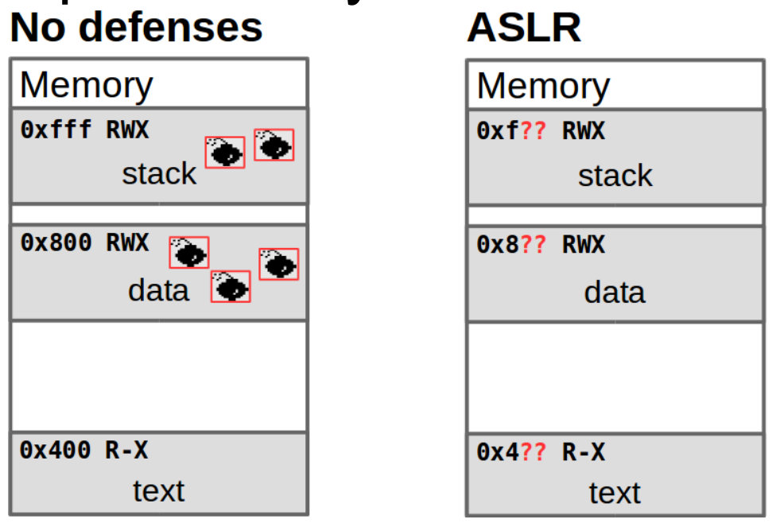
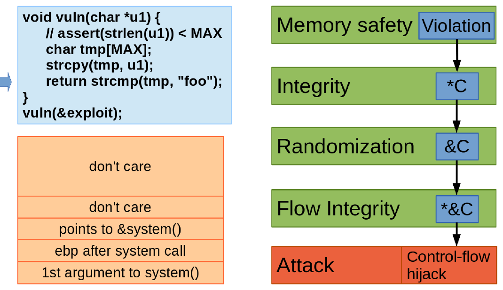
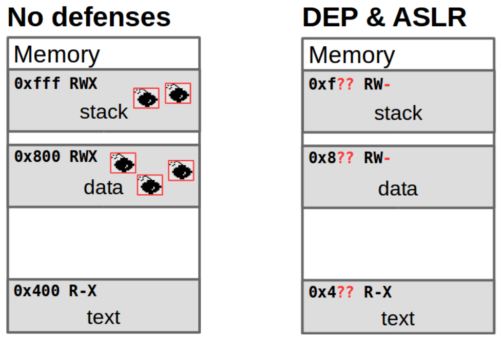
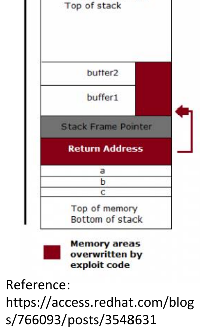
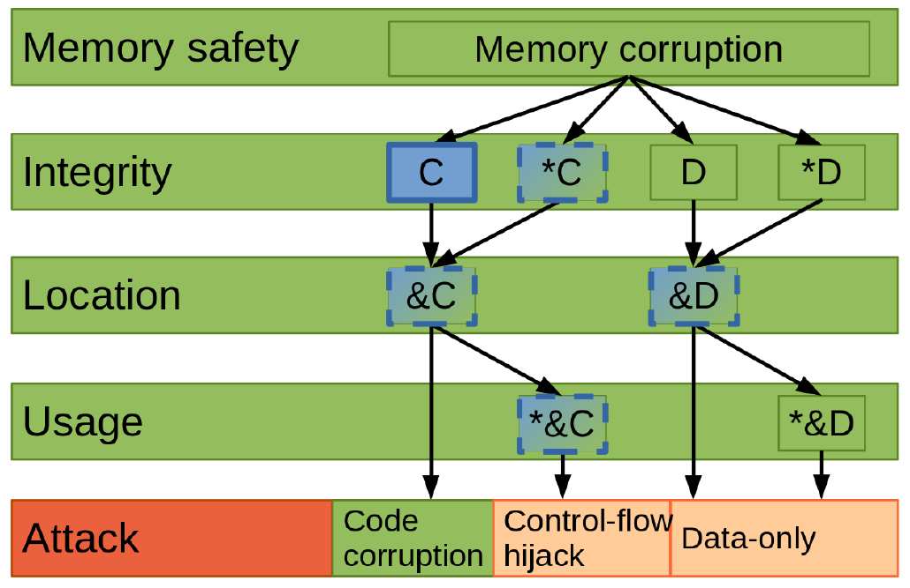

# 강의 07 — 완화 기법

> **최종 수정일:** 2026-10-06
>
> Software Security: Principles, Policies, and Protection, Payer - Ch 6

> **학습 목표**:
> 1. 완화 기법(mitigation)이 무엇이며, 어떤 요인이 완화 기법을 널리 채택되게 하는지 설명할 수 있다
> 2. 데이터 실행 방지(DEP/NX)와 W^X 정책을 설명하고, 무엇을 막고 무엇을 막지 못하는지 설명할 수 있다
> 3. 코드 재사용(return-to-libc, ROP)이 어떻게 DEP를 우회하는지 설명할 수 있다
> 4. 주소 공간 배치 무작위화(ASLR)와 그 효과를 좌우하는 요인을 설명할 수 있다
> 5. 스택 카나리와 Fortify Source를 설명하고, 각 완화 기법의 한계를 말할 수 있다

---

## 목차

- [1. 완화 기법이란](#1-완화-기법이란)
  - [1.1 완화 기법 vs 새니타이저](#11-완화-기법-vs-새니타이저)
  - [1.2 널리 채택된 방어 메커니즘](#12-널리-채택된-방어-메커니즘)
- [2. 데이터 실행 방지 (DEP)](#2-데이터-실행-방지-dep)
  - [2.1 공격 벡터: 코드 주입](#21-공격-벡터-코드-주입)
  - [2.2 DEP와 NX 비트](#22-dep와-nx-비트)
  - [2.3 DEP 요약](#23-dep-요약)
- [3. 코드 재사용이 DEP를 우회한다](#3-코드-재사용이-dep를-우회한다)
  - [3.1 코드 주입에서 코드 재사용으로](#31-코드-주입에서-코드-재사용으로)
  - [3.2 Return-to-libc 단계별 설명](#32-return-to-libc-단계별-설명)
  - [3.3 ROP란](#33-rop란)
- [4. 주소 공간 무작위화 (ASR/ASLR)](#4-주소-공간-무작위화-asraslr)
  - [4.1 개념](#41-개념)
  - [4.2 효과와 무작위화 대상](#42-효과와-무작위화-대상)
  - [4.3 ASLR과 DEP의 결합](#43-aslr과-dep의-결합)
- [5. 스택 카나리와 Fortify Source](#5-스택-카나리와-fortify-source)
  - [5.1 스택 카나리](#51-스택-카나리)
  - [5.2 컴파일러의 스택 보호자](#52-컴파일러의-스택-보호자)
  - [5.3 Fortify Source](#53-fortify-source)
- [요약](#요약)
- [점검 문제](#점검-문제)

---

<br>

## 1. 완화 기법이란

- 우리는 **프로그램에 취약점이 있다고 가정**한다.
- 완화 기법은 버그를 **익스플로잇하기 불가능하거나 더 어렵게** 만든다. **버그는 여전히 프로그램에 남아 있다!**
- 완화 기법은 **흔한 공격 벡터를 제한**한다.
- 완화 기법은 **하드웨어, OS, 런타임, 소프트웨어**를 바꾼다.
- 완화 기법은 **오버헤드가 낮아야** 한다(버그가 없다면 비용이 낮아야 한다).

> **핵심:** 완화 기법은 수정(fix)과 근본적으로 다르다. 취약점을 제거하는 것이 아니라, 성공적인 익스플로잇의 비용을 높이거나 확률을 낮춘다. 모든 프로그램이 버그 유무와 관계없이 완화 기법의 비용을 치르므로, 낮은 오버헤드가 필수적이다.

### 1.1 완화 기법 vs 새니타이저

| | 익스플로잇 완화 기법 | 새니타이저 |
|:--|:--------------------|:-----------|
| 목표 | 공격 완화 | 취약점 발견 |
| 사용 시점 | 운영(production) | 출시 전(pre-release) |
| 성능 예산 | 매우 제한적 | 훨씬 높음 |
| 정책 위반 시 | 프로그램 종료 | 문제 진단 |
| 버그 위치에서 위반이 발생하는가 | 때때로 | 항상 |
| 오탐 허용도 | 0 | 다소 높음 |
| 양성 오류를 견디는 것이 | 바람직함 | 바람직하지 않음 |

### 1.2 널리 채택된 방어 메커니즘

- **수백 가지**의 방어 메커니즘이 제안되었지만, **소수만** 채택되었다.
- 채택 가능성을 높이는 요인:
  1. **가장 시급한 문제**의 완화.
  2. **(매우) 낮은 성능 오버헤드**.
  3. **(매우) 낮은 오탐과 미탐**.
  4. **개발 주기에 잘 맞음**.

---

<br>

## 2. 데이터 실행 방지 (DEP)

### 2.1 공격 벡터: 코드 주입

- 태초에 **코드 주입**이 있었다! 임의 코드 실행을 달성하는 가장 단순한 방법이다.
- 일반적으로 두 단계로 이루어진다.
  1. 프로세스 어딘가에 **코드를 주입**한다.
  2. 제어 흐름을 주입된 코드로 **전환**한다.

### 2.2 DEP와 NX 비트



*Lecture 07, Slide 8 — RWX 영역을 보여 주는 프로세스 레이아웃*

**데이터 실행 방지(DEP, Data Execution Prevention)** 는 하드웨어로 지원된다.

- 페이지 테이블에 **NX 비트(No eXecute bit)** 를 추가한다.
  - Intel은 **XD**(eXecute Disable), AMD는 **Enhanced Virus Protection**, ARM은 **XN**(eXecute Never)이라고 부른다.
- NX 비트는 매핑된 모든 가상 페이지에 대한 추가 비트이다. 이 비트가 설정되면 해당 페이지의 데이터는 **코드로 해석될 수 없으며**, 제어 흐름이 그 페이지에 도달하면 프로세서가 트랩을 발생시킨다.
- **W^X**("write XOR execute"): 프로세스나 커널 주소 공간의 모든 페이지는 **쓰기 가능하거나 실행 가능하되, 둘 다는 될 수 없다**.

> **[운영체제]** 구형 x86(32비트, 비PAE) 페이지 테이블에서는 페이지 테이블 엔트리에 코드와 데이터를 구분하는 비트가 없었으므로, 읽기 가능한 페이지는 모두 실행 가능하기도 했다. NX 비트는 PAE와 함께 추가되었고, x86-64 페이지 테이블 엔트리에서는 표준이다(63번 비트). 이 때문에 DEP는 하드웨어 지원이 필요하며, 초기 프로세서에서는 사용할 수 없었다.

### 2.3 DEP 요약

- DEP는 이제 (x86, ARM처럼 하드웨어 지원이 있을 때마다) **기본적으로 널리 활성화**되어 있다.
- **모든 코드 주입을 막는다**.
- `checksec.sh`(`https://github.com/slimm609/checksec.sh`)로 DEP 적용 여부를 확인할 수 있다.
- DEP는 gcc 플래그 `-z execstack`으로 비활성화할 수 있다.

---

<br>

## 3. 코드 재사용이 DEP를 우회한다

### 3.1 코드 주입에서 코드 재사용으로

DEP가 모든 코드 실행 공격을 해결했을까? **안타깝게도 그렇지 않다**. 다만 공격은 훨씬 어려워졌다.

- 코드 주입 공격은 두 단계로 이루어진다: (1) 제어 흐름을 (2) 주입된 코드로 전환. **DEP는 두 번째 단계를 막는다.**
- 공격자는 여전히 **제어 흐름을 기존 코드로 전환**할 수 있다.

**코드 재사용**에서 공격자는 코드 포인터(함수 포인터, 스택의 복귀 포인터, 또는 C++ 객체의 vtable 포인터)를 덮어쓰고, 스택에 적절한 매개변수를 준비한 뒤, 프로그램에 이미 존재하는 **전체 함수(또는 함수의 일부)를 재사용**한다.

### 3.2 Return-to-libc 단계별 설명

강의는 익숙한 `strcpy` 오버플로우에 대한 return-to-libc 예제를 12단계로 보여 준다. 개념적으로, 공격자는 가짜 스택 프레임을 구성하여 취약한 함수가 반환될 때 `system()`으로 "복귀"하게 만든다.

1. 오버플로우가 **저장된 복귀 주소**를 덮어써서, 호출자가 아니라 **`&system()`을 가리키게** 한다.
2. 그 위의 슬롯은 `system()`이 끝났을 때 **사용할 복귀 주소**가 된다(흔히 `&exit()`로 설정하여 프로그램이 깔끔하게 종료되게 한다).
3. 다음 슬롯은 **`system()`의 첫 번째 인자**가 된다(`"/bin/sh"` 문자열의 주소).



*Lecture 07, Slide 32 — 코드 재사용이 메모리 안전성, 무결성, 무작위화, 흐름 무결성을 위반하며 제어 흐름 탈취로 이어짐*

가짜 프레임의 각 단계가 채워질 때마다 서로 다른 보안 속성이 차례로 위반된다: 메모리 안전성(오버플로우), 무결성(`*C`, 손상된 포인터), 무작위화(`&C`, 알려진 주소), 흐름 무결성(`*&C`, 탈취된 코드 포인터)이며, 최종적으로 **제어 흐름 탈취**로 끝난다.

### 3.3 ROP란

**ROP(Return-Oriented Programming)** 는 return-to-libc를 전체 함수에서 작은 조각으로 일반화한 것이다.

- **가젯(gadget)** 은 점프 명령으로 끝나는 어셈블리 코드 시퀀스이다.
  - 예: `pop rax; ret;`.
  - 점프 명령에는 `ret`, `jmp`, `call` 등이 포함된다.
  - 가젯은 취약한 바이너리 실행 파일에 광범위하게 존재한다.
- 공격자는 취약점을 이용해 유용한 가젯들의 연쇄를 실행한다.

**ROPgadget**(`ROPgadget --binary /bin/bash`) 같은 도구는 바이너리 하나에서 수천 개의 가젯을 찾는다(강의는 한 바이너리에서 고유 가젯 11,699개를 보고한다). 가젯은 메모리에 저장(`mov [eax], ecx; ret`), 산술 연산(`add eax, 0x0b; ret`), 시스템 콜 호출(`int 0x80; ret`)을 할 수 있으므로, 충분히 긴 연쇄는 튜링 완전하다.

> **핵심:** 모든 가젯은 이미 실행 가능한 페이지에 있으므로, ROP는 실행 가능한 스택이나 힙이 전혀 필요 없다. 이 때문에 DEP만으로는 코드 재사용을 막을 수 없으며, "코드 재사용을 어떻게 막을까?"라는 질문은 다음 강의에서 다루는 **제어 흐름 무결성(CFI)** 으로 이어진다.

---

<br>

## 4. 주소 공간 무작위화 (ASR/ASLR)

### 4.1 개념

- 성공적인 제어 흐름 탈취 공격은 공격자가 코드 포인터를 **알려진 대체 목표**로 덮어쓰는 것에 의존한다.
- **주소 공간 무작위화(ASR, Address Space Randomization)** 는 프로세스 메모리 레이아웃을 바꾼다(무작위화한다).
- 공격자가 코드(또는 데이터)가 어디에 있는지 모르면, 그것을 공격에 **재사용할 수 없다**.
- 공격자는 먼저 주소 레이아웃을 **알아내거나 복구**해야 한다.

**주소 공간 배치 무작위화(ASLR, Address Space Layout Randomization)** 는 ASR의 실용적인 형태이다. 프로세스 주소 공간에서 실행 파일의 기준 주소와 라이브러리, 힙, 스택의 위치를 무작위로 배치한다. 취약점을 제거하는 것이 아니라, 기존 취약점을 **익스플로잇하기 더 어렵게** 만든다.

### 4.2 효과와 무작위화 대상

ASR의 보안 개선 효과는 세 가지에 달려 있다.

1. 각 무작위화된 위치에 사용 가능한 **엔트로피**.
2. 무작위화의 **완전성**(모든 객체가 무작위화되는가?).
3. **정보 유출이 전혀 없음**.

무작위화 대상은 오버헤드, 복잡도, 보안 이익 사이의 트레이드오프이다.

| 대상 | 비고 |
|:----------|:-----|
| 힙, 스택의 시작 | 거친 단위, 저렴함 |
| 코드의 시작 | 실행 파일은 PIE, 각 라이브러리는 PIC |
| `mmap` 할당 영역 | |
| 개별 할당(`malloc`) | 더 세밀한 단위 |
| 코드 자체 | 함수 사이 간격, 함수 순서, 기본 블록 |
| 구조체 멤버 | 패딩, 순서 |

### 4.3 ASLR과 DEP의 결합



*Lecture 07, Slide 42 — DEP & ASLR 적용 시 스택과 데이터는 RW-(실행 불가능)이고 모든 기준 주소가 무작위화됨*

두 방어를 함께 쓰면, 스택과 데이터 영역은 DEP를 통해 **실행 불가능(RW-)** 이 되고, 모든 영역의 기준 주소는 ASLR을 통해 **무작위화**된다. DEP는 코드 주입을 막고, ASLR은 코드 재사용에 필요한 주소를 예측하기 어렵게 만든다. 둘은 상호 보완적이다.

> **핵심:** ASLR은 **확률적**이다. **정보 유출**로 실제 주소 하나만 드러나면, 공격자는 (라이브러리가 하나의 블록으로 무작위화되므로) 나머지 주소를 계산할 수 있어 무작위화가 무력화된다. 이 때문에 ASLR과 유출 방지는 함께 간다.

---

<br>

## 5. 스택 카나리와 Fortify Source

### 5.1 스택 카나리

초기 공격은 코드를 주입하기 위해 스택 기반 버퍼를 오버플로우했다. 완전한 메모리 안전성은 이를 완화하겠지만 높은 성능 오버헤드 때문에 실현 가능하지 않다. **모든** 포인터 역참조를 검사하는 대신, 스택 카나리는 **중요한 데이터에 접근하기 직전에만** 검사한다.



*Lecture 07, Slide 44 — 저장된 프레임 포인터와 복귀 주소 앞에 놓인 카나리*

- **핵심 통찰:** 버퍼 오버플로우는 포인터 연산 이후에만 가능하며, 연속적인 오버플로우가 복귀 주소에 도달하려면 카나리를 가로질러야 한다.
- 잠재적으로 취약한 버퍼 뒤에 **카나리**를 두고, **함수가 반환되기 전에 그 무결성을 검사**한다.
- 컴파일러는 모든 버퍼를 스택 프레임의 끝에, 카나리를 첫 번째 버퍼 바로 앞에 배치할 수 있으며, 이렇게 하면 버퍼가 아닌 지역 변수들도 보호된다.

**한계:**

- 카나리는 **연속적인 덮어쓰기**에만, 그리고 공격자가 **카나리를 모를 때만** 보호한다.
- 대안은 복귀 명령 포인터를 비밀 값과 XOR하여 **암호화**하는 것이다.

### 5.2 컴파일러의 스택 보호자

스택 보호자가 활성화되면, 컴파일러는 함수의 프롤로그와 에필로그에 코드를 삽입한다.

```c
char unsafe(char *vuln) {
  char foo[12];
  strcpy(foo, vuln);
  return foo[1];
}
```

- **프롤로그:** `%fs:0x28`에서 비밀 카나리를 읽어 저장된 프레임 포인터 바로 아래 스택에 저장한다.
- **에필로그:** 카나리를 다시 읽어 `%fs:0x28`과 XOR하고, 값이 다르면 `__stack_chk_fail@plt`(프로그램을 중단시킴)로 점프한다. 같으면 정상적으로 반환한다.

> **[운영체제]** 카나리 값은 스레드 제어 블록의 스레드별 위치인 `%fs:0x28`에서 읽으며, OS가 스레드 생성 시 무작위 값으로 초기화한다. 이 값은 오버플로우된 버퍼의 영역에 저장되지 않으므로, 공격자는 정보 유출 없이는 쉽게 읽거나 재현할 수 없다.

### 5.3 Fortify Source

GCC/GLIBC의 `_FORTIFY_SOURCE` 패치는 컴파일러가 목적지의 크기를 판단할 수 있을 때, 흔한 버퍼 함수(`strcpy`, `memcpy` 등)에 경계 검사를 추가한다. 네 가지 경우를 구분한다.

| 경우 | 동작 |
|:-----|:-------|
| 올바름이 알려짐 | 검사하지 않는다. |
| 올바른지 모르지만 **검사 가능**(컴파일러가 목적지의 길이를 앎) | 검사한다. |
| 올바르지 않음이 알려짐 | 컴파일러 경고, 검사한다. |
| 올바른지 모르고 **검사 불가능** | 검사하지 않음. 오버플로우가 탐지되지 않을 수 있다. |

검사 가능 여부는 컴파일러가 목적지의 크기를 추론할 수 있는지에 달려 있다.

```c
// Checkable: the size of buffer is known.
int main(int argc, char *argv[]) {
  char buffer[10];
  char *q = argv[1];
  strcpy(buffer, q);     // destination size (10) is known
  return 0;
}

// Not checkable: p is just a pointer, size unknown.
int main(int argc, char *argv[]) {
  char *p = argv[1];
  char *q = argv[0];
  strcpy(p, q);          // destination size unknown
  return 0;
}
```

---

<br>

## 요약



*Lecture 07, Slide 55 — 저수준 공격 계층에 대응하는 완화 기법들*

실제로 채택된 여러 방어 메커니즘이 있으며, 각각의 강점과 약점을 알아야 한다.

| 완화 기법 | 막는 것 | 한계 |
|:-----------|:------|:-----------|
| **DEP / NX (W^X)** | 코드 주입 | 코드 재사용(ROP, return-to-libc)은 막지 못함 |
| **ASR / ASLR** | 알려진 주소의 코드 재사용 | 확률적이며, 정보 유출로 무력화됨. 완전한 무작위화와 높은 엔트로피가 필요함 |
| **스택 카나리** | 복귀 주소에 도달하는 연속적인 스택 오버플로우 | 확률적이며, 직접(비연속) 덮어쓰기는 보호하지 못함. 카나리 유출로 무력화됨 |
| **Fortify Source** | 컴파일러가 크기를 아는 버퍼의 오버플로우 | 정적이고 검사 가능한 버퍼만 보호함 |

---

<br>

## 점검 문제

1. **완화 기법 vs 수정:** 완화 기법은 버그 수정과 어떻게 다르며, 왜 오버헤드가 낮아야 하는가?

   > **정답:** 완화 기법은 취약점을 제거하지 않으며, 버그는 여전히 프로그램에 남아 있다. 흔한 공격 벡터를 제한하여 익스플로잇을 더 어렵게 하거나 불가능하게 만들 뿐이다. 모든 프로그램이 실제로 버그가 있든 없든 완화 기법의 비용을 치르므로 오버헤드가 매우 낮아야 하며, 이는 완화 기법이 채택되는지를 좌우하는 주요 요인이기도 하다.

2. **DEP:** DEP는 무엇을 강제하며, 무엇을 막고 무엇을 막지 못하는가?

   > **정답:** DEP는 하드웨어 NX 비트로 W^X를 강제하여, 각 페이지가 쓰기 가능하거나 실행 가능하되 둘 다는 될 수 없게 한다. 주입된 코드는 쓰기 가능한(따라서 실행 불가능한) 페이지에 있고 제어 흐름이 그곳에 도달하면 CPU가 트랩을 일으키므로, 모든 코드 주입을 막는다. 재사용되는 코드는 이미 실행 가능한 페이지에 있으므로 코드 재사용은 막지 못한다.

3. **코드 재사용:** return-to-libc가 어떻게 DEP를 우회하는지 설명하라.

   > **정답:** return-to-libc는 저장된 복귀 주소를 `system()` 같은 기존 함수의 주소로 덮어쓰고, 스택을 구성하여 `system()`의 인자(`"/bin/sh"`의 주소)와 자신의 복귀 주소(흔히 `exit()`)를 제자리에 둔다. 새 코드를 주입하지 않으므로 실행되는 모든 명령이 실행 가능한 영역에 있고, DEP가 적용되지 않는다.

4. **ROP:** 가젯이란 무엇이며, 가젯이 풍부하다는 점이 왜 ROP를 강력하게 만드는가?

   > **정답:** 가젯은 점프(`ret`, `jmp`, `call`)로 끝나는 짧은 기존 명령어 시퀀스이다. 도구들은 바이너리 하나에서 수천 개의 가젯을 찾으며, 서로 다른 가젯은 데이터 이동, 산술, 메모리 접근, 시스템 콜을 할 수 있다. 충분히 많은 가젯을 이어 붙이면 공격자는 코드를 전혀 주입하지 않고도 임의의(튜링 완전한) 연산을 조립할 수 있다.

5. **ASLR:** ASLR의 효과를 결정하는 세 가지 요인은 무엇이며, 정보 유출은 왜 ASLR을 무력화하는가?

   > **정답:** 효과는 각 무작위화된 위치의 엔트로피, 무작위화의 완전성, 정보 유출의 부재에 달려 있다. 라이브러리는 하나의 블록으로 무작위화되므로, 실제 주소 하나가 유출되면 공격자는 알려진 오프셋을 더해 그 블록의 다른 모든 주소를 계산할 수 있고, 이는 ASLR이 의존하는 불확실성을 없앤다.

6. **스택 카나리:** 스택 카나리는 어떻게 동작하며, 두 가지 주요 한계는 무엇인가?

   > **정답:** 컴파일러는 지역 버퍼와 저장된 복귀 주소 사이에 비밀 카나리를 두고, 에필로그에서 반환 전에 이를 검사한다. 값이 바뀌었으면 프로그램을 중단시킨다. 한계는 카나리를 가로지르는 연속적인 덮어쓰기만 잡는다는 것(복귀 주소에 직접 쓰는 공격은 잡지 못함)과, 공격자가 카나리 값을 유출할 수 있으면 무력화된다는 것이다.

7. **Fortify Source:** `_FORTIFY_SOURCE`는 언제 경계 검사를 추가할 수 있고, 언제 추가할 수 없는가?

   > **정답:** 컴파일러가 목적지의 크기를 판단할 수 있을 때, 예를 들어 고정 크기 배열 `char buffer[10]`일 때 검사를 추가할 수 있다. 목적지가 크기를 알 수 없는 단순 포인터(예: `char *p = argv[1]`)일 때는 검사할 수 없으므로, 그러한 포인터를 통한 오버플로우는 탐지되지 않을 수 있다.

---
