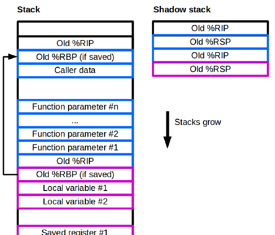
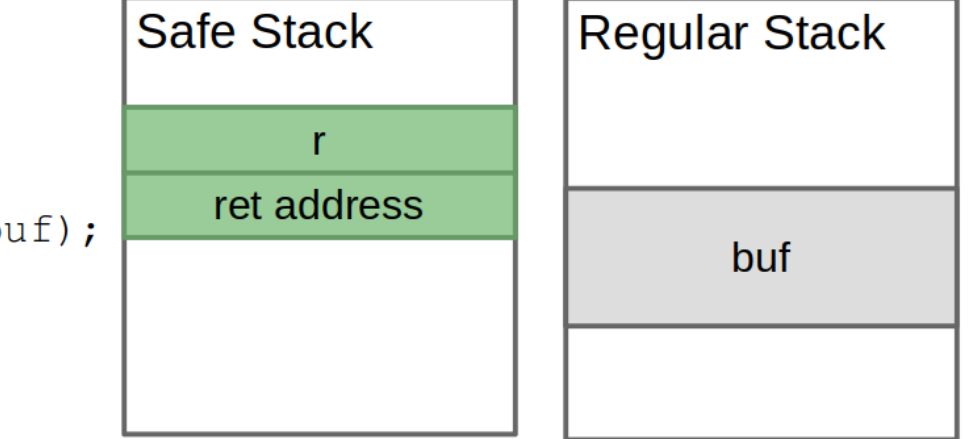
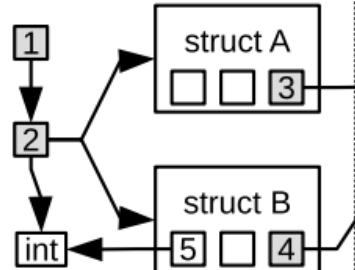
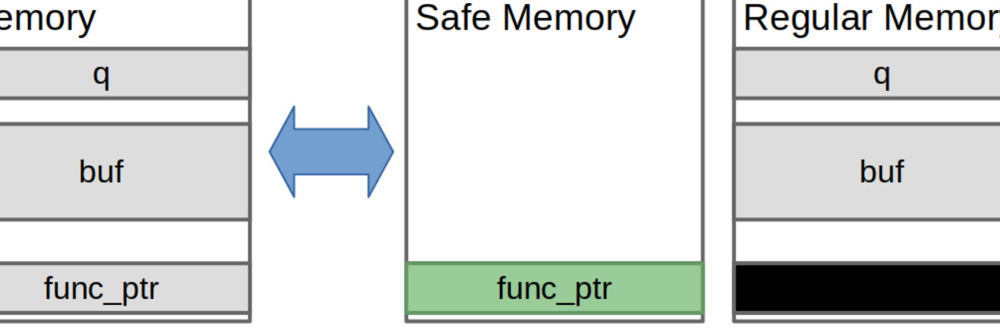

# Lecture 08 — Advanced Mitigations

> **Last Updated:** 2026-10-08
>
> Software Security: Principles, Policies, and Protection, Payer - Ch 6

> **Learning Objectives**:
> 1. Explain why control-flow hijacking is the most flexible attack vector and what advanced mitigations target
> 2. Identify the four types of code pointers and the current state of their defenses
> 3. Describe stack integrity and compare stack canaries, shadow stacks, and safe stacks
> 4. Explain Control-Flow Integrity (CFI): target set construction, runtime checks, and limitations
> 5. Explain Code-Pointer Integrity (CPI) and the "protect a little, completely" paradigm

---

## Table of Contents

- [1. Advanced Mitigations Against Control-Flow Hijacking](#1-advanced-mitigations-against-control-flow-hijacking)
  - [1.1 Control-Flow Hijacking Requirements](#11-control-flow-hijacking-requirements)
  - [1.2 Control-Flow Hijacking Targets](#12-control-flow-hijacking-targets)
  - [1.3 Current Status of Defense](#13-current-status-of-defense)
  - [1.4 Overview](#14-overview)
- [2. Stack Integrity](#2-stack-integrity)
  - [2.1 Definition](#21-definition)
  - [2.2 Shadow Stack](#22-shadow-stack)
  - [2.3 Safe Stack](#23-safe-stack)
  - [2.4 Summary of Stack Integrity](#24-summary-of-stack-integrity)
- [3. Control-Flow Integrity (CFI)](#3-control-flow-integrity-cfi)
  - [3.1 Definition](#31-definition)
  - [3.2 Target Set Construction](#32-target-set-construction)
  - [3.3 Runtime Checks](#33-runtime-checks)
  - [3.4 Limitations and Summary](#34-limitations-and-summary)
- [4. Code-Pointer Integrity (CPI)](#4-code-pointer-integrity-cpi)
  - [4.1 Motivation](#41-motivation)
  - [4.2 Protect a Little, Completely](#42-protect-a-little-completely)
  - [4.3 What Data Must Be Protected](#43-what-data-must-be-protected)
  - [4.4 Memory Layout](#44-memory-layout)
  - [4.5 Summary](#45-summary)
- [Summary](#summary)
- [Self-Check Questions](#self-check-questions)

---

<br>

## 1. Advanced Mitigations Against Control-Flow Hijacking

- Control-flow hijacking gives the attacker the **highest flexibility**.
- Deployed mitigations (ASLR, DEP, stack canaries) make control-flow hijacking **harder, not impossible**.
- **Goal:** further restrict control-flow hijacking through advanced protections.

### 1.1 Control-Flow Hijacking Requirements

To hijack control flow, an attacker must:

1. **Overwrite a code pointer**
2. **With a known value**
3. **Trigger usage** of the modified code pointer

**Advanced mitigations restrict the usage of modified code pointers.**

> **[Computer Architecture]** A code pointer stores an address the processor may use as the next instruction location. A function return uses a saved return address; an indirect call or jump uses a function pointer or similar value. These are the backward and forward control-flow edges that stack-integrity and CFI mechanisms protect.

### 1.2 Control-Flow Hijacking Targets

There are four types of code pointers:

| Code Pointer | Assembly |
|:-------------|:---------|
| Function return | `return` |
| Switch statement | indirect jump |
| Function pointers | indirect call |
| Virtual dispatch | indirect call |

### 1.3 Current Status of Defense

- Given DEP, adversaries must **overwrite code pointers**.
- **Indirect jumps are not a target:**
  - Switch statements are bound-checked (by the compiler).
  - Jumps in loader data structures are write-protected.
- **Returns** are the classic target, with **indirect calls** the alternative.
- Due to stack canaries, returns are harder to exploit, so there is a (non-conclusive) paradigm shift to indirect calls.

### 1.4 Overview

The advanced mitigations target the two remaining categories:

| Mitigation | Protects |
|:-----------|:---------|
| **Stack integrity** | Returns (the backward edge) |
| **Control-Flow Integrity (CFI)** | Indirect calls (the forward edge) |
| **Code-Pointer Integrity (CPI)** | Indirect calls (and all code pointers) |

> **Definition:** In the control-flow graph, the **backward edge** is the return from a function to its caller, and the **forward edge** is an indirect call or jump to a callee. Stack integrity protects the backward edge, while CFI and CPI focus on the forward edge.

---

<br>

## 2. Stack Integrity

### 2.1 Definition

**Stack integrity** ensures that (i) the **return instruction pointer** and (ii) the **stack pointer** cannot be modified.

- Return instruction pointers are code pointers; stack integrity guarantees that only valid return instruction pointers are dereferenced.
- Pointers to other stack frames are stored on the stack, and stack integrity ensures the integrity of this metadata. Note that modifying the base pointer indirectly modifies the return instruction pointer.

| Form | Strength |
|:-----|:---------|
| Stack canaries | Weak form of stack integrity |
| Shadow stacks | Strong form of stack integrity |
| Safe stacks | Strong form with partial data protection |
| Memory safety | Full stack integrity (as a side effect) |

### 2.2 Shadow Stack

A **shadow stack** is a second stack for each thread that keeps track of control data (e.g., the return instruction pointer, or the base pointer).



*Figure 1. A shadow stack mirrors the return addresses of the main stack (slide 14)*

- Not all implementations protect all types of data.
- Data on the shadow stack is **integrity protected**:
  - **Implicitly:** because the shadow stack contains only control data, buffer overflows are not possible.
  - **Explicitly:** some shadow stacks are write-protected.
- **Limitation:** data corruption is uncaught (only control data is protected).

> **[Computer Architecture]** On a call, the return address is pushed onto both the normal stack and the shadow stack. On a return, the two copies are compared; if they differ, the program aborts. Intel CET provides this in hardware (`SHSTK`), which makes the overhead negligible, whereas a software shadow stack adds instructions to every call and return.

### 2.3 Safe Stack

A **safe stack** splits each function's frame into a safe part and an unsafe part.



*Figure 2. Safe variables stay on the safe stack; the overflowable buffer goes to the regular stack (slide 16)*

- The core idea is to decide, **for each variable in a stack frame, whether it is safe**.
- Variables are **safe** if they are only used in a safe context: they do not escape the current function and are only used with bounded pointer arithmetic.
- **Unsafe variables** (such as an overflowable buffer) are pushed to the **unsafe stack**.
- **Performance benefit:** an unsafe stack frame is only allocated if there are unsafe variables.
- **Limitation:** corruption of unsafe data is uncaught.

In the example `int foo() { char buf[16]; int r; r = scanf("%s", buf); return r; }`, the return value `r` and the return address stay on the safe stack, while the overflowable `buf` goes to the regular stack, so an overflow of `buf` cannot reach the return address.

### 2.4 Summary of Stack Integrity

| Mechanism | Protects Against CF Hijacking | Protects Data | Overhead |
|:----------|:-----------------------------:|:-------------:|:---------|
| Stack canaries | Continuous overflows only | No | Negligible |
| SW shadow stack | Yes | No (data corruption allowed) | High |
| HW shadow stack | Yes | No (data corruption allowed) | Negligible |
| Safe stack | Yes | Safe data only | Low |

---

<br>

## 3. Control-Flow Integrity (CFI)

### 3.1 Definition

**CFI** is a defense mechanism that protects applications against control-flow hijack attacks. A successful CFI mechanism ensures that the control flow of the application **never leaves the predetermined, valid control flow** defined at the source code or application level. This means an attacker cannot redirect control flow to alternate or new locations.

**Core idea:** restrict the dynamic control flow of the application to the **control-flow graph** of the application. This requires:

1. **Target set construction**
2. A **dynamic enforcement mechanism** to execute runtime checks

### 3.2 Target Set Construction

How do we infer the control-flow graph for C/C++ programs? A **static analysis** (on source code or binary) can recover an **approximation** of the control-flow graph. **Precision of the analysis is crucial.**

- There is a trade-off between **precision and compatibility**.
- One single set of valid functions is highly compatible with other software, but may be **imprecise** given the large number of functions.

### 3.3 Runtime Checks

The analysis produces **target sets** for each location of an indirect control-flow transfer. The runtime check leverages the runtime value and the target set to execute a **set check**. The most efficient implementation uses a set of bit masks.

```c
void (*fn)(int) = &func;
...
if (!contains(targetset, fn)) {
  abort("Error: illegal target");
}
fn(12);
```

Note that the **check and dispatch are atomic**; otherwise this would result in a **TOCTTOU** vulnerability (the attacker could change the pointer between the check and the call).

### 3.4 Limitations and Summary

**Limitations:**

- CFI **allows the underlying bug to fire**, and the memory corruption can be controlled by the attacker. The defense only detects the deviation **after the fact**, when a corrupted pointer is used.
- **Over-approximation** in the static analysis reduces security (a larger target set lets more illegal targets pass).

**Summary:**

- CFI is an advanced mitigation that protects the **forward edge**.
- The compiler statically infers a per-call target set.
- At runtime, a set check ensures that the observed target is valid.
- Runtime overhead is **low, usually less than 2%**.
- Security is good, **assuming stack integrity** (CFI alone does not protect returns).
- It makes attacks much harder.

---

<br>

## 4. Code-Pointer Integrity (CPI)

### 4.1 Motivation

- Memory corruption is abundant.
- Strong memory-safety-based defenses have **not been adopted**.
- Weaker defenses like strong memory allocators are also ignored.
- Only defenses with **negligible overhead** are adopted.
- **What if we can have memory safety but only where it matters?**
- **Code-Pointer Integrity (CPI)** ensures that all code pointers are protected at all times.

**CPI attacker model:**

- The attacker can **read** data and code (stack, bss, data, text, heap).
- The attacker can **write** data.
- The attacker **cannot modify code**.

The overhead of existing memory safety solutions is the problem: SoftBound+CETS 116%, CCured 56%, AddressSanitizer 73% (and only partial memory safety).

### 4.2 Protect a Little, Completely

**Instead of protecting everything a little, protect a little completely:** strong protection for a select subset of data.

- The attacker may modify any **unprotected** data.
- By only protecting **code pointers**, CPI reduces the overhead of memory safety from **116% to 8.4%**.
- CPI **deterministically** protects against control-flow hijacking.

### 4.3 What Data Must Be Protected

- **Sensitive pointers** are code pointers and pointers used to access sensitive pointers.
- We can **over-approximate** and identify sensitive pointers through their **types**: all types of sensitive pointers are sensitive.
- Over-approximation only affects performance, not security.



*Figure 3. Sensitive pointers are identified transitively by type (slide 31)*

In the figure, a struct that contains a function pointer is sensitive, and a pointer to that struct is also sensitive, so the "sensitive" marking propagates transitively through the type graph, while plain data (such as an `int`) is left unprotected.

### 4.4 Memory Layout



*Figure 4. Memory is split into a protected safe plane and a regular plane (slide 32)*

- The memory view is split into two views: a **control plane** and a **data plane**.
  - The **control plane** contains only code pointers (and transitively all related pointers).
  - The **data plane** contains only data; code pointers are left empty (void/unused).
- The two planes must be **separated**, and data in the control plane must be **protected from pointer dereferences** in the data plane.

### 4.5 Summary

- CPI protects code pointers and sensitive pointers by enforcing memory safety for **select data**.
- CPI prohibits control-flow hijacking.
- The overhead of **6% to 8%** is still too high for general deployment.

---

<br>

## Summary

- Deployed defenses (ASLR, DEP, stack canaries) are **incomplete** and do not stop all attacks.
- **Control-flow hijacking** is the most versatile attack vector.

| Advanced Mitigation | Protects | Assembly | Key Idea |
|:--------------------|:---------|:---------|:---------|
| **Stack integrity** | The backward edge (returns) | `ret` | Protect the return address (shadow stack, safe stack) |
| **CFI** | The forward edge (indirect calls) | `call*` | Restrict each indirect call to a statically computed target set |
| **CPI** | All code pointers | `call*` | Enforce memory safety only for code pointers (protect a little, completely) |

---

<br>

## Self-Check Questions

1. **Hijacking Requirements:** What three things must an attacker do to hijack control flow, and what do advanced mitigations target?

   > **Answer:** The attacker must overwrite a code pointer, with a known value, and trigger the usage of the modified code pointer. Advanced mitigations focus on restricting the usage of modified code pointers, so that even a corrupted pointer cannot be used to divert control flow to an illegal target.

2. **Code Pointers:** Name the four types of code pointers and explain why indirect jumps are no longer a target.

   > **Answer:** Function returns, switch statements, function pointers, and virtual dispatch. Indirect jumps (switch statements) are no longer a target because the compiler bound-checks them and jumps in loader data structures are write-protected, leaving returns and indirect calls as the main targets.

3. **Shadow vs. Safe Stack:** How do a shadow stack and a safe stack each protect the return address, and what is the limitation of each?

   > **Answer:** A shadow stack keeps a second copy of the return address (and control data) and compares it on return, so a tampered return address is detected; its limitation is that it protects only control data, so data corruption is uncaught. A safe stack keeps safe variables and the return address on a separate safe stack and moves unsafe variables (like buffers) to the regular stack, so an overflow cannot reach the return address; its limitation is that corruption of the unsafe data is uncaught.

4. **CFI Mechanism:** What are the two parts of a CFI mechanism, and why must the check and dispatch be atomic?

   > **Answer:** CFI consists of target set construction (a static analysis recovers an approximate control-flow graph and a target set for each indirect transfer) and a dynamic enforcement mechanism (a runtime set check). The check and dispatch must be atomic, because otherwise the attacker could change the code pointer between the check and the call, which is a TOCTTOU vulnerability.

5. **CFI Limitations:** Why does CFI not prevent the underlying bug, and how does analysis precision affect security?

   > **Answer:** CFI allows the bug to fire and the memory to be corrupted; it only detects the deviation afterward, when the corrupted pointer is used in an indirect transfer. If the static analysis over-approximates the target set, more illegal targets are considered valid, so a less precise analysis provides weaker security.

6. **CPI Paradigm:** What is the "protect a little, completely" idea, and how does CPI decide what to protect?

   > **Answer:** Instead of weakly protecting all data, CPI strongly (completely) protects a small, select subset: the code pointers and the sensitive pointers used to reach them. It identifies these over-approximately by type, so all values of a sensitive pointer type are protected. This reduces the overhead of full memory safety from about 116% to about 8%, while deterministically preventing control-flow hijacking.

---
