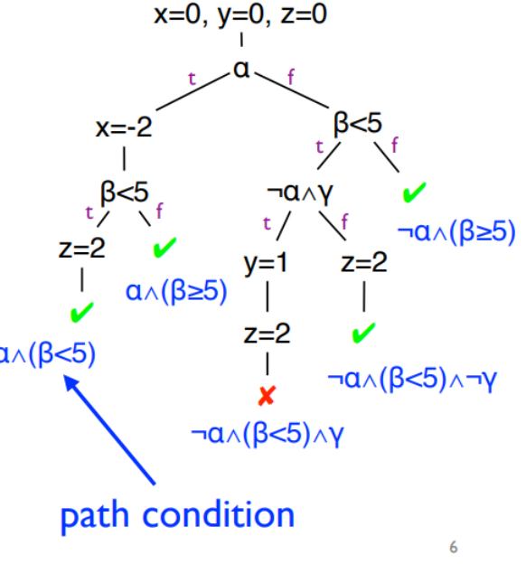

# 강의 09 — 왜 테스트하는가?

> **최종 수정일:** 2026-10-06
>
> Software Security: Principles, Policies, and Protection, Payer - Ch 6

> **학습 목표**:
> 1. 테스트가 무엇인지, 왜 명세가 필요한지, 결함을 어떻게 탐지하는지 설명할 수 있다
> 2. 수동 테스트, 정적 분석, 동적 분석을 구분할 수 있다
> 3. 정적 분석의 법칙과 오탐, 미탐이 모두 중요한 이유를 설명할 수 있다
> 4. 정적 분석의 수준(컴파일러 경고, clang-tidy, clang 정적 분석기)을 설명할 수 있다
> 5. 심볼릭 실행의 개념과 그 한계를 설명할 수 있다

---

## 목차

- [1. 왜 테스트하는가?](#1-왜-테스트하는가)
  - [1.1 정의](#11-정의)
  - [1.2 테스트의 한계](#12-테스트의-한계)
  - [1.3 명세의 필요성](#13-명세의-필요성)
  - [1.4 결함 탐지](#14-결함-탐지)
- [2. 테스트의 세 가지 형태](#2-테스트의-세-가지-형태)
  - [2.1 개요](#21-개요)
  - [2.2 테스트 분류](#22-테스트-분류)
  - [2.3 수동 테스트](#23-수동-테스트)
- [3. 정적 분석](#3-정적-분석)
  - [3.1 장점과 단점](#31-장점과-단점)
  - [3.2 정적 분석의 법칙](#32-정적-분석의-법칙)
  - [3.3 간단한 정적 분석](#33-간단한-정적-분석)
  - [3.4 정적 분석의 수준](#34-정적-분석의-수준)
- [4. 동적 분석과 심볼릭 실행](#4-동적-분석과-심볼릭-실행)
  - [4.1 동적 분석](#41-동적-분석)
  - [4.2 심볼릭 실행](#42-심볼릭-실행)
- [요약](#요약)
- [점검 문제](#점검-문제)

---

<br>

## 1. 왜 테스트하는가?

### 1.1 정의

**테스트(testing)** 는 오류를 찾기 위해 프로그램을 분석하는 과정이다. **오류(error)** 는 관찰된 동작과 명세된 동작 사이의 괴리, 즉 바탕이 되는 명세의 위반이다.

- **기능 요구사항**(기능 a, b, c)
- **운영 요구사항**(성능, 사용성)
- **보안 요구사항**은 어떤가?

### 1.2 테스트의 한계

> **참고:** "테스트는 버그의 존재를 보일 수 있을 뿐, 그 부재를 보일 수는 없다." (Edsger W. Dijkstra)

- 성공적인 테스트는 **괴리**를 찾아낸다.
- 테스트는 **프로그램 분석**의 한 형태이다. 코드를 분석하고, 테스트 환경이 코드의 동작을 관찰하여 위반을 탐지한다.

### 1.3 명세의 필요성

- 테스트는 구현이 **명세와 일치**하는지 확인한다.
- **명세가 없으면 테스트할 것이 없다!**
- 테스트는 구현과 명세 사이의 엄격한 **일관성 검사** 역할을 한다.

### 1.4 결함 탐지

- 테스트는 주어진 구현에 대해 명세 위반을 탐지한다.
- 명세는 정책에 따라 **불법 연산**을 정의한다.

테스트 케이스는 다음을 통해 버그를 탐지한다.

| 메커니즘 | 예시 |
|:----------|:--------|
| 단언문(Assertion) | `assert(var != 0x23 && "illegal value");` |
| 세그먼테이션 폴트 | |
| 0으로 나누기 트랩 | |
| 처리되지 않은 예외 | |
| 종료를 유발하는 완화 기법 | |

버그 탐지 확률을 어떻게 높일 수 있는가? **새니타이제이션** 강의에서 결함 탐지 환경을 다룬다.

---

<br>

## 2. 테스트의 세 가지 형태

### 2.1 개요

| 형태 | 설명 |
|:-----|:------------|
| **수동 테스트** | 사람이 코드를 테스트한다. |
| **정적 분석** | 프로그램을 **실행하지 않고** 분석한다. 가능한 모든 실행에 걸쳐 추상화하며, 많은 제약 조건 때문에 **상태 폭발(state explosion)** 이 자주 발생한다. |
| **동적 분석** | **구체적인 실행 중에** 프로그램을 분석한다. 하나의 실행에 초점을 맞추므로 상세한 분석이 가능하지만 **불완전**하다. |

### 2.2 테스트 분류

| 형태 | 예시 |
|:-----|:---------|
| **수동 테스트** | "printf로 디버깅", 단위 테스트, 통합 테스트 |
| **정적 분석** | 컴파일러 경고(`-Wall -Wextra -Wpedantic`), 빠른 검사기(린터), 무거운 정적 분석(clang checker) |
| **동적 분석** | 화이트박스 테스트(명세를 앎), 그레이박스 테스트(부분적으로 앎), 블랙박스 테스트(모름) |

### 2.3 수동 테스트

수동 테스트의 흐름은 다음과 같다. 상위 수준 문서를 읽고 기능을 이해하고, 코드 구조에 익숙해지고, 요구사항을 다루는 테스트 케이스를 작성하고, 검토와 논의를 거쳐 실행하고, 버그를 보고하고, 수정 후 다시 실행한다. 시간이 지나면 원하는 기능의 모든 측면을 다루는 큰 테스트 케이스 집합이 만들어진다.

| 강점 | 한계 |
|:----------|:------------|
| 설정과 실행이 간단함 | 각 테스트를 만드는 데 수작업이 필요함 |
| 테스트 케이스를 신중히 설계하면 좋은 피드백 | 명세가 바뀌면 테스트도 최신 상태로 유지해야 함 |

---

<br>

## 3. 정적 분석

정적 분석은 코드를 실행하는 대신 **코드에 대해 추론**한다. 정적 분석과 동적 분석의 경계는 모호하지만, 일반적으로 정적 분석은 실행 중의 구체적인 값을 추적하지 않고 코드만 본다.

### 3.1 장점과 단점

| 장점 | 단점 |
|:-----------|:--------------|
| 절대적 커버리지(완전한 테스트 케이스가 필요 없음) | 계산이 데이터에 의존하여 **결정 불가능성(undecidability)** 발생 |
| 완전함(테스트 케이스는 엣지 케이스를 놓칠 수 있음) | 부정확성과 별칭(aliasing)으로 인한 **과근사** |
| 추상 해석(런타임 환경이 필요 없음) | **오탐**이 많을 수 있음 |

### 3.2 정적 분석의 법칙

| 법칙 | 의미 |
|:----|:--------|
| 보지 못하는 코드는 검사할 수 없다 | 빌드 시스템은 복잡하며, 분석은 기존 빌드 시스템에 연동되어야 한다. |
| 파싱할 수 없는 코드는 검사할 수 없다 | 다양한 컴파일러와 버전이 파싱을 어렵게 한다. |
| 모든 것이 C로 구현되지는 않는다 | 시스템에는 다른 언어, 바이너리 코드, 라이브러리, 낡은 방언이 포함된다. |
| 버그는 버그다(맥락을 제공하라) | 도구는 버그를 재현할 충분한 맥락(매개변수, 상황, 경로)을 제공해야 하며, 최소 테스트 케이스가 이상적이다. |
| 모든 버그가 중요하지는 않다(순위를 매겨라) | 분석이 버그 2만 개를 찾아도 자원은 유한하므로 심각도에 따라 순위를 매겨야 한다. |
| 오탐이 중요하다 | 각 오탐은 분석 시간을 소모하고 개발자를 지치게 하여 포기하게 만든다. |
| 미탐이 중요하다 | 미탐은 놓친 버그이며, 분석은 오탐과 미탐 사이에서 신중히 조정되어야 한다. |

> **핵심:** 반복되는 주제는 **순위 매기기(ranking)** 이다. 수천 개의 결과를 보고하는 도구는 개발자가 어느 것이 중요한지 구분할 수 없으면 쓸모가 없고, 오탐이 너무 많으면 "경고 피로(warning fatigue)" 때문에 진짜 버그가 무시된다.

### 3.3 간단한 정적 분석

기본적인 정적 분석은 각 변수의 **가능한 값의 집합**을 추적한다.

```c
int z, x, y;
z = val1;
x = val2;
if (p1) x = val3; else s1;
z = val4;
if (p2) y = x;    else y = z;
```

분석은 `p1`이나 `p2`가 참인지 모르므로 모든 가능성을 유지한다.

- `z = {val4}`, `x = {val2, val3}`
- 따라서 `y = {val2, val3, val4}` (`x` 또는 `z`).

같은 아이디어를 함수 포인터에 적용하면 **가능한 호출 목표**가 나온다. `p = F1; q = F2; if (p1) q = F3; else p = F4; if (p2) p = F5; else p = q;`에 대해 분석은 `q = {F2, F3}`, `p = {F5, F2, F3}`을 추론한다. 이 가능한 목표 집합이 바로 CFI가 필요로 하는 것이다.

### 3.4 정적 분석의 수준

**컴파일러 경고**가 가장 가벼운 수준이다. 빠르고 오탐이 적어야 한다(경고 피로를 피하기 위해).

| 플래그 | 활성화하는 것 |
|:-----|:----------------|
| `-Wall` | 기본 경고 집합, 대부분 쉽게 고칠 수 있음 |
| `-Wextra` | 더 상세한 경고(빈 함수 본문, 사용되지 않은 매개변수, 부호 불일치) |
| `-Wpedantic` | 엄격한 C/C++를 벗어나는 모든 것을 경고하며, 나쁜 스타일도 포함 |
| `-Weverything` | 존재하는 모든 경고. 매우 많은 잡음을 만든다 |

**clang-tidy**는 clang 기반 C++ "린터"로, 검사가 플러그인으로 구현되며 플랫폼, 코딩 규약, 라이브러리, 버그 유발 코드 구조를 다룬다. 현재 컴파일 단위로 범위가 제한된다("약간의 제약 해결이 가미된 고급 경고").

**clang 정적 분석기**는 빌드 시스템에 연동되며(`scan-build make`), 전체 시스템에 걸쳐 무거운 분석을 실행한다. 핵심 논리 오류(널 역참조, 0으로 나누기, 초기화되지 않은 값), C++(Double Free, Use-After-Free, 메모리 누수), 데드 코드, 보안, 흔한 시스템 콜 오용을 다룬다.

---

<br>

## 4. 동적 분석과 심볼릭 실행

### 4.1 동적 분석

| 테스트 | 기법 |
|:--------|:----------|
| 화이트박스 테스트 | 심볼릭 실행 |
| 그레이박스 테스트 | 피드백 기반 퍼징 |
| 블랙박스 테스트 | 블랙박스 퍼징 |

### 4.2 심볼릭 실행

**심볼릭 실행(SE, Symbolic Execution)** 은 코드의 추상 해석이다.

> **직관:** 일반 테스트는 `x = 3`처럼 선택한 구체적인 입력으로 프로그램을 실행한다. 심볼릭 실행은 `x` 같은 기호로 시작하고, 분기를 따라가며 그 기호가 만족해야 하는 조건을 모은 뒤, 조건을 만족하는 구체적인 값을 묻는다. 손으로 찾기 어려운 입력을 찾을 수 있지만, 실행 경로의 수가 빠르게 늘어날 수 있다.

- 구체적인 값이 아니라 **심볼릭 값**을 사용한다. 값은 **공식(formula)** 이 되고, 제약 조건이 공식을 구체화한다.
- 목표 조건이 정의되어야 한다.
- "흥미로운" 조건을 유발하는 **구체적인 입력**을 찾는다.



*Lecture 09, Slide 29 — 각 리프마다 경로 조건을 가진 심볼릭 실행 트리*

예제에서 입력은 심볼로 시작한다(`x=0, y=0, z=0`과 심볼릭 `a`, `b`, `c`). 각 분기(`if (a)`, `if (b < 5)` 등)는 실행을 참 경로와 거짓 경로로 나누고, 각 리프는 **경로 조건(path condition)**(예: `¬a ∧ (β < 5) ∧ γ` 같은 논리곱)을 모은다. 경로 조건을 **SAT/SMT 솔버**로 풀면 그 리프에 도달하는 구체적인 입력이 나오며, 예를 들어 실패하는 `assert(x+y+z != 3)`를 유발하는 입력을 찾을 수 있다.

**기법:**

- 코드 위치에 조건 집합을 정의하면, SE가 유발 입력을 결정한다.
- 테스트의 경우, 사전/사후 조건을 추론하고 단언문을 추가한 뒤, SE로 조건을 부정한다.
- **SAT 풀이**를 통해 개념 증명(PoC) 입력을 생성한다.

**과제:**

- 버그 조건이 명확히 정의되어야 한다.
- **상태 폭발:** 제약 조건의 길이나 상태의 양이 각 루프 반복이나 조건마다 두 배가 된다.
- 복잡도가 확장성을 제한한다.

> **용어 정의:** **SAT 솔버**는 불리언 공식을 참으로 만들 수 있는지 판정하고, **SMT 솔버**(Satisfiability Modulo Theories)는 이를 정수, 배열, 비트 벡터에 대한 공식으로 확장한다. 심볼릭 실행은 각 경로 조건을 이러한 솔버에 넘기며, 솔버는 만족하는 입력(테스트 케이스)을 반환하거나 그 경로가 실행 불가능함을 증명한다.

---

<br>

## 요약

| 개념 | 핵심 요약 |
|:--------|:------------|
| 테스트 | 공격자가 익스플로잇하기 전에 버그를 찾는다. 버그의 존재는 보일 수 있으나 부재는 보일 수 없다. |
| 명세 | 테스트에는 명세나 정책이 필요하며, 없으면 테스트할 것이 없다. |
| 세 가지 형태 | 수동 테스트, 정적 분석(실행 없음, 완전하지만 부정확), 동적 분석(구체적 실행, 정확하지만 불완전). |
| 정적 분석의 법칙 | 모든 코드를 검사하고, 파싱하고, 다른 언어를 다루고, 맥락을 제공하고, 버그에 순위를 매기고, 오탐과 미탐을 균형 있게 조정한다. |
| 정적 분석의 수준 | 컴파일러 경고, clang-tidy(단위별 린터), clang 정적 분석기(전체 시스템). |
| 심볼릭 실행 | 심볼릭 값을 사용하는 추상 해석. 경로 조건을 모아 SAT/SMT 솔버로 풀며, 상태 폭발이 한계이다. |

---

<br>

## 점검 문제

1. **정의:** 테스트에서 오류란 무엇이며, 테스트에 왜 명세가 필요한가?

   > **정답:** 오류는 관찰된 동작과 명세된 동작 사이의 괴리, 즉 바탕 명세(기능, 운영, 보안 요구사항)의 위반이다. 테스트는 구현이 명세와 일치하는지 확인하므로, 명세가 없으면 비교할 대상이 없어 테스트할 것도 없다.

2. **Dijkstra:** "테스트는 버그의 존재를 보일 수 있을 뿐 부재를 보일 수는 없다"는 무슨 뜻인가?

   > **정답:** 테스트는 괴리를 찾았을 때 버그의 존재를 보일 수 있을 뿐이며, 통과한 테스트가 버그가 없음을 증명하지는 않는다. 테스트는 모든 실행이 아니라 일부 실행만 탐색하기 때문이다. 버그의 부재는 전수 검사나 정형 검증을 요구한다.

3. **세 가지 형태:** 정적 분석과 동적 분석을 커버리지와 정밀도 측면에서 비교하라.

   > **정답:** 정적 분석은 코드를 실행하지 않고 추론하므로 가능한 모든 실행에 걸쳐 추상화한다(완전한 커버리지). 하지만 부정확하고 과근사하여 오탐과 결정 불가능성이 발생한다. 동적 분석은 하나의 구체적인 실행을 관찰하므로 그 실행에 대해서는 정확하지만, 실제로 실행된 경로만 보므로 불완전하다.

4. **정적 분석의 법칙:** 오탐과 미탐이 모두 중요한 이유는 무엇이며, 순위 매기기가 왜 중요한가?

   > **정답:** 각 오탐은 조사에 개발자의 시간을 소모하며, 수가 많으면 경고 피로를 일으켜 개발자가 도구를 포기하고 무시하게 만든다. 각 미탐은 놓친 버그이다. 분석이 수만 개의 결과를 보고할 수 있지만 고칠 자원은 유한하므로, 중요한 버그를 먼저 고치도록 심각도에 따라 순위를 매기는 것이 중요하다.

5. **수준:** 컴파일러 경고, clang-tidy, clang 정적 분석기는 범위와 비용에서 어떻게 다른가?

   > **정답:** 컴파일러 경고(`-Wall`, `-Wextra`, `-Wpedantic`)는 가장 빠르고 저렴하며 파일 단위로 간단한 문제를 표시한다. clang-tidy는 현재 컴파일 단위로 제한된 린터로, 플러그인 검사와 가벼운 제약 해결을 한다. clang 정적 분석기는 빌드 시스템에 연동되어 전체 시스템에 걸쳐 무거운 분석을 실행하므로 가장 철저하고 가장 비싸다.

6. **심볼릭 실행:** 심볼릭 실행은 버그를 유발하는 입력을 어떻게 찾으며, 주요 확장성 과제는 무엇인가?

   > **정답:** 프로그램을 심볼릭 입력으로 실행하여 값을 공식으로 바꾸고, 각 분기에서 참 경로와 거짓 경로로 갈라지며 각각에 대한 경로 조건을 누적한다. 단언문 위반에 도달하는 경로 조건을 SAT/SMT 솔버에 넘기면 버그를 유발하는 구체적인 입력이 나온다. 주요 과제는 상태 폭발로, 경로의 수(와 제약 조건의 크기)가 모든 분기나 루프 반복마다 두 배가 되어 확장성을 제한한다.

---
