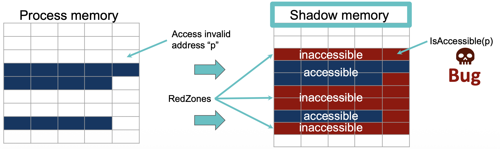
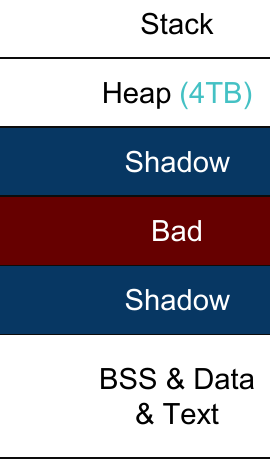
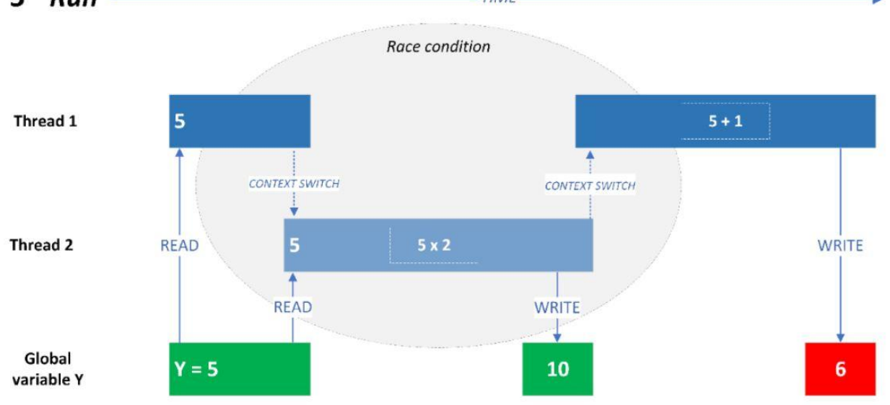

# Lecture 10 — Sanitization

> **Last Updated:** 2026-10-08
>
> Software Security: Principles, Policies, and Protection, Payer - Ch 6

> **Learning Objectives**:
> 1. Explain what a sanitizer is and the two components dynamic fault detection requires
> 2. Describe how AddressSanitizer uses redzones and shadow memory to detect memory errors
> 3. Explain the shadow memory encoding and the address-to-shadow mapping
> 4. Compare the main sanitizers (ASan, LSan, TSan, MSan, HexType, UBSan) and their targets and overheads
> 5. Explain why only UBSan is suitable for production and how Valgrind differs

---

## Table of Contents

- [1. Sanitization](#1-sanitization)
  - [1.1 Fault Detection Recap](#11-fault-detection-recap)
  - [1.2 Dynamic Testing Requirements](#12-dynamic-testing-requirements)
  - [1.3 What Is a Sanitizer](#13-what-is-a-sanitizer)
- [2. AddressSanitizer (ASan)](#2-addresssanitizer-asan)
  - [2.1 Overview](#21-overview)
  - [2.2 Shadow Memory and Redzones](#22-shadow-memory-and-redzones)
  - [2.3 Metadata Encoding](#23-metadata-encoding)
  - [2.4 Instrumentation](#24-instrumentation)
  - [2.5 Runtime Library and Report](#25-runtime-library-and-report)
  - [2.6 Summary](#26-summary)
- [3. Other Sanitizers](#3-other-sanitizers)
  - [3.1 LeakSanitizer (LSan)](#31-leaksanitizer-lsan)
  - [3.2 ThreadSanitizer (TSan)](#32-threadsanitizer-tsan)
  - [3.3 MemorySanitizer (MSan)](#33-memorysanitizer-msan)
  - [3.4 HexType](#34-hextype)
  - [3.5 UndefinedBehaviorSanitizer (UBSan)](#35-undefinedbehaviorsanitizer-ubsan)
  - [3.6 Valgrind Memcheck](#36-valgrind-memcheck)
- [Summary](#summary)
- [Self-Check Questions](#self-check-questions)

---

<br>

## 1. Sanitization

### 1.1 Fault Detection Recap

- Testing detects a violation of a specification given an implementation; both the specification and the implementation are concrete instantiations.
- A specification defines illegal operations, given a policy.
- Test cases detect bugs through assertions, segmentation faults, division-by-zero traps, uncaught exceptions, and mitigations that trigger termination.
- The key idea is to **augment code with checks that validate your specification**.

### 1.2 Dynamic Testing Requirements

Fault detection through dynamic testing requires **two components**:

1. A mechanism that **triggers** faults.
2. A mechanism that makes faults **detectable**.

This lecture focuses on the latter: detecting faults as they are triggered. (Triggering inputs are the job of fuzzing and symbolic execution.)

### 1.3 What Is a Sanitizer

**Sanitizers enforce a given policy, detect bugs earlier, and increase the effectiveness of testing.** Most sanitizers rely on a combination of static analysis, instrumentation, and dynamic analysis:

1. The program is **analyzed during compilation** (e.g., to learn properties such as type graphs, or to enable optimizations).
2. The program is **instrumented**, e.g., to record metadata for checks and to execute policy checks.
3. **At runtime**, the instrumentation constantly verifies that the policy holds.

The design questions for any sanitizer are: **what policy** to enforce, **what metadata** to record, and **where** to check.

---

<br>

## 2. AddressSanitizer (ASan)

### 2.1 Overview

AddressSanitizer **finds memory address bugs**, focusing on buffer overflows (heap, stack, globals) with limited support for use-after-free. It detects some spatial and some temporal memory safety violations.

**Implementation:**

- A compiler module (available in clang/gcc).
- At compile time, it instruments loads and stores.
- At compile time, it places redzones around stack and global variables.
- A runtime module intercepts `malloc`.

To use it, compile with `-fsanitize=address` (e.g., `gcc test.c -fsanitize=address`).

### 2.2 Shadow Memory and Redzones

ASan is the most widely used sanitizer. It **inserts a redzone around objects** and uses **shadow memory** to record whether each byte is accessible. It has detected over 10,000 memory safety violations.



*Figure 1. ASan checks shadow memory before each access; touching a redzone reports a bug (slide 8)*

Before every access to an address `p`, ASan checks `IsAccessible(p)` in shadow memory. Objects are surrounded by **redzones** marked inaccessible, so an out-of-bounds access lands in a redzone and is reported as a **bug**.

### 2.3 Metadata Encoding

The idea is to store the **accessible state of each word** in shadow memory.

- Encoding each byte as one bit would be expensive.
- An **8-byte aligned word** has only **9 states**: 0 to 8 of its bytes may be accessible.
- The encoding assumes that **only the first k bytes** of a word are accessible, so each shadow entry stores the number `k` for its word (a negative value marks a fully poisoned word).



*Figure 2. ASan reserves a shadow region mapped from the whole address space (slide 15)*

ASan maps a real address to its shadow address with a shift and an add:

```
shadow = (addr >> 3) + shadowbase
```

where `shadow` is the address in the shadow metadata table, `addr` is the original address, and `shadowbase` is the base address of the shadow table. Because one shadow byte covers 8 application bytes, the shadow region is one eighth of the address space; the region between the application memory and its shadow is left as an inaccessible "Bad" gap.

### 2.4 Instrumentation

**Full-word access:** every load/store is preceded by a shadow check.

```c
long getData(long *addr) {
  return *addr;
}
// becomes:
long getData(long *addr) {
  char *shadow = (addr>>3) + shadowbse;
  if (*shadow)
    ReportError(addr);
  return *addr;
}
```

**Partial (N-byte) access:** when fewer than 8 bytes are accessed, the check also compares the last accessed byte against the shadow value.

```c
// N-byte access instead:
if (*shadow && *shadow <= ((addr&7)+N-1))
  ReportError(a);
```

**Stack:** redzones are inserted around objects on the stack and poisoned when entering a stack frame. Each time a function runs, the redzones are initialized in the prologue and removed in the epilogue.

**Globals:** a redzone is inserted after each global object and poisoned at initialization, for example turning `int original;` into `struct { int original; char redzone[60]; } a;` (32-byte aligned).

### 2.5 Runtime Library and Report

The ASan runtime library:

- Initializes the shadow map at startup.
- Replaces `malloc`/`free` to update metadata (and pads allocations with redzones).
- Intercepts special functions such as `memset`.

For a program that reads `global_array[16]` when `global_array` has 16 elements, ASan reports a **global-buffer-overflow** with the exact location of the illegal read and the allocation site.

### 2.6 Summary

AddressSanitizer detects memory errors by placing redzones around objects and checking them on trigger events. It detects:

- Out-of-bounds accesses to heap, stack, and globals
- Use-after-free, use-after-return, use-after-scope
- Double-free, invalid free
- Memory leaks

The typical slowdown is about **2x** (and 1.5x to 3x memory overhead). In three years, ASan found over 3,000 bugs in Chrome, over 3,000 in Google server software, and over 1,000 in open-source software.

---

<br>

## 3. Other Sanitizers

### 3.1 LeakSanitizer (LSan)

LeakSanitizer detects **run-time memory leaks**. It can be combined with AddressSanitizer or used stand-alone. It adds almost no performance overhead until process termination, when the extra leak detection phase runs: at `exit()`, LSan iterates through allocated heap objects and prints errors at the sites where they were allocated.

### 3.2 ThreadSanitizer (TSan)

Multiple threads share an address space, so accessing the same variable requires a protocol: accesses must be ordered if at least one thread writes. A **data race** happens if a variable is accessed concurrently without synchronization, and data races are **undefined behavior** in C/C++.



*Figure 3. A race condition: two threads read and write the shared Y without synchronization (slide 29)*

In the figure, Thread 1 reads `Y = 5` and computes `5 + 1`, while Thread 2 reads the same `5` and computes `5 x 2`. Because of a context switch between the read and the write, the two threads' updates interleave, so the final value of `Y` depends on timing (10 and then 6, instead of a well-defined result).

**TSan** detects data races between threads. It instruments writes to global and heap variables and records which thread wrote the value last, which allows it to detect **WAW, RAW, and WAR** data races.

- **Metadata:** each 8-byte word maps to a shadow area that stores the last {2, 4, 8} accesses, each recording a 16-bit thread ID, a 42-bit epoch (scalar clock), a 2-bit access size, a 3-bit access offset, and 1 bit for whether it was a write. It is mapped similarly to ASan.
- **Policy:** instrument every single access and check the metadata. The checks are reasonably fast, but the memory overhead is massive (5x to 8x) and it is still slow (4x to 10x).

> **Definition:** **WAW, RAW, WAR** stand for write-after-write, read-after-write, and write-after-read: pairs of unsynchronized accesses to the same location where at least one is a write. The epoch is a per-thread **scalar (logical) clock** that lets TSan order accesses and decide whether a happens-before relationship exists; if not, the two accesses race.

> **Intuition:** A mutex provides a simple example of *happens-before*: one thread unlocks it after updating shared data, and another thread locks it before reading that data. The lock orders those operations. Without a synchronization relation like this, overlapping reads and writes can form a data race; TSan checks for such missing ordering.

### 3.3 MemorySanitizer (MSan)

MemorySanitizer **finds uninitialized reads**: reading data that has not been initialized.

- **Metadata:** simple, one bit per byte (initialized or not).
- **Instrumentation:** taint stack areas on entry and untaint on return or write; taint data on allocation and untaint on free or write.
- Typical slowdown is **2.5x to 4x** with 2x to 3x memory overhead.

> **Note:** Do not confuse MemorySanitizer (uninitialized reads) with AddressSanitizer (out-of-bounds and use-after-free). They target different bug classes and generally cannot be enabled at the same time.

### 3.4 HexType

HexType **finds type cast violations** (type confusion).

- **Implementation:** a clang extension that instruments all casts (static cast, dynamic cast, placement new, C-style cast) and the `new` operation, with a runtime module for bookkeeping and explicit cast checking.
- It records the **true type** of allocated objects and makes all type casts explicit.
- Typical slowdown is about **0.5x** (that is, roughly 1.5x total run time).

### 3.5 UndefinedBehaviorSanitizer (UBSan)

UBSan detects **undefined behavior** by instrumenting code to trap on typical UB in C/C++ programs, such as:

- Unsigned/misaligned pointers
- Signed integer overflow
- Floating-point conversions leading to overflow
- Illegal use of NULL pointers
- Illegal pointer arithmetic

The slowdown depends on the amount and frequency of checks. **UBSan is the only sanitizer that can be used in production**; for production use, a special **minimal runtime library** with minimal attack surface is used.

### 3.6 Valgrind Memcheck

Valgrind is a memory debugging, leak detection, and profiling tool. Unlike the compiler-based sanitizers, it uses **binary translation** to lift programs into a high-level representation on which it instruments checks, so it needs **no recompilation**.

- Valgrind **memcheck** finds memory errors: use of uninitialized memory, use-after-free, and buffer overflows for `malloc`'d data.
- Typical slowdown is **20x to 30x**.

> **Key Point:** The compiler-based sanitizers (ASan, TSan, MSan, and so on) need source code and recompilation but are much faster, whereas Valgrind works on unmodified binaries but is an order of magnitude slower. Use the compiler sanitizers during development when you can rebuild, and Valgrind when you only have a binary.

---

<br>

## Summary

| Sanitizer | Finds | Metadata | Typical Slowdown |
|:----------|:------|:---------|:-----------------|
| **ASan** | Out-of-bounds, use-after-free/return/scope, double/invalid free, leaks | Shadow memory (1 byte per 8 bytes) + redzones | 2x |
| **LSan** | Memory leaks | Allocated-object tracking | Almost none until exit |
| **TSan** | Data races (WAW, RAW, WAR) | Shadow area with last accesses (thread ID, epoch) | 4x to 10x |
| **MSan** | Uninitialized reads | 1 bit per byte | 2.5x to 4x |
| **HexType** | Type confusion | True type of allocated objects | ~1.5x |
| **UBSan** | Undefined behavior | Inline checks | Depends (production-capable) |
| **Valgrind memcheck** | Memory errors (binary, no recompile) | Binary translation | 20x to 30x |

- Software testing finds bugs before an attacker can exploit them.
- Sanitizers allow **early bug detection**, not just on exceptions, and there is a different sanitizer for each use case.
- ASan enforces probabilistic memory safety by recording metadata for every allocated object and checking every read/write; MSan targets uninitialized data, TSan targets data races, and HexType targets type confusion.
- **Key lesson: use sanitizers to test your code.**

---

<br>

## Self-Check Questions

1. **Two Components:** What two components does dynamic fault detection require, and which does this lecture address?

   > **Answer:** It requires a mechanism that triggers faults (the job of fuzzing and symbolic execution) and a mechanism that makes faults detectable. This lecture focuses on the latter: sanitizers that detect faults as they are triggered.

2. **Shadow Memory:** How does ASan use shadow memory and redzones to detect an out-of-bounds access?

   > **Answer:** ASan surrounds every object with redzones that are marked inaccessible in a separate shadow memory region, where one shadow byte records the accessible state of eight application bytes. Before each memory access, instrumentation computes the shadow address (`(addr>>3) + shadowbase`) and checks it; if the access falls into a redzone (or freed memory), the shadow marks it inaccessible and ASan reports a bug.

3. **Metadata Encoding:** Why does an 8-byte word have only 9 states, and how is this encoded?

   > **Answer:** An 8-byte aligned word can have 0, 1, 2, ..., or 8 of its bytes accessible, which is nine possibilities. ASan assumes the accessible bytes are the first `k`, so each shadow byte stores that number `k` (with a negative value marking a fully poisoned word), which is far cheaper than one bit per byte.

4. **ASan Bug Classes:** List four bug classes ASan detects and state its typical slowdown.

   > **Answer:** Out-of-bounds accesses (heap, stack, globals), use-after-free (and use-after-return, use-after-scope), double or invalid free, and memory leaks. The typical slowdown is about 2x.

5. **TSan:** What is a data race, and how does ThreadSanitizer detect one?

   > **Answer:** A data race is a concurrent access to the same variable without synchronization where at least one access is a write; it is undefined behavior in C/C++. TSan instruments writes to global and heap variables and records, in a shadow area, which thread accessed the value last along with its epoch (logical clock), so it can detect WAW, RAW, and WAR races when accesses are not ordered by a happens-before relationship.

6. **Choosing a Sanitizer:** Which sanitizer targets uninitialized reads, which targets type confusion, and which can run in production?

   > **Answer:** MemorySanitizer targets uninitialized reads (one bit per byte), HexType targets type confusion (recording the true type of each object and checking casts), and UndefinedBehaviorSanitizer is the only one suitable for production, using a minimal runtime library with minimal attack surface.

7. **Valgrind vs. Compiler Sanitizers:** How does Valgrind differ from the compiler-based sanitizers, and what is the trade-off?

   > **Answer:** Valgrind uses binary translation and instruments an unmodified binary, so it needs no source code or recompilation, whereas compiler-based sanitizers require recompiling with a flag such as `-fsanitize=address`. The trade-off is speed: Valgrind is about 20x to 30x slower, while ASan is about 2x, so compiler sanitizers are preferred during development and Valgrind when only a binary is available.

---
